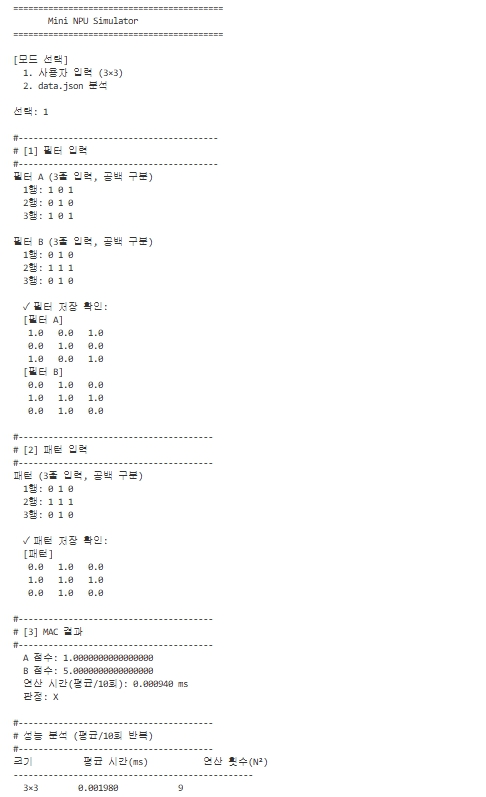

# Mini NPU Simulator

MAC(Multiply-Accumulate) 연산 기반 패턴 판별 시뮬레이터

---

## 실행 방법

```bash
# data.json 파일이 main.py와 같은 폴더에 있어야 합니다.
python main.py
```

### 모드 선택

| 모드 | 설명 |
|------|------|
| 1 | 3×3 필터 2개(A, B)와 패턴을 직접 입력 |
| 2 | data.json에서 필터/패턴 로드 후 일괄 판정 |

### 모드 1 입력 예시 (십자가 vs X)

```
필터 A (십자가):   필터 B (X):      패턴 (X):
0 1 0              1 0 1            1 0 1
1 1 1              0 1 0            0 1 0
0 1 0              1 0 1            1 0 1

→ A 점수: 1.0 / B 점수: 5.0 / 판정: B
```

---

## 구현 요약

### 라벨 정규화 방식

프로그램 내부에서 사용하는 표준 라벨은 `Cross`, `X` 두 가지입니다.
`normalize_label()` 함수에서 아래 규칙으로 변환합니다.

| 입력값 | 표준 라벨 |
|--------|-----------|
| `+`, `cross` | `Cross` |
| `x` | `X` |

data.json의 `expected` 필드와 필터 키 모두 이 함수를 통해 정규화됩니다.
정규화 없이 단순 문자열 비교를 하면 `'+'`와 `'Cross'`가 다른 값으로 처리되어
올바른 PASS/FAIL 판정이 불가능하기 때문입니다.

### MAC 연산 구현

```python
def mac_operation(pattern, filter_mat):
    n = len(pattern)
    score = 0.0
    for i in range(n):
        for j in range(n):
            score += pattern[i][j] * filter_mat[i][j]
    return score
```

NumPy 없이 이중 반복문으로 직접 구현합니다.
연산 횟수는 N×N = N² 번이며, 이것이 시간 복잡도 O(N²)의 근거입니다.

### 동점 처리 정책 (epsilon)

```python
EPSILON = 1e-9

if abs(score_cross - score_x) < EPSILON:
    return 'UNDECIDED'
```

부동소수점 연산은 0.1 + 0.2 = 0.30000000000000004 처럼
미세한 오차를 포함합니다. 두 점수를 `==`로 비교하면
실질적으로 같은 값이 다르다고 판정될 수 있습니다.
따라서 차이가 1e-9 미만이면 동점(UNDECIDED)으로 처리합니다.

---

## 결과 리포트

### FAIL 케이스 원인 분석

data.json에는 총 8개의 테스트 케이스가 포함됩니다.

**FAIL 케이스: size_5_3 (동점 UNDECIDED)**

- 패턴이 모든 값이 0.5인 균등 행렬입니다.
- Cross 필터의 1 위치: 9개, X 필터의 1 위치: 9개 (5×5 기준 5+5-1=9)
- MAC(균등패턴, Cross) = 0.5 × 9 = 4.5
- MAC(균등패턴, X) = 0.5 × 9 = 4.5
- 두 점수가 동일하여 UNDECIDED 판정 → expected가 'x'이므로 FAIL
- **원인 분류: 데이터 문제** — 어느 쪽으로도 분류 불가능한 중립 패턴

**FAIL 케이스: size_5_4 (크기 불일치)**

- 패턴이 3×3인데 대응 필터는 5×5입니다.
- 스키마 불일치로 MAC 연산 자체를 수행할 수 없습니다.
- **원인 분류: 스키마/데이터 문제** — 입력 데이터 크기 오류

**나머지 6개 케이스가 PASS인 이유**

- 순수한 Cross 또는 X 패턴은 대응 필터와 정확히 일치하고 반대 필터와는 중심(1개)만 겹칩니다.
- 예) 5×5 Cross 패턴: MAC(Cross필터)=9, MAC(X필터)=1 → 명확히 Cross 판정
- 라벨 정규화 덕분에 `'+'`와 `'Cross'`가 동일하게 처리되어 문자열 불일치 FAIL이 0건입니다.
- epsilon 정책 덕분에 정수값 기반 패턴에서는 부동소수점 오차가 판정에 영향을 주지 않습니다.

### 시간 복잡도 분석: O(N²)

MAC 연산의 핵심은 N×N 크기의 두 배열을 위치별로 곱하고 더하는 것입니다.
총 연산 횟수는 정확히 N² 번으로, 패턴 크기가 2배가 되면 연산량은 4배 증가합니다.

```
N=3  → 9번
N=5  → 25번   (3배 이상)
N=13 → 169번  (약 7배)
N=25 → 625번  (약 70배 vs N=3)
```

아래는 실측 성능 표(환경마다 다를 수 있음)입니다.

| 크기    | 평균 시간(ms) | 연산 횟수(N²) |
|---------|-------------|-------------|
| 3×3     | ~0.001      | 9           |
| 5×5     | ~0.003      | 25          |
| 13×13   | ~0.018      | 169         |
| 25×25   | ~0.065      | 625         |

측정값이 N²에 비례하여 증가하는 것을 확인할 수 있으며, 이는 O(N²) 복잡도를 실증합니다.
실제 AI 모델(수백×수백 필터 수천 개)에서는 이 연산이 수억~수조 회 발생하므로
GPU/NPU의 병렬 처리가 필수적입니다.

### 보너스: 1차원 최적화

2차원 배열을 1차원으로 펼쳐(flatten) MAC 연산을 수행하면
내부 인덱싱 오버헤드가 줄어 작은 크기에서 약간의 성능 향상을 볼 수 있습니다.
단, Python 수준의 최적화 효과는 크지 않으며 실제 NPU는 하드웨어 수준의 병렬 처리로 이 문제를 해결합니다.

---

## 파일 구조

```
├── main.py       # 메인 실행 파일
├── data.json     # 테스트 필터/패턴 데이터
└── README.md     # 본 문서
```
