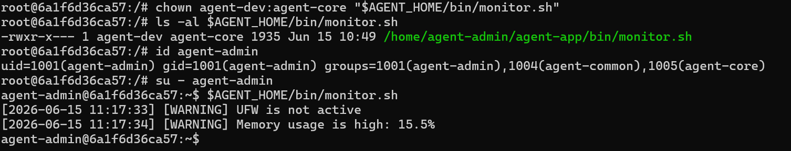
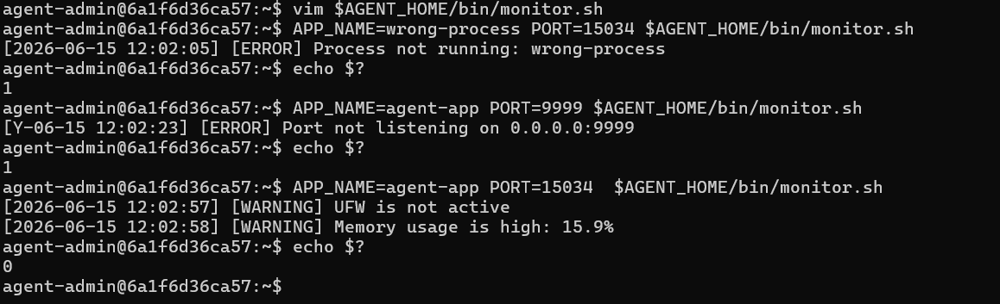
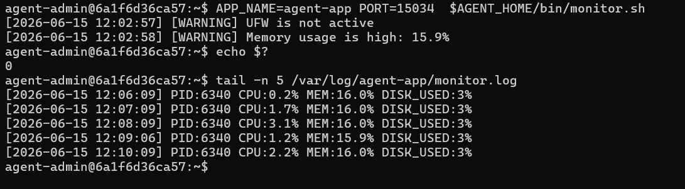
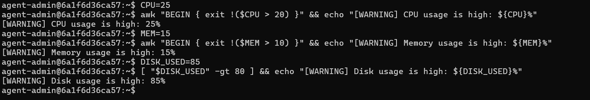
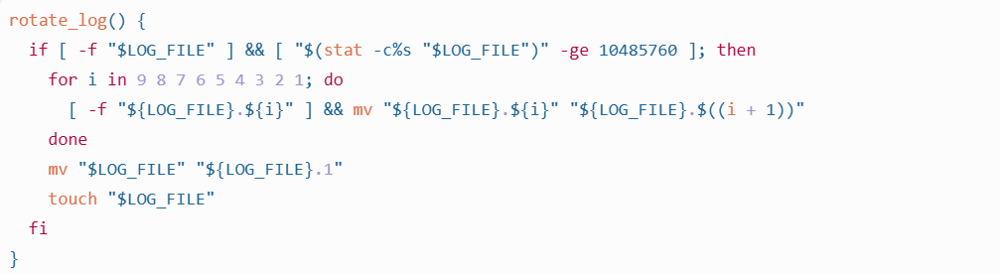

#### 4. 시스템 관제 자동화 스크립트(monitor.sh) 구현


■ 파일 위치/권한 정책

    경로: $AGENT_HOME/bin/monitor.sh
    소유자: agent-dev
    그룹: agent-core
    권한: 750 (rwxr-x---)
    cron 실행 계정: agent-admin (agent-admin은 agent-core에 포함되어 실행 가능해야 함)

     

■ Health Check(실패 시 종료)

    프로세스: agent_app.py(또는 제공 앱 파일명) 실행 상태를 확인하고, 비정상 시 exit 1
    포트: TCP 15034 LISTEN 상태 확인, 비정상 시 exit 1

    


■ 상태 점검(경고만 출력)

    방화벽(UFW 또는 firewalld) 활성화 상태를 점검한다.
    비활성 상태면 [WARNING]을 출력하되, 스크립트는 종료하지 않는다.
    

■ 자원 수집

    CPU 사용률(%)
    메모리 사용률(%)
    디스크 사용률(Root partition, Used %)

    

■ 임계값 경고(경고만 출력)

    CPU > 20%: [WARNING]
    MEM > 10%: [WARNING]
    DISK_USED > 80%: [WARNING]
   


■ 로그 기록

    로그 파일: /var/log/agent-app/monitor.log
    로그 포맷
        [YYYY-MM-DD HH:MM:SS] PID:... CPU:..% MEM:..% DISK_USED:..%

  
    
■ 로그 파일 용량 관리

    monitor.log가 커지면 최대 10MB/10개 파일 유지(방법 자유: logrotate 사용 또는 스크립트 로직 구현)
  


■ monitor.sh에서 프로세스 식별(pgrep/ps 등)과 포트 확인(ss/netstat 등)에 사용한 명령과 선택 이유

```
 APP_PID="$(pgrep -x "$APP_NAME" | head -n 1 || true)"

 prep은 실행중인 프로세스 목록에서 이름 기준으로 PID를 찾는 명령
 ps -ef | grep ... 방식보다 코드가 짧고 , grep 자기 자신이 검색결과에 썩이는 문제를 피할 수 있다.  

 ss -ltn | awk '{print $4}' | grep -Eq "(:|\.)${APP_PORT}$"

 ss는 현재 시스템의 소켓 상태를 호가인 하는 명령
 -l : Listen 상태의 소켓만 조회
 -t : TCP 소켓만 조회
 -n : 포터번호를 숫자로 출력
 따라서 TCP 15304 가 LISTEN 상태인지 확인 하기 적합

 ss는 리눅스에서 소켓 상태를 확인하는 표준 도구이며, -ltn 옵션을 통해 TCP LISTEN 상태의 포트를 숫자 형식으로 조회할 수 있다. 조회 결과에서 15034 포트가 존재하는지 확인하여 애플리케이션이 정상적으로 네트워크 요청을 받을 수 있는 상태인지 판단했다.
```


#### 5. 자동실현(cron) 설정

■ agent-admin 계정의 crontab으로 monitor.sh를 매분 실행되도록 등록한다.
```
* * * * * APP_NAME=agent-app PORT=15034 /home/agent-admin/agent-app/bin/monitor.sh >> /var/log/agent-app/monitor.cron.out 2>&1

crontab -u agent-admin -e
```

■ 등록 후 1~2분 내 monitor.log에 새 라인이 자동으로 누적되는 것을 확인한다.

```
tail -n 5 /var/log/agent-app/monitor.log
```

■  CPU/MEM/DISK 값을 어떤 방식으로 추출/파싱했고, 로그 포맷을 왜 그 형태로 고정했는지 설명할 수 있는가?

CPU 
```
CPU=$(awk '
  NR==1 { idle1=$5; total1=0; for (i=2; i<=NF; i++) total1+=$i }
  NR==2 { idle2=$5; total2=0; for (i=2; i<=NF; i++) total2+=$i }
  END { printf "%.1f", (1 - (idle2-idle1)/(total2-total1)) * 100 }
' < <(grep "^cpu " /proc/stat; sleep 1; grep "^cpu " /proc/stat))

/proc/stat에는 CPU 누적 시간이 들어있기 때문에 한 번만 읽으면 현재 사용률을 알 수 없습니다. 그래서 1초 간격으로 두 번 읽고, 전체 시간 증가분 중 idle 증가분을 제외해서 CPU 사용률을 퍼센트로 계산했습니다. printf "%.1f"로 소수점 한 자리만 남겼습니다.

```

MEM
```
MEM=$(free | awk '/Mem:/ { printf "%.1f", ($3 / $2) * 100 }')

메모리는 free 명령 결과에서 전체 메모리 대비 사용 중인 메모리 비율을 계산
free의 Mem: 행에서 $2는 전체 메모리, $3은 사용 중인 메모리이므로 used / total * 100으로 메모리 사용률을 구했습니다
```

DISK
```
DISK_USED=$(df / | awk 'NR==2 { gsub("%", "", $5); print $5 }')

디스크는 루트 파티션 / 기준으로 df 결과의 사용률 컬럼을 파싱
df /는 루트 파티션의 디스크 사용량을 보여주며, 두 번째 줄의 5번째 컬럼이 Used%입니다. % 문자를 제거해서 숫자만 저장했습니다.
```

로그포맷
```
[YYYY-MM-DD HH:MM:SS] PID:... CPU:..% MEM:..% DISK_USED:..%
```

■ 소유자(agent-dev)와 실행자(agent-admin, cron) 권한 정책을 어떻게 만족시켰는지(소유/그룹/권한) 설명할 수 있는가?

```
 monitor.sh의 소유자는 agent-dev, 그룹은 agent-core, 권한은 750으로 설정했다. 
 750 권한에 따라 소유자인 agent-dev는 읽기/쓰기/실행 권한을 가지고, agent-core 그룹에는 읽기/실행 권한만 부여된다. 
 cron 실행 계정인 agent-admin은 agent-core 그룹에 포함되어 있으므로 스크립트를 수정할 수는 없지만 실행할 수 있다. 기타 사용자는 권한이 없으므로 접근이 차단된다. 이를 통해 작성자와 실행자를 분리하고 최소 권한 원칙을 만족시켰다.
```

■  용량 기반 로그 관리(10MB/10개)를 어떤 방식(logrotate/스크립트)으로 구현했는지 설명할 수 있는가?

```
로그 용량 관리는 logrotate를 사용하지 않고 monitor.sh 내부의 rotate_log() 함수로 구현했다. 
stat -c%s 명령으로 monitor.log의 크기를 확인하고, 10MB(10485760 bytes) 이상이면 기존 백업 로그를 monitor.log.1부터 monitor.log.10까지 순차적으로 밀어낸다. 
이후 현재 monitor.log를 monitor.log.1로 변경하고 새 monitor.log 파일을 생성한다. 
rotate_log()는 로그 기록 직전에 호출되어 로그 파일이 커질 경우 자동으로 회전되도록 했다.
```

■  SSH 포트 변경과 Root 접속 차단이 왜 보안에 효과적인지 위협 모델 관점에서 설명할 수 있는가?
```
SSH 포트 변경은 기본 포트 22번을 대상으로 하는 자동화 스캔과 무차별 대입 공격 노출을 줄이는 효과가 있다. 포트 변경 자체가 강력한 인증 대체 수단은 아니지만, 공격자가 서버를 쉽게 식별하는 것을 어렵게 하고 불필요한 공격 로그를 줄여 운영자가 실제 위협을 파악하기 쉽게 한다.

Root 원격 접속 차단은 더 직접적인 보안 효과가 있다. root는 시스템 전체 권한을 가진 계정이므로 원격 로그인이 허용되면 공격자가 root 계정을 직접 대상으로 비밀번호 대입이나 키 탈취 공격을 시도할 수 있다. PermitRootLogin no 설정을 통해 root 직접 접속을 막으면, 공격자는 일반 계정 인증과 권한 상승 단계를 모두 통과해야 하므로 공격 난이도가 높아지고 사용자 단위의 접속 기록과 감사 추적도 가능해진다.
```

■  api_keys와 로그 디렉토리를 agent-core로 제한한 이유를 “최소 권한 원칙”으로 설명할 수 있는가?

```
api_keys와 /var/log/agent-app 디렉토리는 운영상 민감한 정보를 포함할 수 있으므로 agent-core 그룹으로 접근을 제한했다. 

api_keys에는 서비스 실행에 필요한 키 파일이 저장되며, 로그 디렉토리에는 실행 상태, 오류, 경로, 포트 등 내부 운영 정보가 남을 수 있다. 

최소 권한 원칙에 따라 해당 정보가 실제로 필요한 agent-admin과 agent-dev만 agent-core 그룹에 포함하고, 테스트 계정인 agent-test는 제외했다. 

이를 통해 각 계정은 자신의 역할 수행에 필요한 최소 권한만 가지며, 키 유출이나 로그를 통한 정보 노출 위험을 줄일 수 있다.
```

■  “경고는 출력하되 종료하지 않는 항목”(방화벽 비활성/임계치 초과)을 분리한 운영상의 이유를 설명할 수 있는가?
```
프로세스 미실행과 포트 미리스닝은 애플리케이션이 실제로 서비스 요청을 받을 수 없는 상태이므로 exit 1로 즉시 실패 처리했다. 

반면 방화벽 비활성이나 CPU/MEM/DISK 임계치 초과는 운영상 조치가 필요한 위험 신호이지만, 그 자체가 즉시 서비스 중단을 의미하지는 않는다. 

따라서 해당 항목은 [WARNING]만 출력하고 스크립트를 계속 진행하도록 했다. 

이렇게 분리하면 일시적인 부하나 보안 설정 문제도 로그에 계속 누적되어 추세 분석이 가능하고, 실제 장애 상태와 운영 리스크를 구분해서 대응할 수 있다.
```

■  리다이렉션 기호 > 와 >> 차이를 설명하고, 로그 누적에 >>가 필요한 이유를 설명할 수 있는가?

```
>와 >>는 둘 다 명령어 출력을 파일로 보내는 리다이렉션 기호입니다. 차이는 덮어쓰기냐, 이어쓰기냐입니다.

>는 파일을 새로 덮어씁니다.
```
■  모니터링 대상이 웹 서버(Nginx 등)로 바뀐다면, monitor.sh에서 바꿔야 할 핵심 포인트(프로세스/포트/로그/임계값)를 설명할 수 있는가?

```
모니터링 대상이 Nginx로 바뀐다면 APP_NAME을 nginx로 변경해 nginx 프로세스 실행 여부를 확인해야 한다. 

포트는 기존 15034 대신 웹 서비스 포트인 80 또는 443을 확인하도록 변경한다. 

로그 파일은 관제 로그 목적에 맞게 별도 경로를 사용하거나, 장애 분석을 위해 /var/log/nginx/access.log와 error.log를 함께 확인 대상으로 삼을 수 있다. 

또한 CPU/MEM 임계값은 실제 웹 서버 트래픽과 운영 기준에 맞게 조정해야 한다. 
```

■  “프로세스는 살아있는데 포트가 안 열리는 상황”을 발견했다면, 원인 후보와 확인 순서를 설명할 수 있는가?

```
프로세스는 살아있지만 포트가 열리지 않은 경우, 앱이 아직 부팅 중이거나 다른 포트로 실행되었거나 127.0.0.1에만 바인딩되었을 가능성이 있다. 

또한 포트 충돌, 환경 변수 오류, 앱 내부 리스너 초기화 실패도 원인이 될 수 있다. 

확인 순서는 
  1) 먼저 ps로 프로세스 실행 명령을 확인하고, (pgrep -af agent-app)
  2) ss -ltnp로 실제 LISTEN 포트를 확인한다. (ss -ltnp | grep 15034) 
  3) 이후 AGENT_PORT 등 환경 변수를 점검하고, 앱 로그에서 바인딩 실패나 설정 오류를 확인한다. 필요하면 lsof -i :15034로 포트 점유 여부를 확인한다. (ss -ltnp | grep 15034) 
```

■  로그가 급증해 디스크가 가득 찰 위험이 있다면, 운영자가 취할 대응(단기/중기)을 설명할 수 있는가?

```
로그 급증으로 디스크가 가득 찰 위험이 있으면, 
단기적으로는 df -h와 du -sh로 디스크 사용량과 큰 로그 파일을 확인하고, 오래된 로그를 압축하거나 삭제한다. 

현재 프로세스가 쓰고 있는 로그 파일은 rm보다 truncate -s 0을 사용해 파일 핸들 문제 없이 용량을 비운다. 
동시에 tail로 최근 로그를 확인해 어떤 메시지가 반복적으로 쌓이는지 원인을 파악한다.

중기적으로는 logrotate 또는 monitor.sh 내부 로테이션 정책을 강화해 크기 기준 회전, 보관 개수 제한, 압축을 적용한다. 

또한 cron 중복 등록 여부를 확인하고, 반복 경고의 원인을 제거하며, 디스크 사용률 임계치 초과 시 운영자에게 알림이 가도록 개선한다. 

이를 통해 단순히 용량을 비우는 데서 끝나지 않고 같은 문제가 반복되지 않도록 예방
```


---
---
---
---
---
---
---
---
---
---
---
---
---


 monitor.sh가 프로세스/포트 상태를 점검하고, 비정상 상태에서 exit 1로 종료되는가?

 cron 매분 실행으로 monitor.log가 자동 증가하는가?
 

 monitor.log 용량 관리(10MB/10개)가 설정되어 있고 동작을 설명할 수 있는가?

A-2)
 monitor.sh에서 프로세스 식별(pgrep/ps 등)과 포트 확인(ss/netstat 등)에 사용한 명령과 선택 이유를 설명할 수 있는가?
 


 CPU/MEM/DISK 값을 어떤 방식으로 추출/파싱했고, 로그 포맷을 왜 그 형태로 고정했는지 설명할 수 있는가?

 소유자(agent-dev)와 실행자(agent-admin, cron) 권한 정책을 어떻게 만족시켰는지(소유/그룹/권한) 설명할 수 있는가?
 
 용량 기반 로그 관리(10MB/10개)를 어떤 방식(logrotate/스크립트)으로 구현했는지 설명할 수 있는가?

A-3)

 SSH 포트 변경과 Root 접속 차단이 왜 보안에 효과적인지 위협 모델 관점에서 설명할 수 있는가?
 ```
 SSH 포트 변경과 Root 접속 차단은 외부 공격자가 SSH를 통해 서버에 침입하려는 상황을 줄이기 위한 기본 보안 조치입니다.

SSH 기본 포트는 22번입니다. 공격자는 인터넷에 노출된 서버를 스캔하면서 22번 포트가 열려 있는지 먼저 확인하고, 열려 있으면 자동화된 봇으로 계정/비밀번호 대입 공격을 시도합니다. 포트를 20022처럼 변경하면 이런 무작위 자동 스캔과 기본 포트 대상 공격에 덜 노출됩니다.

다만 포트 변경은 완전한 보안 대책은 아닙니다. 공격자가 전체 포트 스캔을 하면 변경된 포트도 찾을 수 있습니다. 그래서 포트 변경은 공격을 불가능하게 만든다기보다는, 자동화된 대량 공격의 노이즈와 빈도를 줄이는 효과가 있다고 설명하는 것이 정확합니다.

Root 접속 차단은 더 직접적인 보안 효과가 있습니다. root는 리눅스에서 모든 권한을 가진 관리자 계정입니다. SSH에서 root 로그인을 허용하면 공격자는 계정 이름을 맞힐 필요 없이 root 하나만 대상으로 비밀번호 대입 공격을 할 수 있습니다. 만약 root 비밀번호가 유출되거나 약하면 곧바로 서버 전체 권한을 탈취당합니다.

Root 접속을 막으면 공격자는 먼저 일반 계정으로 로그인해야 하고, 이후 sudo 같은 별도 권한 상승 단계를 거쳐야 합니다. 즉 공격 경로가 다음처럼 길어집니다.

Root 접속 허용:
SSH 접속 성공 = 즉시 관리자 권한 탈취
Root 접속 차단:
일반 계정 탈취 → sudo 권한 확인 → 추가 인증/권한 상승 성공 필요
위협 모델 관점에서 보면, SSH 포트 변경은 자동화된 스캐닝/무차별 대입 공격의 노출면을 줄이는 조치이고, Root 접속 차단은 계정 탈취가 곧바로 전체 시스템 탈취로 이어지는 위험을 줄이는 조치입니다. 따라서 둘을 함께 적용하면 침입 가능성과 침입 성공 시 피해 범위를 모두 줄일 수 있습니다.
 ```

 api_keys와 로그 디렉토리를 agent-core로 제한한 이유를 “최소 권한 원칙”으로 설명할 수 있는가?
 ```
 api_keys와 로그 디렉터리를 agent-core 그룹으로 제한한 이유는 최소 권한 원칙 때문입니다.

최소 권한 원칙은 사용자가 작업에 필요한 권한만 가져야 하고, 필요 없는 권한은 주지 않는다는 보안 원칙입니다.

api_keys 디렉터리에는 앱이 사용하는 비밀키나 인증 정보가 들어갈 수 있습니다. 이 파일을 모든 사용자가 읽을 수 있으면 일반 계정이 키를 훔쳐서 외부 API 접근이나 앱 인증을 우회할 위험이 있습니다. 그래서 앱 운영에 필요한 계정과 그룹, 즉 agent-core에 속한 사용자만 접근할 수 있게 제한했습니다.

예를 들면 이런 구조입니다.

api_keys 소유자/그룹: agent-admin:agent-core
권한: 770 또는 750
이렇게 하면 agent-core 그룹에 포함되지 않은 계정은 디렉터리 안을 볼 수도 없고 키 파일도 읽을 수 없습니다.

로그 디렉터리도 마찬가지입니다. 로그에는 실행 상태뿐 아니라 경로, PID, 에러 메시지, 환경 정보 등이 남을 수 있습니다. 경우에 따라 내부 구조나 민감한 운영 정보가 노출될 수 있기 때문에 모든 사용자에게 공개하면 안 됩니다. 그래서 앱 운영과 관제에 필요한 agent-core 그룹만 읽고 쓸 수 있도록 제한합니다.

즉, agent-core로 제한한 이유는:

비밀키 파일을 불필요한 사용자에게 노출하지 않기 위해
로그에 포함될 수 있는 운영 정보를 보호하기 위해
앱 운영에 필요한 계정만 접근하도록 범위를 줄이기 위해
계정 하나가 침해되더라도 피해 범위를 줄이기 위해
정리하면, api_keys와 로그 디렉터리를 agent-core 그룹으로 제한한 것은 “모든 사용자에게 열어두지 않고, 앱 운영에 필요한 최소 사용자 집합에게만 접근 권한을 부여한 것”입니다.
 ```

 “경고는 출력하되 종료하지 않는 항목”(방화벽 비활성/임계치 초과)을 분리한 운영상의 이유를 설명할 수 있는가?
 ```
 방화벽 비활성이나 CPU/MEM/DISK 임계치 초과를 실패로 종료하지 않고 경고만 출력한 이유는, 이것들이 즉시 앱이 동작 불가능하다는 뜻은 아니기 때문입니다.

프로세스 미실행이나 포트 미LISTEN은 앱 서비스가 실제로 죽었거나 외부 요청을 받을 수 없는 상태입니다. 그래서 Health Check 실패로 보고 exit 1로 종료합니다.

반면 방화벽 비활성은 보안상 위험한 상태이지만, 앱 프로세스 자체가 실행 불가능한 상태는 아닙니다. 그래서 운영자가 조치할 수 있도록 [WARNING]을 출력하되 스크립트는 계속 진행합니다.

CPU, MEM, DISK 임계치 초과도 마찬가지입니다. 예를 들어 메모리가 10%를 넘었다고 해서 반드시 앱이 죽은 것은 아닙니다. 순간적인 부하일 수도 있고, 컨테이너 환경에서는 기본 사용량만으로도 임계치를 넘을 수 있습니다. 이런 항목 때문에 매번 스크립트를 실패 처리하면 cron 로그가 불필요하게 실패로 쌓이고, 실제 장애와 경고 상황을 구분하기 어려워집니다.

운영상 분리 이유는 다음과 같습니다.

서비스 생존 여부와 운영 위험 신호를 구분하기 위해
실제 장애인 프로세스/포트 실패만 exit 1로 처리하기 위해
방화벽/자원 사용률 문제는 모니터링 로그로 남기고 추세를 보기 위해
일시적인 부하 때문에 자동 점검이 실패로 오인되지 않게 하기 위해
운영자가 경고를 보고 조치하되 서비스 확인 자체는 계속 수행되게 하기 위해
정리하면, 즉시 서비스 불능이면 실패 종료, 위험하거나 조치가 필요한 상태지만 앱은 살아 있으면 경고만 출력하도록 나눈 것입니다.


 ```

 리다이렉션 기호 > 와 >> 차이를 설명하고, 로그 누적에 >>가 필요한 이유를 설명할 수 있는가?
```
>와 >>는 둘 다 명령어 출력을 파일로 보내는 리다이렉션 기호입니다. 차이는 덮어쓰기냐, 이어쓰기냐입니다.

>는 파일을 새로 덮어씁니다.

echo "first" > test.log
echo "second" > test.log
cat test.log
결과는 마지막 내용만 남습니다.

second
즉, 기존 first는 사라집니다.

>>는 파일 끝에 내용을 추가합니다.

echo "first" >> test.log
echo "second" >> test.log
cat test.log
결과는 두 줄이 모두 남습니다.

first
second
monitor.sh에서는 로그를 누적해야 하므로 >>를 사용합니다.

echo "[$(timestamp)] PID:${PID} CPU:${CPU}% MEM:${MEM}% DISK_USED:${DISK_USED}%" >> "$LOG_FILE"
cron이 매분 monitor.sh를 실행할 때마다 새로운 상태 기록이 monitor.log에 한 줄씩 추가되어야 합니다. 만약 여기서 >를 쓰면 매번 이전 로그가 지워지고 최신 한 줄만 남습니다. 그러면 시간별 CPU/MEM/DISK 변화, 장애 발생 시점, 경고 누적 이력을 확인할 수 없습니다.

그래서 로그 파일처럼 실행 이력을 계속 보관해야 하는 경우에는 >가 아니라 >>를 사용해야 합니다.
```
 
A-4)

 모니터링 대상이 웹 서버(Nginx 등)로 바뀐다면, monitor.sh에서 바꿔야 할 핵심 포인트(프로세스/포트/로그/임계값)를 설명할 수 있는가?
```
모니터링 대상이 현재 Agent App에서 Nginx 같은 웹 서버로 바뀌면, monitor.sh에서 바꿔야 할 핵심은 프로세스 이름, 포트, 로그 경로, 임계값 기준입니다.

현재 스크립트는 앱 이름과 포트를 이렇게 고정해 두었습니다.

LOG_FILE="/var/log/agent-app/monitor.log"
APP_NAME="agent-app"
APP_PORT="15034"
Nginx를 대상으로 한다면 예를 들어 이렇게 바꿀 수 있습니다.

LOG_FILE="/var/log/nginx-monitor/monitor.log"
APP_NAME="nginx"
APP_PORT="80"
프로세스 확인도 agent-app이 아니라 nginx 프로세스를 찾아야 합니다. 현재는 아래처럼 APP_NAME을 기준으로 pgrep합니다.

# Health Check: process
pgrep -f "$APP_NAME" > /dev/null || fail "Process not running: $APP_NAME"
Nginx에서는 APP_NAME="nginx"로 바꾸면 nginx 프로세스 실행 여부를 확인할 수 있습니다. 더 엄격하게 하려면 systemctl is-active nginx 같은 서비스 상태 확인으로 바꿀 수도 있습니다.

포트 확인도 15034가 아니라 웹 서버 포트를 봐야 합니다. 일반 HTTP는 80, HTTPS는 443입니다.

# Health Check: port
ss -H -ltn | awk '{print $1, $4}' | grep -q "LISTEN 0.0.0.0:${APP_PORT}" \
  || fail "Port not listening on 0.0.0.0:${APP_PORT}"
Nginx가 0.0.0.0:80 또는 0.0.0.0:443에서 LISTEN하는지 확인하도록 APP_PORT를 바꾸면 됩니다. IPv6까지 고려하면 [::]:80도 허용하도록 조건을 조금 넓힐 수 있습니다.

로그 경로도 Agent App용 /var/log/agent-app/monitor.log 대신 웹 서버 모니터링용 경로로 바꿔야 합니다. 예를 들어:

LOG_FILE="/var/log/nginx-monitor/monitor.log"
그리고 로그 디렉터리 소유자/그룹/권한도 새 운영 정책에 맞게 만들어야 합니다.

임계값도 서비스 특성에 맞게 조정해야 합니다. 현재는 아래 기준입니다.

awk "BEGIN { exit !($CPU > 20) }" && warning "CPU usage is high: ${CPU}%"
awk "BEGIN { exit !($MEM > 10) }" && warning "Memory usage is high: ${MEM}%"
[ "$DISK_USED" -gt 80 ] && warning "Disk usage is high: ${DISK_USED}%"
Nginx는 트래픽이 많으면 CPU/MEM 사용량이 Agent App보다 높을 수 있으므로, 운영 환경에 맞게 예를 들어 CPU > 70%, MEM > 70%, DISK_USED > 80%처럼 조정할 수 있습니다.

정리하면 웹 서버로 바뀔 때 핵심 변경 포인트는 다음입니다.

프로세스: APP_NAME="agent-app" → APP_NAME="nginx"
포트: APP_PORT="15034" → 80 또는 443
로그: /var/log/agent-app/monitor.log → 웹 서버 모니터링 로그 경로
임계값: 웹 서버 부하 특성에 맞게 CPU/MEM/DISK 기준 조정
필요 시 상태 확인 방식: pgrep 대신 systemctl is-active nginx 사용 가능
```

 “프로세스는 살아있는데 포트가 안 열리는 상황”을 발견했다면, 원인 후보와 확인 순서를 설명할 수 있는가?
 ```
 프로세스는 살아 있는데 포트가 안 열려 있다면, 앱은 실행됐지만 네트워크 리스닝 단계까지 정상 도달하지 못한 상태로 볼 수 있습니다.

먼저 실제 상태를 확인합니다.

pgrep -af agent-app
ss -ltnp | grep 15034
pgrep에는 나오는데 ss에는 안 나오면 아래 순서로 봅니다.

앱이 아직 부팅 중인지 확인합니다.
ps -fp $(pgrep -f agent-app | head -n 1)
앱이 막 시작된 상태라면 Boot Sequence 중이거나 초기화 대기 상태일 수 있습니다. 실행 터미널 로그에서 Agent READY까지 도달했는지 확인합니다.

환경변수가 잘못됐는지 확인합니다.
echo $AGENT_PORT
echo $AGENT_HOME
echo $AGENT_KEY_PATH
포트 환경변수 AGENT_PORT가 비어 있거나 15034가 아니면 앱이 다른 포트로 뜨거나 리스닝에 실패할 수 있습니다.

다른 포트에 떠 있는지 확인합니다.
ss -ltnp
15034가 아니라 127.0.0.1:15034, 0.0.0.0:다른포트, [::]:15034처럼 떠 있을 수 있습니다.

바인딩 주소 문제를 확인합니다.
ss -ltnp | grep agent
과제 기준은 0.0.0.0:15034입니다. 만약 127.0.0.1:15034로 떠 있으면 외부 접속용이 아니라 localhost에만 바인딩된 것입니다. 이 경우 앱 설정에서 host/bind address를 0.0.0.0으로 바꿔야 합니다.

포트 충돌을 확인합니다.
ss -ltnp | grep 15034
다른 프로세스가 이미 15034를 사용 중이면 앱이 포트 바인딩에 실패할 수 있습니다. 그 경우 해당 프로세스를 종료하거나 앱 포트를 바꿔야 합니다.

권한/파일 문제로 앱 초기화가 실패했는지 봅니다.
ls -al /home/agent-admin/agent-app/api_keys
ls -al /var/log/agent-app
필수 파일이나 로그 권한 문제 때문에 프로세스가 잠깐 살아 있다가 정상 리스닝 전에 실패할 수 있습니다.

앱 로그 또는 실행 터미널 출력 확인합니다.
실행 화면에 [FAIL], Permission denied, Address already in use, Missing File 같은 메시지가 있는지 봅니다.

정리하면 확인 순서는:

프로세스 확인 → 포트 전체 확인 → 앱 부팅 로그 확인 → 환경변수 확인 → 바인딩 주소 확인 → 포트 충돌 확인 → 파일/권한 확인
이 순서로 보면 “앱이 안 떴는지”, “다른 포트/주소에 떴는지”, “초기화 중 실패했는지”를 빠르게 구분할 수 있습니다.


 ```
 로그가 급증해 디스크가 가득 찰 위험이 있다면, 운영자가 취할 대응(단기/중기)을 설명할 수 있는가?

 ```
 로그가 급증해서 디스크가 가득 찰 위험이 있으면, 운영자는 먼저 서비스 장애를 막는 단기 조치를 하고, 이후 로그가 계속 폭증하지 않도록 중기 개선을 해야 합니다.

단기 대응은 즉시 디스크 사용량을 낮추는 것입니다.

df -h
du -sh /var/log/agent-app/*
ls -lh /var/log/agent-app
어떤 로그가 커졌는지 확인한 뒤, 필요한 경우 오래된 로그를 압축하거나 삭제합니다.

gzip /var/log/agent-app/monitor.log.10
rm -f /var/log/agent-app/monitor.log.10
현재 로그 파일이 너무 크면 서비스를 유지한 채 비울 수 있습니다.

: > /var/log/agent-app/monitor.log
rm monitor.log보다 : > monitor.log가 안전한 경우가 많습니다. 실행 중인 프로세스가 파일을 계속 잡고 있어도 파일 내용만 비우기 때문입니다.

중기 대응은 로그 관리 정책을 강화하는 것입니다. 예를 들어 monitor.sh의 로테이션 기준을 더 낮추거나, 보관 개수를 줄일 수 있습니다.

10MB/10개 → 5MB/5개
또는 logrotate를 사용해서 압축, 보관 기간, 보관 개수, 권한을 체계적으로 관리할 수 있습니다.

추가로 로그가 급증한 원인도 찾아야 합니다. 같은 에러가 반복되는지 확인합니다.

tail -n 100 /var/log/agent-app/monitor.log
예를 들어 포트 오류, 권한 오류, API 키 오류가 매분 반복되면 단순히 로그만 지우는 것이 아니라 원인 설정을 수정해야 합니다.

정리하면:

단기: 디스크 사용량 확인, 큰 로그 식별, 오래된 로그 압축/삭제, 현재 로그 비우기
중기: 로테이션 기준 조정, logrotate 도입, 로그 레벨 조정, 반복 에러 원인 해결, 디스크 임계치 알림 강화
목표는 “당장 디스크 full로 서비스가 죽는 것”을 막고, 이후 “같은 로그 폭증이 반복되지 않게” 만드는 것입니다.
 ```