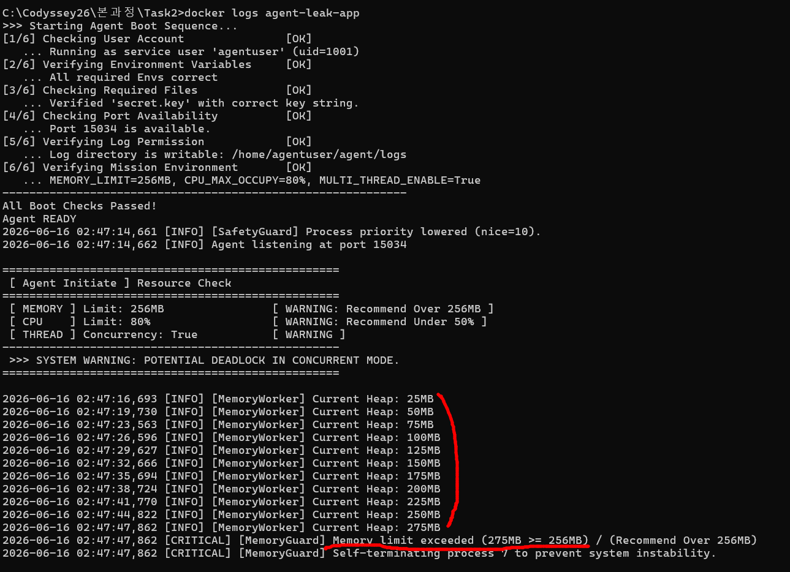
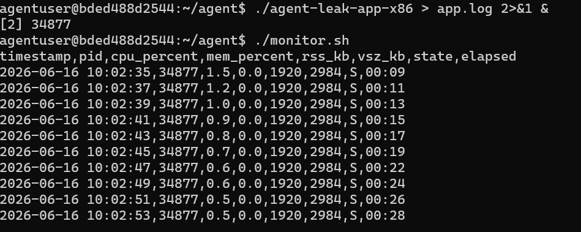
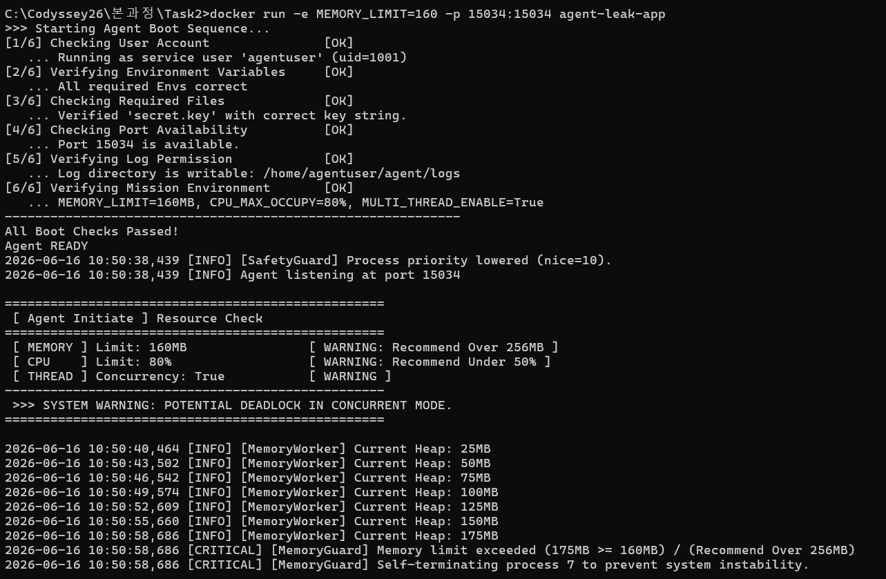
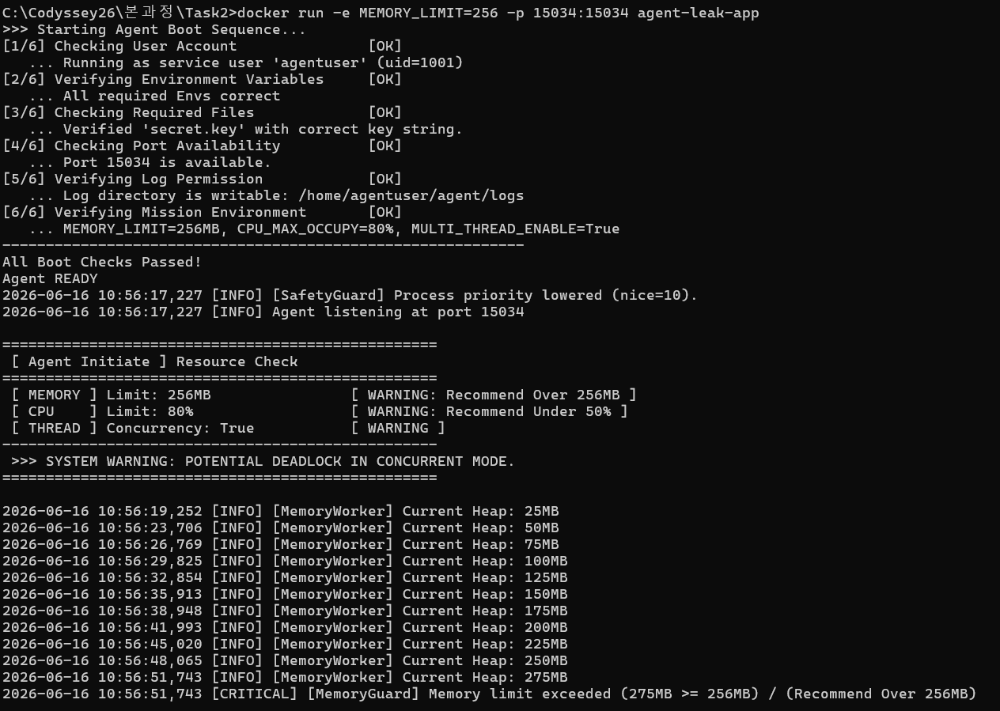

# [Bug] OOM Crash — agent-leak-app, 메모리 선형 증가로 256MB 한계 초과 후 MemoryGuard 강제 종료

> **요약**: `agent-leak-app` 프로세스가 부팅 후 약 31초 만에 힙 메모리를 일정하게 늘려가다가, `MEMORY_LIMIT(256MB)`를 초과한 275MB 시점에서 애플리케이션 자체 보호 정책(`MemoryGuard`)에 의해 강제 종료됨.

| 항목 | 값 |
|---|---|
| 장애 유형 | OOM Crash (Memory Leak → 강제 종료) |
| 대상 프로세스 | `agent-leak-app` (PID 7) |
| 실행 계정 | `agentuser` (uid=1001) |
| 발생 시각 | 2026-06-16 02:47:14 (부팅) ~ 02:47:47 (종료) |
| 환경 | MEMORY_LIMIT=256MB, CPU_MAX_OCCUPY=80%, MULTI_THREAD_ENABLE=True |
| 생존 시간 | 약 31초 |
---

■ Docker & Container 실행 순서

```
1. Dockerfile Review
2. Docker 빌드 : Docker build -t agent-leak-app:latest . 
3. Container 실행 (컨테이너 없을때) : 
   docker run -it --name docker-leak-app -p 15034:15034 agent-leak-app:latest /bin/bash
4. Container 실행 (컨테이너 있을때 단,실행중 아닐때): 
   docker start docker-leak-app
5. Container 내부 진입 : 
   docker exec -it docker-leak-app
```


## 1. Description (현상 설명)

- **무엇이**: `agent-leak-app` 컨테이너 프로세스가 정상 부팅(부트 체크 6/6 통과) 직후 정상 동작하다가, **예고 없이 종료**되었다.
- **언제**: 2026-06-16 02:47:14 부팅 → **02:47:47에 종료**. 부팅부터 종료까지 약 31초.
- **어떤 조건에서**: `MEMORY_LIMIT=256MB`, `MULTI_THREAD_ENABLE=True` 환경. 부팅 직후 자원 점검 단계에서 이미 `[ MEMORY ] Limit: 256MB [ WARNING ]` 경고가 출력됨.
- **관측된 패턴**: 내부 `MemoryWorker`가 약 3초마다 힙 사용량을 기록했는데, 그 값이 **한 번도 줄지 않고 25MB → 275MB까지 일정하게 증가**했다. 256MB를 넘는 순간 `MemoryGuard`가 프로세스를 스스로 종료(self-terminate)했다.

◆ 모니터셀 & 앱 실행
```
  (컨테이너 내부에서)
  1. 모니터셀 실행 
    ./monitor.sh &
  2. 엡 실행
    ./agent-leak-app 2>&1 &
  3. 쌓이는거 실시간 보기
    tail -f logs/monito.log

  (PowerShell 에서)
  1. docker logs agent-leak-app
```

---

## 2. Evidence & Logs (증거 자료)

### 2-1. 애플리케이션 실행 로그 — 힙 메모리 추이

`docker logs agent-leak-app` 출력 중 `MemoryWorker`의 힙 기록 구간. 약 3초 간격으로 **정확히 25MB씩 단조 증가**한다.




### 2-2. 종료 직전/직후 핵심 로그 발췌

```text
2026-06-16 02:47:44,822 [INFO] [MemoryWorker] Current Heap: 250MB
2026-06-16 02:47:47,862 [INFO] [MemoryWorker] Current Heap: 275MB
2026-06-16 02:47:47,862 [CRITICAL] [MemoryGuard] Memory limit exceeded (275MB >= 256MB) / (Recommend Over 256MB)
2026-06-16 02:47:47,862 [CRITICAL] [MemoryGuard] Self-terminating process 7 to prevent system instability.
```

부팅 단계 자원 점검에서 출력된 사전 경고:

```text
==================================================
[ Agent Initiate ] Resource Check
==================================================
[ MEMORY ] Limit: 256MB   [ WARNING: Recommend Over 256MB ]
[ CPU ]    Limit: 80%      [ WARNING: Recommend Under 50% ]
[ THREAD ] Concurrency: True [ WARNING ]
```

### 2-3. monitor.sh 관제 데이터 (물리 메모리 RSS)

■ 실행순서

```
1) 앱실행 
   ./agent-leak-app-x86 > app.log 2>&1 &
2) 모니터링실행 
   ./monitor.sh &
```



---

## 3. Root Cause Analysis (원인 분석)

### 3-1. 직접 원인 — 메모리 누수(Memory Leak)

힙 사용량이 **일정 시간(~3초)마다 일정량(+25MB)으로 끝없이 증가**하고 한 번도 감소하지 않는다. 정상적인 프로그램이라면 사용이 끝난 객체가 가비지 컬렉션(GC)이나 명시적 해제로 회수되어 메모리가 톱니 모양(saw-tooth)으로 오르내린다. 여기서는 **단조 증가(monotonic increase)만** 나타나므로, 할당한 메모리에 대한 참조가 계속 유지되어 회수되지 못하는 전형적인 **메모리 누수** 패턴이다. (실제 코드에서는 전역 리스트/캐시 누적, 닫지 않은 리소스, 종료되지 않는 객체 참조 등이 흔한 원인.)

■ Heap Memory 가 증가만 함


### 3-2. 종료 메커니즘 — 커널 OOM Killer가 아닌 애플리케이션 레벨 보호 정책

종료의 주체는 리눅스 커널의 OOM Killer가 아니라 **애플리케이션이 자체 구현한 `MemoryGuard`**다. `275MB >= 256MB` 조건을 직접 감시하다가 한계를 넘자 "시스템 불안정 방지"를 명분으로 자기 프로세스를 종료(self-terminate)했다. 

| 구분 | 이번 사례 (애플리케이션 가드) | 커널 OOM / Docker OOMKilled |
|---|---|---|
| 종료 주체 | 앱 내부 `MemoryGuard` | 커널 OOM Killer / cgroup |
| 증거 위치 | 애플리케이션 실행 로그 | `dmesg`의 `Out of memory: Killed process...` |
| 컨테이너 종료코드 | 앱이 정한 코드 | **137** (SIGKILL), `docker inspect`에서 `OOMKilled: true` |

### 3-3. 관련 OS 동작 원리

- 프로세스의 힙(Heap)은 동적 할당 영역으로, 해제되지 않은 할당이 쌓이면 RSS(실제 점유한 물리 메모리)가 계속 증가한다.
 
- 컨테이너 환경에서는 cgroup의 메모리 제한을 초과하면 커널이 해당 프로세스에 SIGKILL을 보내 강제 종료하고, Docker는 이를 `OOMKilled`로 표시한다.

- 이번 앱은 그 한계에 도달하기 전에 **소프트웨어적으로 먼저 한계를 감시·차단**하도록 설계되어, 커널 OOM이 동작하기 전에 스스로 멈춘 것이다.

*** cgroup 은 **"control group(제어 그룹)"**의 줄임말이고, 리눅스 커널이 프로세스들의 자원 사용량을 제한·관리하는 기능.


---

## 4. Workaround & Verification (조치 및 검증)

### 4-1. 임시 조치 — MEMORY_LIMIT 상향

근본 원인(누수)을 즉시 고치기 전, 임계치를 높여 프로세스 생존 시간을 늘리는 임시 조치를 적용한다. 허용 범위는 `50~512MB`이므로 최대 `512MB`까지 상향 가능.

```bash
# 예시: MEMORY_LIMIT 상향 후 재실행
docker run -e MEMORY_LIMIT=512 ... agent-leak-app
# 또는 환경변수 변경 후 컨테이너 재시작
```

### 4-2. Before & After 비교





*(After 실행 로그 / monitor.sh 캡처 첨부)*

예상 결과: 한계가 512MB로 높아지면 같은 누수 속도(~25MB/3초)에서 한계 도달까지 시간이 약 2배로 늘어 **더 오래 생존**한다. 단, 누수가 계속되므로 결국 다시 종료된다 → 임시 조치일 뿐임을 확인.

### 4-3. 근본 해결 제안 (선택)

- 임계치 상향은 시간만 버는 미봉책이다. **누수 지점 자체를 수정**해야 한다.
- 추적 방법: 어떤 객체/컬렉션이 계속 커지는지 확인(전역 리스트·캐시 누적, 닫지 않은 파일/소켓/커넥션, 콜백·이벤트 핸들러 누적 등). Python이라면 `tracemalloc`, `objgraph`, `gc` 모듈 등으로 증가 객체를 스냅샷 비교.
- 회수 로직(주기적 캐시 비우기, 리소스 `with`/`close()` 보장)을 추가하면 힙이 톱니 모양으로 안정화되는지 재측정.

---

