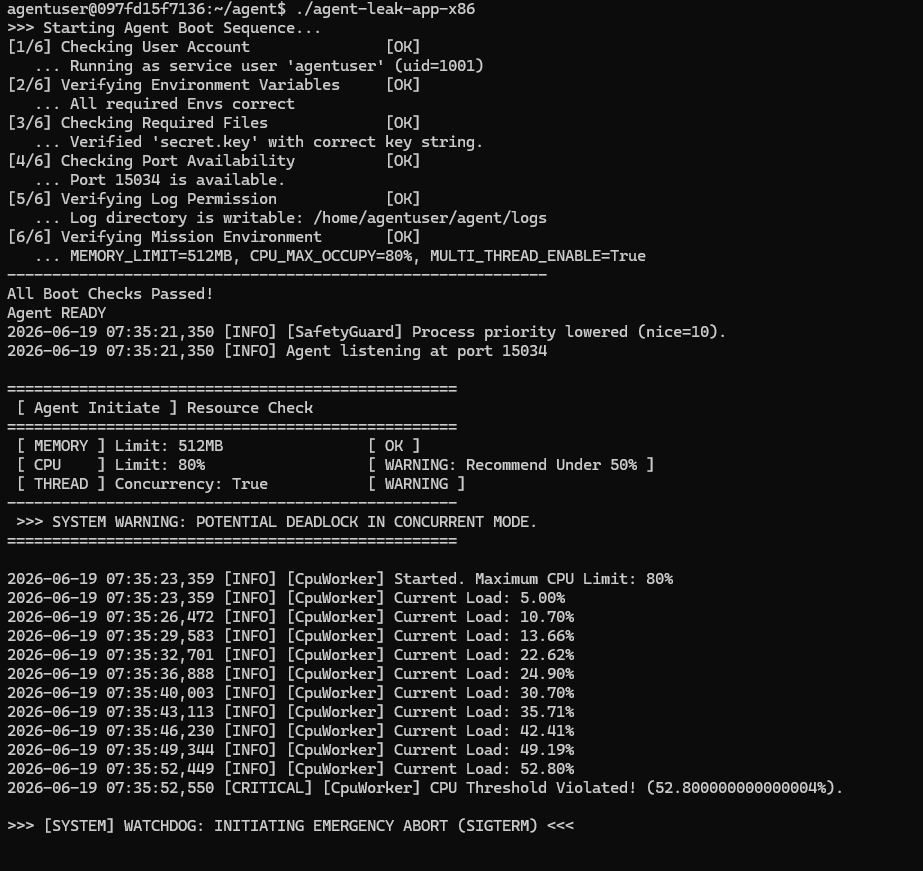
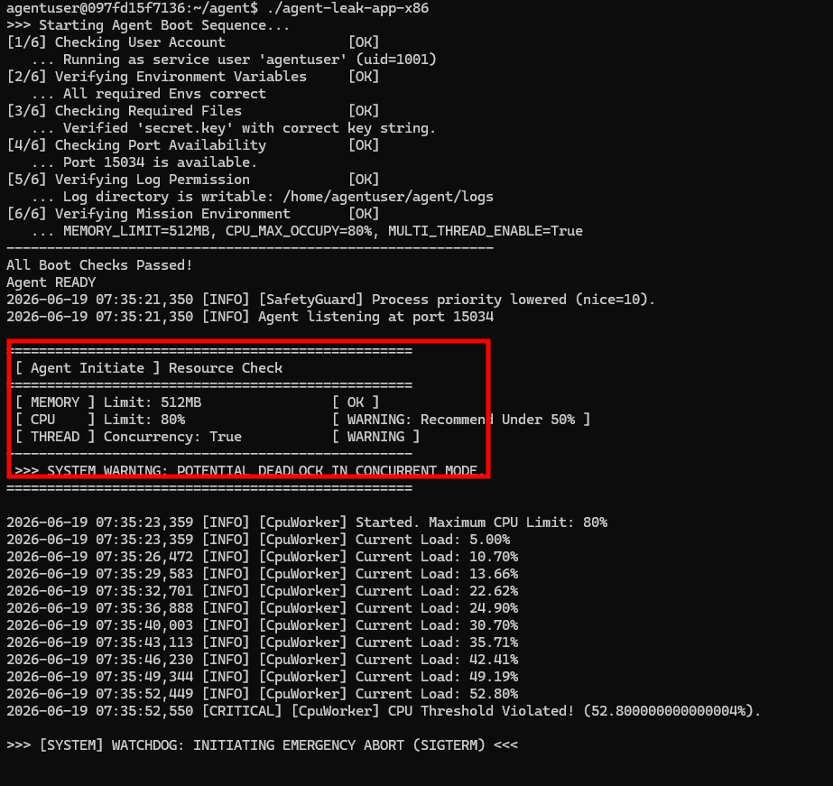
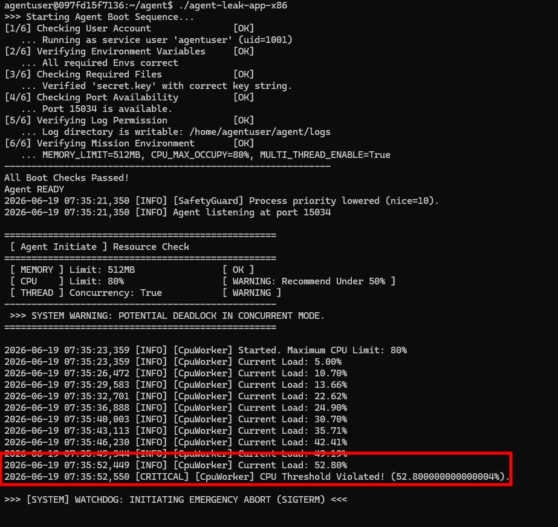
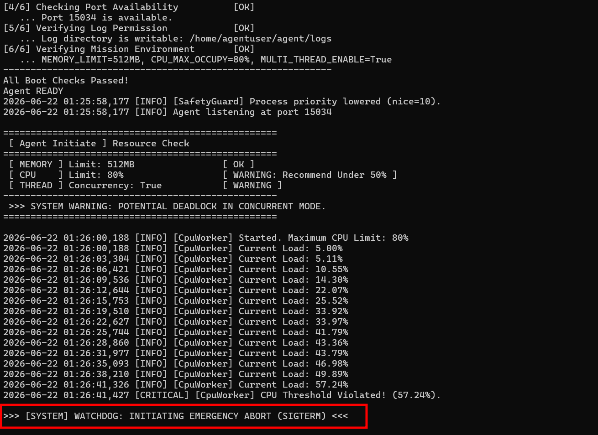
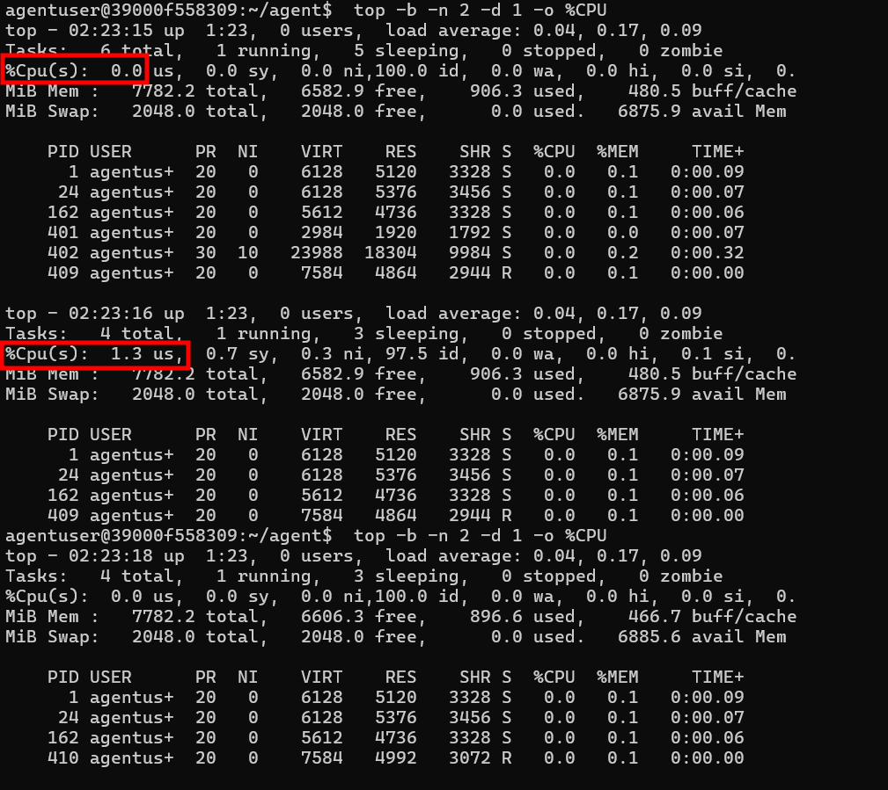
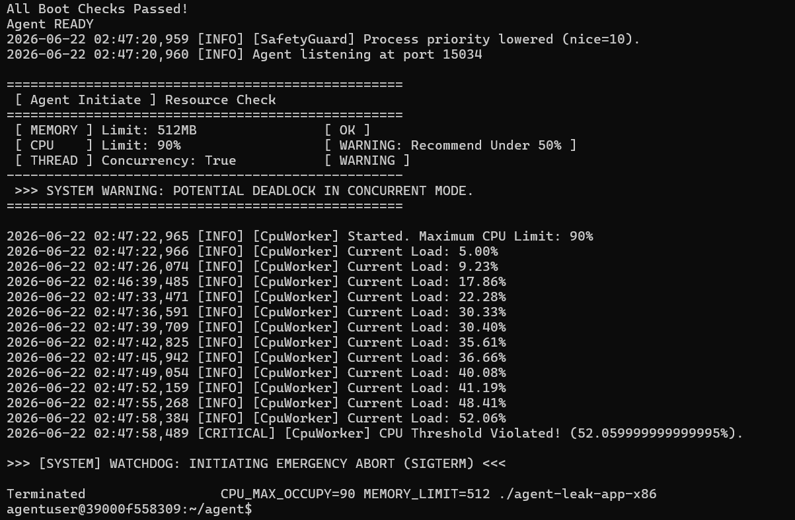
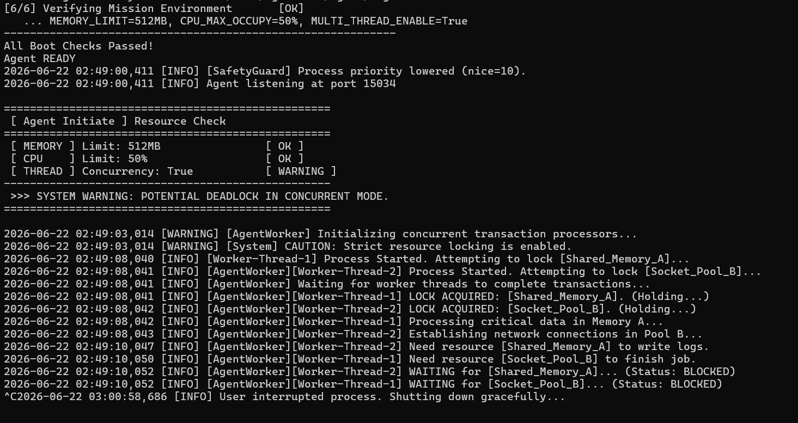

# [Bug] CPU Latency — agent-leak-app, CPU 사용률 점진 상승으로 임계 초과 후 Watchdog 보호 종료

> **요약**: `agent-leak-app`의 `CpuWorker`가 CPU 사용률을 점진적으로 끌어올리다가 임계치를 넘어선 52.79% 시점에서 과점유 방지 정책(`Watchdog`)에 의해 보호 종료되었다. CPU 시나리오는 `MEMORY_LIMIT`을 512MB로 올려 메모리 경고를 해소한 상태에서 트리거된다.

| 항목 | 값 |
|---|---|
| 장애 유형 | CPU Latency (CPU 과점유 → Watchdog 보호 종료) |
| 대상 프로세스 | `agent-leak-app` (`CpuWorker`) |
| 실행 계정 | `agentuser` (uid=1001) |
| 발생 시각 | 2026-06-16 10:39:28 (부팅) ~ 10:39:56 (임계 위반) |
| 환경 | MEMORY_LIMIT=512MB(OK), CPU_MAX_OCCUPY=80%, MULTI_THREAD_ENABLE=True |
| 임계 위반 지점 | CPU Load 52.79% |

---

## 1. Description (현상 설명)

- **무엇이**: 부팅 직후 `CpuWorker`가 동작하며 프로세스의 CPU 사용률을 단계적으로 끌어올렸고, 임계치를 초과하자 `[CRITICAL] CPU Threshold Violated!`가 기록되며 종료 절차로 진입했다.
- **언제**: 2026-06-16 10:39:28 부팅 → **10:39:56에 CPU 임계 위반**. 약 26초간 부하 상승.
- **어떤 조건에서**: `MEMORY_LIMIT=512MB`(메모리 정상 처리), `CPU_MAX_OCCUPY=80%`, CPU 항목에 `[ WARNING: Recommend Under 50% ]` 경고가 있는 상태.
- **재현 경로 (중요)**: 기본 상태(MEMORY_LIMIT=256)에서는 메모리 경고로 인해 `MemoryWorker`(OOM)가 동작한다. **`MEMORY_LIMIT`을 512MB로 올려 메모리 경고를 OK로 해소하면**, 앱이 다음으로 경고 상태인 **CPU 자원을 대상으로 `CpuWorker` 부하 테스트를 수행**한다. 즉 이 앱은 WARNING 상태인 자원을 골라 부하를 가하는 구조다.
- **관측된 패턴**: CPU Load가 5.00% → 52.79%로 **점진 상승**(중간에 38%대 정체 구간 포함)하다가, 52.79%에서 임계 위반 처리되었다.

---

## 2. Evidence & Logs (증거 자료)

### 2-1. 애플리케이션 실행 로그 — CPU Load 추이

`CpuWorker`가 보고한 CPU 부하. OOM의 메모리(일정한 선형 증가)와 달리, **점진적으로 상승**하며 중간 정체 구간이 있다.

powershell 에서
docker run -it --rm -p 15034:15034 -e MEMORY_LIMIT=512 --entrypoint /bin/bash agenet-leak-app:latest
./agent-leak-app-x86



### 2-2. 부팅 자원 점검 및 임계 위반 로그 발췌

자원 점검 단계 — 메모리는 OK, CPU만 경고:




CpuWorker 동작 및 임계 위반:




### 2-3. 종료(Watchdog / SIGTERM) 로그





### 2-4. 시스템 도구(top / monitor.sh)의 CPU 수치


```bash
# 컨테이너 안에서, CpuWorker 동작 중 순간 CPU 스냅샷
top -b -n 1 | head -15
# 또는 monitor.sh의 cpu_percent 컬럼 사용
```



---

## 3. Root Cause Analysis (원인 분석)

### 3-1. 직접 원인 — CPU 과점유 (특정 프로세스 단독)

`agent-leak-app`의 `CpuWorker`가 **자체 보고하는 CPU 부하 지표**를 5% → 52.79%까지 단계적으로 끌어올렸고, 이 값이 임계치를 넘자 Watchdog가 작동했다.

단, OS 레벨에서 실측한 실제 CPU 점유는 이와 달랐다. `top`의 `%CPU`와 누적 CPU 시간(`TIME+` 약 0.3초), 그리고 시스템 전체 `%Cpu(s)`가 약 99% idle을 유지한 점은 해당 프로세스가 실제로는 CPU를 거의 쓰지 않았음을 보여준다. 즉 이번 시나리오의 'CPU 과점유'는 앱이 자체적으로 연출한 부하이며, **애플리케이션이 보고하는 지표와 OS가 측정한 실제 사용률은 일치하지 않는다**는 점이 핵심 발견이다.

### 3-2. 종료 메커니즘 — 오류가 아닌 보호 정책(Watchdog)

이 종료는 **버그로 인한 비정상 크래시가 아니라, 과점유 방지 정책(Watchdog)에 의한 의도된 보호 조치**다. CPU 임계치를 초과하자 Watchdog가 개입하여 프로세스를 정리했다(미션 요건상 SIGTERM으로  확인). OOM 사례의 `MemoryGuard`와 짝을 이루는, 애플리케이션 레벨의 자체 보호 장치다.

| 구분 | 이번 사례 (보호 정책) | 비정상 크래시 |
|---|---|---|
| 종료 트리거 | CPU 임계 초과 감지 → Watchdog | 예외/세그폴트 등 비정상 |
| 성격 | 시스템 안정성 보호를 위한 **정상 동작** | 의도치 않은 오류 |
| 증거 | `CPU Threshold Violated!` + Watchdog 종료 로그 | 스택 트레이스, 비정상 종료 코드 |
| 신호 | SIGTERM (정중한 종료 요청, 예상) | 다양 |

### 3-3. 관련 OS 동작 원리

한 프로세스가 CPU를 과도하게 점유하면, 운영체제의 스케줄러가 다른 프로세스에 CPU 시간을 충분히 배분하지 못해 **시스템 전체가 느려지는 지연(latency)**이 발생한다. 따라서 Watchdog는 특정 프로세스가 임계치를 넘기면 미리 차단하여 시스템 전체의 응답성을 보호한다.

### 3-4. 관찰 — 위반 임계가 80%가 아닌 ~50%로 보임

표시된 `Maximum CPU Limit`은 80%였으나, 실제 위반은 **52.79%**(권장선 "Under 50%"를 막 넘긴 지점)에서 발생했다. 즉 위반 판정 기준이 설정값 80%가 아니라 **권장 한계 50% 근처**일 가능성이 있다. `CPU_MAX_OCCUPY` 값을 바꿔(예: 50 vs 90) 재실행하면 실제 기준을 검증할 수 있다.

---

## 4. Workaround & Verification (조치 및 검증)

### 4-1. 임시 조치 — CPU_MAX_OCCUPY 조정

```bash
# 예시: CPU 임계 상향 후 재실행
docker run --name agent-cpu -e MEMORY_LIMIT=512 -e CPU_MAX_OCCUPY=90 -p 15034:15034 agent-leak-app:latest

(컨테이너 내부에서)
CPU_MAX_OCCUPY=90 MEMORY_LIMIT=512 ./agent-leak-app-x86
CPU_MAX_OCCUPY=50 MEMORY_LIMIT=512 ./agent-leak-app-x86
```

> 주의: CPU 항목이 OK 상태가 될 만큼 조정하면, 앱이 CPU 테스트를 건너뛰고 다음 경고 자원(THREAD → Deadlock)으로 넘어갈 수 있다. CPU 시나리오를 유지하려면 CPU가 테스트 대상으로 남는 값으로 실험할 것.

### 4-2. Before & After 비교

"CPU_MAX_OCCUPY를 권장선(50%) 이하로 낮추면 CPU가 OK로 판정되어 과부하 시나리오와 Watchdog 종료가 모두 사라진다. 반대로 50% 초과로 두면 설정값(80%)과 무관하게 항상 ~52%에서 SIGTERM이 발동한다. 따라서 Watchdog 발동선은 설정값이 아니라 50% 권장선에 고정돼 있으며, 이 선을 넘기느냐가 과부하 발생 여부를 가른다."

 



### 4-3. 근본 해결 제안 (선택)

- 임계 조정은 시간을 버는 미봉책이다. 근본적으로는 **CPU를 과점유하는 연산 로직**(불필요한 busy-loop, 비효율 알고리즘, 과도한 동시 작업)을 찾아 최적화해야 한다.
- 추적 방법: `top -H`로 어떤 스레드가 CPU를 점유하는지 확인 → 프로파일러(예: `py-spy`, `perf`)로 핫스팟 함수 식별 → 연산 분산/슬립 추가/알고리즘 개선.

---
 