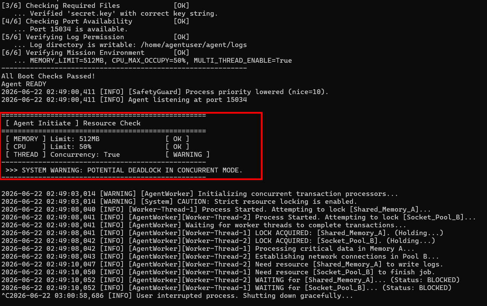
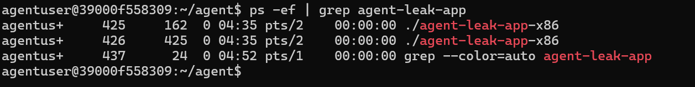
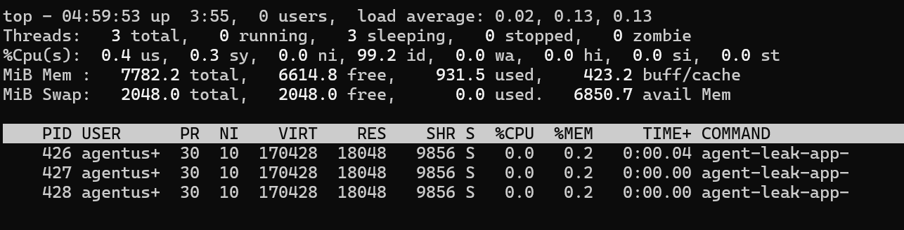
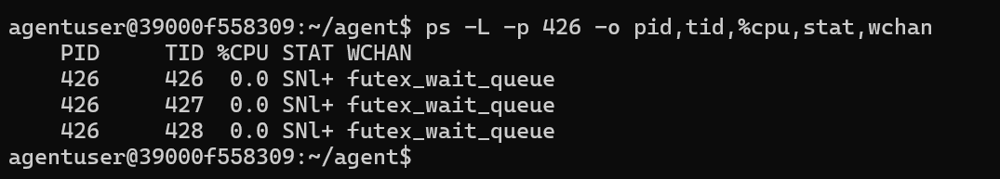
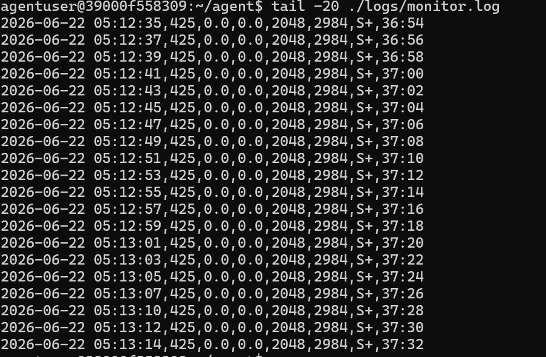
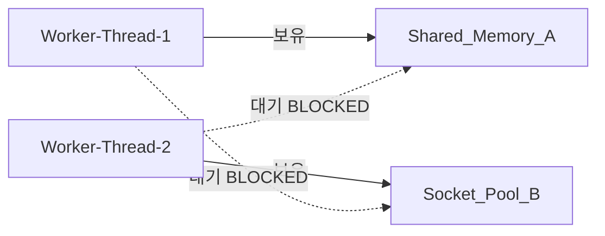
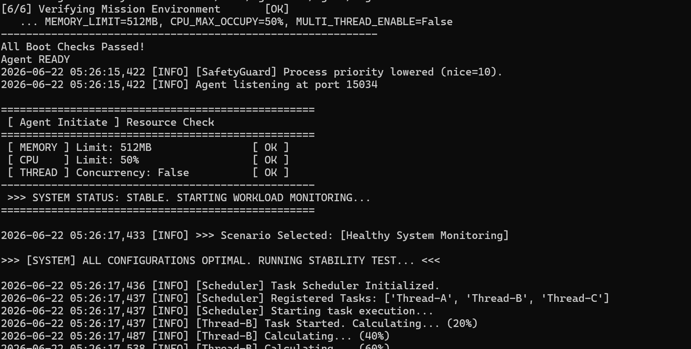
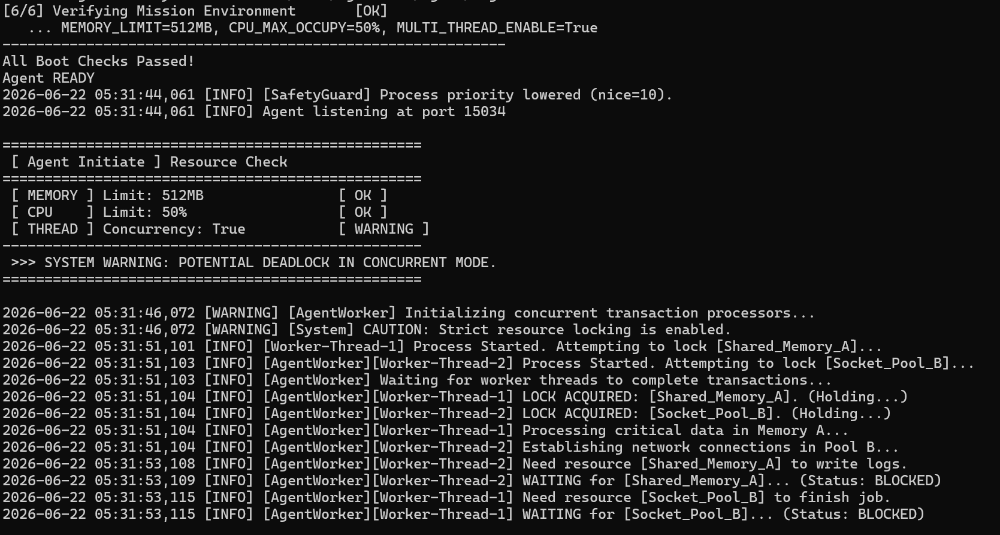

# [Bug] 교착상태(Deadlock) - 동시성 모드에서 두 스레드의 순환 대기로 인한 무응답(Hang)

## 1. Description (현상 설명)

**현상**

`agent-leak-app`을 CPU_LIMIT를 50미만으로 실행하자, 두 워커 스레드가 트랜잭션 처리 도중 멈췄다. 프로세스는 **종료되지 않고 살아있으나(PID 존재)**, CPU·메모리 사용량에 변화가 없고 프로그램 로그도 특정 시점 이후 더 이상 출력되지 않는 **무응답(Hang)** 상태가 되었다. 이는 예외/세그폴트에 의한 비정상 종료(crash)가 아니라, 서로의 자원을 무한히 기다리는 **교착상태(Deadlock)**다.

**발생 조건**

| 항목 | 값 |
|---|---|
| 컨테이너 | `39000f558309` |
| 실행 파일 | `agent-leak-app-x86` (port 15034) |
| 트리거 | `MULTI_THREAD_ENABLE=True` → THREAD 항목이 `WARNING` |
| 동반 설정 | `MEMORY_LIMIT=512` (OK), `CPU_MAX_OCCUPY=50` (OK) |
| 멈춘 시각 | 2026-06-22 02:49:10 (마지막 로그 기록 시점) |

```
CPU_MAX_OCCUPY=50 MEMORY_LIMIT=512 ./agent-leak-app-x86
```

> 부팅 자원 점검에서 MEMORY와 CPU가 모두 `OK`였기 때문에 해당 두 시나리오는 비활성화되고, 유일하게 `WARNING`인 THREAD(Concurrency)가 활성화되어 교착 시나리오가 실행되었다.
>




---

## 2. Evidence & Logs (증거 자료)

교착상태는 "죽지도, 일하지도 않는" 상태이므로, 아래 세 가지를 **동시에** 만족함을 확인하여 식별한다.

### 2-1. 프로그램 실행 로그 — 핵심 구간 (교착 발생 지점)


→ 마지막 두 줄의 `BLOCKED` 이후 **로그가 완전히 멈춘다.** 이 지점이 교착이 발생한 시각이다.

### 2-2. 시스템 도구 ① — 프로세스는 살아있음 (PID 존재)

```bash
ps -ef | grep agent-leak-app
```




### 2-3. 시스템 도구 ② — CPU/메모리 변화 정체 (busy가 아니라 '대기')

```bash
top -H -p <PID>                                # 스레드별 CPU
ps -L -p <PID> -o pid,tid,%cpu,stat,wchan      # 스레드 상태/대기 지점
```


```
스레드 3개 (TID 426 / 427 / 428)

426은 메인 스레드, 427·428이 데드락에 빠진 두 워커(로그의 Thread-1 / Thread-2)입니다.
S (상태 칸, 셋 다) — sleeping. CPU에 올라가 있지 않고 대기 상태로 잠들어 있음.
%CPU 0.0 (셋 다) — CPU를 전혀 안 씀. 빙빙 도는 busy-loop이 아니라 락을 기다리며 멈춘 것이라는 증거(= CPU 과부하와 구분되는 결정적 차이).

TIME+ 0:00.04 / 0:00.00 / 0:00.00 — 누적 CPU 사용 시간. 메인(426)은 초기 로깅으로 0.04초, 워커 둘은 락만 잡고 바로 멈춰 0.00초. ★ 그리고 이 값이 11분 전(04:46) 캡처와 완전히 똑같습니다. 

시간이 지나도 TIME+가 1도 안 올랐다 = 전혀 진전이 없다 = 일시적 지연이 아니라 영구 교착이라는 강력한 증거예요.
NI 10 (셋 다) — nice=10. 부팅 때 [SafetyGuard] Process priority lowered (nice=10)가 이 워커 프로세스에 적용된 것. (부모 425는 NI 0이었죠 — 426이 실제 워커임을 재확인)
RES 18048이 세 줄 모두 동일 — 스레드는 한 프로세스의 메모리를 공유하기 때문에 RES가 같게 찍힙니다. (그래서 애초에 Shared_Memory_A 같은 공유 자원을 두고 다툰 거예요.)
위쪽 %Cpu(s): 99.2 id — 시스템 전체가 99% 유휴. 어디에서도 연산이 안 일어남 = 바쁜 게 아니라 멈춰서 노는 중.

결론:

프로세스 426의 3개 스레드가 모두 sleeping(0 running), %CPU 0, TIME+ 정체 상태이며, 11분 간격의 두 캡처에서 수치가 전혀 변하지 않았다. 프로세스는 살아있으나(crash 아님), CPU를 전혀 쓰지 않고(과부하 아님), 어떤 진전도 없는 — 전형적인 교착(Deadlock)에 의한 영구 무응답이다.
```



> ps -L -p <PID> -o pid,tid,%cpu,stat,wchan   
```
WCHAN = futex_wait_queue ← 핵심 중의 핵심
WCHAN(waiting channel)은 **"이 스레드가 커널 안 어디에서 잠들어 있는가"**를 알려주는 칸입니다. 세 스레드 모두 futex_wait_queue로 찍혔는데:

futex = Fast Userspace muTEX = 리눅스에서 락(뮤텍스)을 구현하는 바로 그 장치입니다.
스레드가 이미 잠긴 락을 잡으려 하면, 커널이 그 스레드를 futex_wait_queue(락 대기 줄) 에 넣고 재워버립니다. 락이 풀릴 때까지요.

즉 세 스레드가 전부 futex_wait_queue에 있다 = **모두 "락이 풀리기를 기다리며 잠들어 있다"**는, 운영체제 커널이 직접 증언하는 증거입니다. 프로그램 로그(Thread-1은 B, Thread-2는 A 대기)와 정확히 일치하죠. 이건 추론이 아니라 OS 레벨의 직접 확인이라, 교착 증거 중 가장 강력합니다.
STAT = SNl+ 한 글자씩

S = interruptible sleep(잠듦). CPU에 안 올라가 있고 깨어날 이벤트를 기다리는 중.
N = Niced, 낮은 우선순위(nice > 0). 부팅 때 SafetyGuard가 건 nice=10이 반영된 것.
l = multi-threaded. 이 프로세스가 여러 스레드를 쓴다는 표시(소문자 L).
+ = 포그라운드 프로세스 그룹에서 실행 중.

→ 합치면 "낮은 우선순위로 도는 멀티스레드 프로세스가, 락을 기다리며 잠들어 있다."
메인 스레드(426)까지 futex인 이유
워커 둘(427·428)은 서로의 락을 기다리느라 futex에 잠겼고, 메인(426)은 로그의 Waiting for worker threads to complete...처럼 그 워커들이 끝나길 기다리는데, 워커가 영원히 안 끝나니 메인도 같이 futex에서 깨어나지 못합니다. 그래서 세 줄 전부 같은 상태인 거예요.
리포트용 결론

ps -L로 확인한 결과, 426의 세 스레드 모두 STAT=S(sleeping), WCHAN=futex_wait_queue 상태였다. futex는 사용자 락(뮤텍스)의 커널 측 대기 지점으로, 세 스레드가 전부 락 해제를 기다리며 차단되어 있음을 OS 레벨에서 직접 증명한다. 이는 프로그램 로그의 WAITING ... BLOCKED와 일치하며, 순환 대기에 의한 교착을 확정한다.

이 한 줄이 들어가면 2-3 증거가 (top -H의 "전부 sleeping" + ps -L의 "전부 futex 대기"로) 이중으로 못 박혀서, 빈틈없는 분석이 됩니다. 이제 남은 건 2-4(monitor 정체)와 4-2(회피 실행)뿐이에요.
```


### 2-4. monitor.sh 관제 로그 — 정체 패턴

앱이 도는 동안 `monitor.sh`를 함께 돌려, 같은 PID에 대해 `cpu_percent`·`rss_kb`가 **변하지 않고 같은 값으로 반복**되는지 확인한다.

```
./monitor.sh
tail -20 ./logs/monitor.log
```



```
컬럼 읽는 법
한 줄(2026-06-22 05:11:46,425,0.0,0.0,2048,2984,S+,36:06)을 monitor.sh 헤더에 맞춰 보면:
값컬럼의미
05:11:46 timestamp측정 시각
425  pid추적 중인 프로세스
0.0  cpu_percentCPU 사용률
0.0  mem_percent메모리 사용률
2048 rss_kb실제 메모리(KB)
2984 vsz_kb가상 메모리(KB)
S+   state상태 (sleeping, 포그라운드)
36:06 elapsed실행 경과 시간
```
```
핵심 — '정체(flatline)' 패턴
20줄 전체(약 40초간)를 세로로 훑어보면:

pid가 계속 425로 동일 → 프로세스가 죽지 않고 살아있음 (crash 아님)
cpu·mem·rss·vsz가 전부 고정 (0.0 / 0.0 / 2048 / 2984) → 자원 변화가 0. 아무 일도 안 하고 있음
elapsed만 증가 (36:06 → 36:44) → 살아있는 시간만 늘어날 뿐 (벌써 36분째 멈춤)
state S+ → 계속 sleeping

즉 "살아는 있는데(PID·elapsed 증가) 모든 수치가 멈춰 있는(자원 변화 0)" 패턴 — 이게 관제 도구로 본 교착(Hang)의 전형적인 시그니처입니다.
한 가지 짚을 점 — 이건 부모(425)를 추적 중
여기 rss_kb가 2048(~2MB)이죠? 이건 아까 top -H -p 426의 18048(~18MB)과 다릅니다. monitor.sh가 pgrep ... | head -n 1로 **첫 번째 PID(=부모 425)**를 잡아서 추적하고 있기 때문이에요. 그래서 state도 S+(N·l 없음) — 단일 스레드·일반 우선순위인 425와 정확히 일치합니다(426이면 SNl+).

→ 부모(425)도 자식이 끝나길 기다리며 멈춰 있으니, 정체 증거로는 이대로도 충분합니다. 다만 워커(426)의 정체를 직접 보여주고 싶다면, 실행 시 APP_NAME='agent-leak-app-x86'처럼 더 구체적으로 주거나 head -n 1을 빼서 426을 잡게 하면 됩니다.

결론

monitor.sh 관제 로그상 동일 PID가 약 40초간 반복 기록되었으며, CPU·메모리·RSS·VSZ가 모두 변화 없이 고정되고 elapsed만 증가했다(state S+). 프로세스는 생존해 있으나 모든 자원 지표가 정체된 — 교착에 의한 무응답 상태의 관제 증거다.

```
---

## 3. Root Cause Analysis (원인 분석)

### 3-1. 직접 원인 — 순환 대기(Circular Wait)

로그를 시간순으로 추론하면 두 스레드의 락 획득 순서가 엇갈려 있다.

| 시각 | Worker-Thread-1 | Worker-Thread-2 |
|---|---|---|
| 08,041~042 | `Shared_Memory_A` 점유(Holding) | `Socket_Pool_B` 점유(Holding) |
| 10,047~050 | `Socket_Pool_B` **요청** | `Shared_Memory_A` **요청** |
| 10,052 | B 대기 → `BLOCKED` | A 대기 → `BLOCKED` |

- Thread-1은 **A를 쥔 채** B를 기다린다. 그런데 B는 Thread-2가 쥐고 있다.
- Thread-2는 **B를 쥔 채** A를 기다린다. 그런데 A는 Thread-1이 쥐고 있다.
- 즉 **1은 2를, 2는 1을 기다리는 닫힌 사이클**이 형성되어, 두 스레드 모두 영원히 진행할 수 없다.



### 3-2. 교착상태 4대 조건(Coffman Conditions) 검증

네 조건이 **모두** 성립할 때만 교착이 발생한다. 이번 사례는 네 조건을 전부 만족한다.

| 조건 | 의미 | 이번 사례의 증거 |
|---|---|---|
| 상호 배제 (Mutual Exclusion) | 자원은 한 번에 한 스레드만 점유 | `LOCK ACQUIRED`, "Strict resource locking is enabled" |
| 점유 대기 (Hold and Wait) | 자원을 쥔 채 다른 자원을 대기 | T1이 A를 Holding하면서 B를 WAITING |
| 비선점 (No Preemption) | 점유한 자원을 강제로 뺏지 못함 | 두 스레드 모두 BLOCKED, 누구도 락을 반납하지 않음 |
| 순환 대기 (Circular Wait) | 대기 사슬이 원형 | T1 → B(T2 보유), T2 → A(T1 보유) |

### 3-3. 관련 OS 동작 원리

스레드가 락(mutex)을 얻지 못하면, OS 스케줄러는 그 스레드를 실행 큐에서 빼 **대기(BLOCKED/sleep) 상태**로 둔다. 그래서 해당 스레드는 CPU를 전혀 쓰지 않는다(= `top`에서 `%CPU 0`, 2-3의 증거와 일치). 또한 일반적인 락은 **비선점(No Preemption)**이라, 커널이 한쪽이 쥔 락을 강제로 회수해 다른 쪽에 넘겨주지 않는다. 결국 두 스레드는 서로가 락을 풀어주기를 기다리지만 누구도 깨어날 수 없으며, **외부 개입(프로세스 강제 종료 또는 코드 수정) 없이는 영원히 풀리지 않는다.** 이것이 교착이 "크래시보다 위험할 수 있는" 이유다 — 자원은 점유된 채, 시스템은 조용히 멈춰 있기 때문이다.

> **비유 — 식사하는 철학자 문제(Dining Philosophers Problem)**
> 요리사 두 명이 한 요리를 만드는데, 1번은 **칼**(A)을 쥐고 **도마**(B)를 기다리고, 2번은 **도마**(B)를 쥐고 **칼**(A)을 기다린다. 서로 "네가 먼저 놔"라며 안 놓으니 둘 다 영원히 멈춘다. 이번 사례가 바로 이 구조다.

---

## 4. Workaround & Verification (조치 및 검증)

### 4-1. 조치 — 동시성 비활성화로 교착 회피

교착 4대 조건은 **하나만 깨도** 교착이 성립하지 않는다. 가장 직접적인 방법은 **동시성 자체를 제거**(`MULTI_THREAD_ENABLE=False`)하여, 두 스레드가 락을 두고 경쟁하는 상황(점유 대기·순환 대기)을 원천 차단하는 것이다.

```bash
# 재현 (교착 발생)
MULTI_THREAD_ENABLE=True  CPU_MAX_OCCUPY=50 MEMORY_LIMIT=512 ./agent-leak-app-x86

# 회피 (정상 동작 확인)
MULTI_THREAD_ENABLE=False CPU_MAX_OCCUPY=50 MEMORY_LIMIT=512 ./agent-leak-app-x86
```

### 4-2. Before & After 비교

| 항목 | Before: `MULTI_THREAD_ENABLE=True` | After: `MULTI_THREAD_ENABLE=False` |
|---|---|---|
| THREAD 판정 | `WARNING` (Concurrency) | `OK` *(예상)* |
| 락 경쟁 | 두 스레드가 A·B를 교차 점유 | 동시 경쟁 없음 *(예상)* |
| 결과 | **교착(Hang) · 무응답** | 정상 완료 *(예상)* |
| 로그 | `BLOCKED`에서 정지 | 끝까지 진행 *(예상)* |

> **[직접 실행]** 위 회피 명령을 실행하고, 정상적으로 끝까지 진행/완료되는 로그를 캡처하여 "After" 열의 *(예상)* 표기를 실제 결과로 바꿔 채우세요.
>
>MULTI_THREAD_ENABLE=False CPU_MAX_OCCUPY=50 MEMORY_LIMIT=512 ./agent-leak-app-x86 



> MULTI_THREAD_ENABLE=True CPU_MAX_OCCUPY=50 MEMORY_LIMIT=512 ./agent-leak-app-x86 



### 4-3. 근본적 해결 제안 (선택)

동시성을 유지하면서 교착만 제거하려면, 4대 조건 중 하나를 코드 레벨에서 깬다.

- **락 획득 순서 통일 (Lock Ordering)** — 모든 스레드가 항상 `A → B` 같은 동일한 순서로만 락을 잠그게 하면, 순환 대기가 구조적으로 발생하지 않는다. (가장 일반적이고 효과적인 방법)
- **락 타임아웃 / try-lock** — 일정 시간 안에 락을 얻지 못하면 쥐고 있던 락을 풀고 재시도 → 점유 대기 조건을 깬다.
- **자원 통합** — A와 B를 하나의 락으로 묶어 한 번에 획득하게 하여 교차 점유 자체를 없앤다.
---
