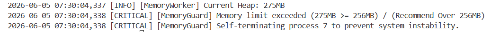

# docker build -t agent-leak-lab .

# docker run -d --name agent-leak-lab -p 15034:15034 agent-leak-lab  
docker rm -f agent-leak-lab
docker run -d --name agent-leak-lab -p 15034:15034 agent-leak-lab

docker ps -a
docker logs agent-leak-lab


### monitor.sh를 활용하여, 대상 프로세스(agent-leak-app)의 물리 메모리 사용량이 시간 경과에 따라 증가하는 패턴을 관측한다.

1. 기존 컨테이너 삭제
```
docker rm -f agent-leak-lab
```
2. 컨테이너 새로 실행
```
docker run -d --name agent-leak-lab -p 15034:15034 -e MEMORY_LIMIT=256 agent-leak-lab
 
 2-1.  docker run            : 새 컨테이너를 만들어 실행 
 2-2.  -d                    : 백 그라운드에서 실행
 2-3.  --name agent-leak-lab : 컨테이너 이름을 agent-leak-lab 으로 지정
 2-4.  -p 15034:15034        : 포트 연결 (-p 내PC포트:컨테이너포트)
 2-5.  -e MEMORY_LIMIT=256   : 환경변수를 컨테이너 실행 시점에 지정하는 옵션 (-e 환경변수이름=값)

 docker ps -a --filter "name=agent-leak-lab"  >> 현재 컨테이너 확인 방법
 docker start agent-leak-lab   >> 기존 컨테이너 실행 
```
3. 이미 실행중인 컨테이너 안에서 monitor.sh 를 백그라운드로 실행해서 관제로그를 남기는 명령
```
docker exec -d agent-leak-lab bash -lc "APP_NAME=agent-leak-app-x86 LOG_FILE=/home/agentuser/agent/logs/monitor-memory-256.log INTERVAL=2 ./monitor.sh"

3-1.   docker exec : 이미 실행 중인 컨테이너 안에서 명령을 실행
3-2.   -d          : 백그라운드 실행
3-3.   agent-leak-lab : 명령을 실행할 컨테이너 이름
3-4.   bash -lc "..." : 컨테이너 안에서 bash 쉘을 열고, 따옴표 안의 명령을 실행 하라는 뜻
3-4-1. "APP_NAME=agent-leak-app-x86 LOG_FILE=/home/agentuser/agent/logs/monitor-memory-256.log INTERVAL=2 ./monitor.sh"
       : 이 부분은 monitor.sh 실행하면서 임시 설정값 3개를 넘기는 것
         APP_NAME=agent-leak-app-x86  (감시할 프로그램 이름. monitor.sh 가 이 이름으로 PID를 찾음)
         LOG_FILE='/home/agentuser/agent/logs/monitor-memory-256.log' (관제 결과를 저장할 파일 위치)
         INTERVAL=2 (2초마다 한 번씩 기록하라는 뜻)
         ./monitor.sh (현재 폴더에 있는 monitor.sh를 실행)

즉, agent-leak-lab 컨테이너 안에서 monitor.sh를 백그라운드로 실행한다. 감시 대상은 agent-leak-app-x86이고, 2초마다 CPU/메모리 정보를 /home/agentuser/agent/logs/monitor-memory-256.log에 기록한다

3-5. docker exec agent-leak-lab bash -lc "cat /home/agentuser/agent/logs/monitor-memory-256.log"  (로그 확인)
3-6. docker cp agent-leak-lab:/home/agentuser/agent/logs/monitor-memory-256.log .\monitor-memory-256.log 
     (컨테이너가 꺼진 뒤에는 내PC로 복사)
```

4.
docker logs -f agent-leak-lab
docker exec agent-leak-lab bash -lc "cat /home/agentuser/agent/logs/monitor-memory-256.log"


### [프로세스가 예고 없이 중단되었을 때 프로그램 실행 로그를 분석하여 메모리 임계치 초과로 인해 애플리케이션의 메모리 보호 정책(MemoryGuard)에 따라 강제 종료되었음을 나타내는 핵심 로그를 식별한다.]

 
```
docker logs agent-leak-lab > memory-256-app.log
notepad .\memory-256-app.log

프로그램 실행 로그에서 `[MemoryGuard] Memory limit exceeded`와
`SELF-TERMINATED (Memory Limit Exceeded)` 메시지를 확인했다.
따라서 해당 종료는 단순 크래시가 아니라, 설정된 `MEMORY_LIMIT=256MB`를 초과한 뒤
애플리케이션 내부 MemoryGuard 정책에 의해 수행된 강제 종료로 판단된다.
```
