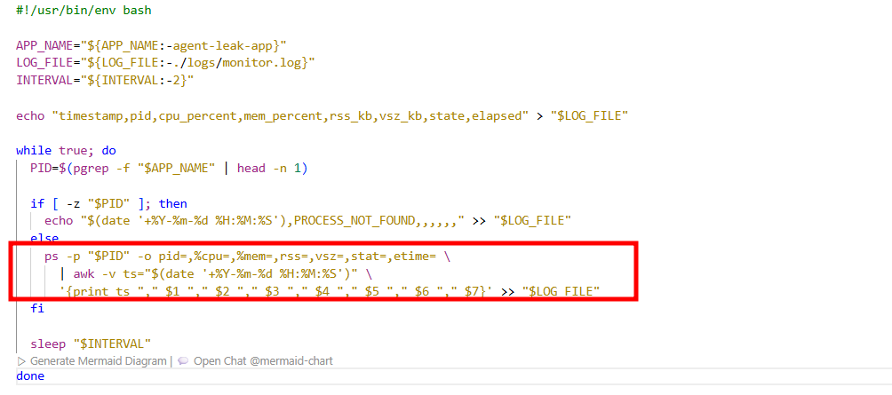
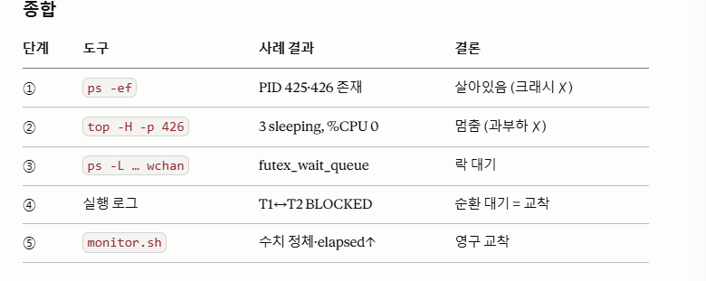

 [OOM] 메모리 사용량이 선형적으로 증가하다가 프로세스가 강제 종료되는 패턴이 로그에 기록되어 있는가?

 [OOM] 환경변수(MEMORY_LIMIT) 조정 후 프로세스 생존 시간이 늘어난 Before & After 비교 결과가 있는가?

 [CPU] CPU 사용률이 임계치를 초과하여 프로세스가 종료되는 패턴이 로그에 기록되어 있는가?

 [CPU] 환경변수(CPU_MAX_OCCUPY) 조정 후 프로세스 종료 여부/생존 시간이 변화한 Before & After 비교 결과가 있는가?

 [Deadlock] 프로세스가 살아있으나(PID 존재) CPU/메모리 변화 없이 로그가 멈춘 상태를 식별했는가?

 [Deadlock] 환경변수(MULTI_THREAD_ENABLE) 조정 후 데드락 재현/회피 비교 결과가 있는가?

 [Format] 3건의 리포트 모두 GitHub Issue 구조(현상 → 증거 → 원인 → 조치)를 갖추고 있는가?

 [Evidence] 리포트에 PID, 로그 타임스탬프, 핵심 로그 메시지가 포함된 증거(스크린샷 또는 로그 발췌)가 첨부되어 있는가?

---
■ monitor.sh에서 메모리 증가 패턴을 추적하기 위해 사용한 명령어와 데이터 추출 방법을 구체적으로 답변할 수 있는가?



```
 ① ps -p "$PID" -o pid=,%cpu=,%mem=,rss=,vsz=,stat=,etime= 이 프로세스($PID)의 통계를 지정한 순서대로 뽑습니다.

-p "$PID" → 이 PID 하나만 본다
-o ... → 출력할 항목을 직접 지정: pid(번호), %cpu, %mem, rss(물리메모리KB), vsz(가상메모리KB), stat(상태), etime(실행 경과시간)

각 항목 뒤의 = → 헤더(제목 줄)를 없애라는 뜻. 그냥 -o pid면 위에 PID라는 제목이 붙는데, pid=로 쓰면 값만 나옵니다.

→ 결과(위 ①):   519  0.0  0.0  1744  2704  S  00:00 — 공백으로 구분된 값들, 제목 없음.
② | awk -v ts="$(date ...)" '{print ts "," $1 ...}'
|(파이프)는 ①의 출력을 awk에게 넘깁니다. awk가 하는 일은 두 가지예요:
(a) 시간 변수 만들기 — -v ts="$(date '+%Y-%m-%d %H:%M:%S')"

$(date ...) → 지금 시각을 2026-06-22 05:51:00 형식 문자열로 만들고, 그걸 awk 변수 ts에 담습니다. (ps는 '현재 시각'을 못 주니, 여기서 직접 붙이는 것)

(b) 공백 → 콤마(CSV)로 재조립 — '{print ts "," $1 "," $2 ...}'

awk는 들어온 줄을 공백 기준으로 쪼개 $1~$7로 봅니다.
print ts "," $1 "," $2 ... → 시간부터 시작해 각 값을 콤마로 이어서 출력. 중간의 ","가 literal 콤마예요.

→ 결과(위 ②): 2026-06-22 05:51:00,519,0.0,0.0,1744,2704,S,00:00 — CSV 한 줄!
필드 대응:

awkps 항목CSV 컬럼ts(date)timestamp$1pidpid$2%cpucpu_percent$3%memmem_percent$4rssrss_kb$5vszvsz_kb$6statstate$7etimeelapsed

③ >> "$LOG_FILE"
>>는 파일 끝에 이어붙이기(append). 측정할 때마다 새 줄이 로그 아래에 쌓입니다. (헤더 줄은 루프 시작 전에 >로 한 번만 써둔 거고요.)
```   


■ 프로세스의 CPU 사용률을 확인하기 위해 선택한 도구와 적용한 옵션의 의미를 구분하여 서술할 수 있는가?
```
프로세스의 순간 CPU 사용률을 확인하려면 top을 주 도구로 선택합니다. ps도 CPU를 보여주지만, 둘은 측정 대상이 다릅니다.
```

|도구|측정하는 값|성격|
|---|---|---|
|ps의 %cpu|프로세스 생애 전체 평균 CPU|안정적이나 순간 변화에 둔함|
|top의 %CPU|직전 갱신 주기의 순간 CPU|실시간 변화를 포착|
---

→ 순간 부하(스파이크)를 봐야 하므로 **top**을 선택. ps는 누적·평균값이 필요하거나 한 줄로 빠르게 볼 때 보조로 씀.


 top 옵션

|옵션|의미|
|---|---|
|-b|batch 모드 — 대화형 화면을 끄고 텍스트로 출력 (파이프·파일용)|
|-n| <N>측정 횟수 (몇 번 찍을지)|
|-d| <초>측정 간격(delay)|
|-p| <PID>특정 프로세스만-H프로세스 내부의 스레드까지 펼쳐 표시|
|-o %CPUCPU |사용률 높은 순 정렬 (범인을 맨 위로)|
---

 ps 옵션

|옵션|의미|
|---|---|
|-p|<PID>특정 프로세스만|
|-o %cpu|출력 컬럼으로 CPU 사용률 지정|
|컬럼명=|컬럼 헤더(제목) 제거, 값만 출력|
---
```
 핵심 구분 — 같은 top이라도 옵션이 정확도를 가른다

top -b -n 1 (한 번 찍기) → 비교할 직전 측정이 없어, 특히 '일했다 쉬었다' 하는 프로세스에서 값이 0~수십%로 튐(복권).
top -b -n 2 -d 1 (1초 간격 두 번) → 두 번째 측정이 그 1초 동안의 평균이라 안정적·정확. 그래서 순간 CPU의 신뢰값은 이 '두 번째 블록'을 본다.

정리

도구 구분은 무엇을 재느냐 — ps(생애 평균) vs top(순간값).
옵션 구분은 어떻게 재느냐 — 횟수(-n), 간격(-d), 범위(-p), 스레드 전개(-H), 정렬(-o), 출력형식(-b).
```

■ 프로세스가 "살아있지만 멈춰있는 상태"를 진단하기 위해 어떤 도구를 어떤 순서로 사용했는지, 본인의 판단 흐름을 논리적으로 제시할 수 있는가?

```
① 죽었나? — ps -ef | grep agent-leak-app

실제 결과:
agentus+  425  162  ...  ./agent-leak-app-x86      ← 부모
agentus+  426  425  ...  ./agent-leak-app-x86      ← 자식 (PPID=425)

판단: PID 425·426이 존재한다 → 프로세스는 살아있다. TIME도 00:00:00이라 CPU도 거의 안 쓴다. → 크래시 배제.

② 바쁜가, 멈췄나? — top -H -p 426
실제 결과:
Threads: 3 total, 0 running, 3 sleeping
   426  S  0.0  ... 0:00.04 agent-leak-app-
   427  S  0.0  ... 0:00.00 agent-leak-app-
   428  S  0.0  ... 0:00.00 agent-leak-app-

판단: 스레드 3개가 전부 sleeping(0 running), %CPU 0.0. 일하느라 멈춘 게 아니다. → CPU 과부하 배제. → 여기서 "살아있지만 멈춤"이 확정됩니다.


③ 왜 멈췄나? — ps -L -p 426 -o pid,tid,%cpu,stat,wchan
실제 결과:
426  426  0.0 SNl+ futex_wait_queue
426  427  0.0 SNl+ futex_wait_queue
426  428  0.0 SNl+ futex_wait_queue

판단: WCHAN=futex_wait_queue (전부) → futex는 락(뮤텍스)의 커널 대기 지점. 단순 sleep이 아니라 락을 기다리며 멈춤임을 OS에서 확인.


④ 무슨 교착인가? — 프로그램 실행 로그
실제 결과(04:34:43~45):
43,637 [Thread-1] LOCK ACQUIRED: [Shared_Memory_A]   ← A 보유
43,639 [Thread-2] LOCK ACQUIRED: [Socket_Pool_B]     ← B 보유
45,650 [Thread-1] Need [Socket_Pool_B]               ← B 필요(T2가 점유)
45,650 [Thread-2] Need [Shared_Memory_A]             ← A 필요(T1이 점유)
45,651 [Thread-1] WAITING ... (BLOCKED)
45,651 [Thread-2] WAITING ... (BLOCKED)
판단: T1은 A 쥐고 B 대기, T2는 B 쥐고 A 대기 → 순환 대기 = 교착(Deadlock) 확정.


⑤ 영구적인가? — monitor.sh 재측정 / 시간차 비교
실제 결과(monitor.log, 약 40초):
05:11:46,425,0.0,0.0,2048,2984,S+,36:06
   ... (cpu·mem·rss·vsz 전부 고정) ...
05:12:25,425,0.0,0.0,2048,2984,S+,36:44   ← elapsed만 증가
게다가 top -H -p 426을 04:46·04:57 두 번 찍어도 TIME+ 0:00.04로 동일.

판단: 시간이 지나도 모든 수치가 정체, elapsed만 늘어남 → 일시적 지연이 아니라 영구 교착 확정.
```


---

■ 메모리 누수가 발생했을 때 애플리케이션의 메모리 보호 정책이 해당 프로세스를 강제 종료하는 이유를 설명할 수 있는가?
```
메모리 누수가 왜 위험한가
메모리 누수 = 프로세스가 메모리를 계속 할당받기만 하고 반납하지 않는 것. RSS가 시간에 따라 끝없이 증가합니다(monitor.sh의 rss_kb 우상향). 

이걸 그대로 두면:
시스템 전체 메모리 고갈 — 누수 프로세스 하나가 RAM을 다 먹으면, 다른 정상 프로세스와 OS 자신도 쓸 메모리가 없어진다. 한 앱의 문제가 시스템 전체로 번진다.

스왑 폭주 → 시스템 마비(thrashing) — RAM이 차면 OS가 메모리를 디스크(swap)로 밀어내는데, 디스크는 RAM보다 수백~수천 배 느려서 시스템 전체가 기어가게 된다.

OS의 OOM Killer가 무차별 개입 — 끝까지 방치하면 결국 리눅스 커널의 OOM Killer가 아무 프로세스나 골라 SIGKILL로 즉살한다. 누가·언제 죽을지 통제 불가, 정리(cleanup)도 없음.

그래서 MemoryGuard가 강제 종료하는 이유
애플리케이션의 메모리 보호 정책(MemoryGuard)은 자기 RSS가 임계치를 넘으면, 시스템 전체가 위험해지기 전에 선제적으로 그 프로세스를 종료합니다.

예방·격리 — 문제는 누수 프로세스 하나뿐. 그것만 끄면 나머지 시스템은 멀쩡하다. 피해 범위(blast radius)를 최소화.

통제된 종료 — 정해진 임계치에서 (이상적으로) SIGTERM으로 우아하게 종료 → 리소스 반납·로그 기록 가능. 커널 OOM Killer의 무자비한 SIGKILL과 대비된다.
예측·진단 가능 — "MemoryGuard: 한계 초과 → 종료" 같은 명확한 로그를 남겨, 원인을 즉시 알 수 있다.

즉, 
메모리 누수를 방치하면 RSS가 무한 증가해 시스템 전체 메모리를 고갈시키고, 결국 OS OOM Killer가 통제 불가능하게 임의의 프로세스를 종료한다. 애플리케이션의 MemoryGuard는 이를 예방하기 위해, 누수 프로세스가 정해진 임계치를 넘는 순간 선제적·통제된 방식으로 해당 프로세스만 종료하여 시스템 전체의 안정성을 보호한
```

■ CPU 과점유 시 단일 프로세스를 종료하는 것이 시스템 보호에 왜 필요한지 근거를 제시할 수 있는가?
```
CPU는 시간 공유 자원이라 한 프로세스의 과점유가 다른 모든 프로세스를 기아 상태로 만들어 시스템 전체 응답성을 떨어뜨린다. 게다가 메모리의 OOM Killer와 달리 OS는 CPU 폭주 프로세스를 종료해주지 않으므로, 방치하면 시스템은 영구히 저하된다. 따라서 애플리케이션 Watchdog이 임계치에서 해당 단일 프로세스를 선제적·통제된 방식으로 종료하는 것은, 피해를 그 프로세스에 격리하고 시스템 전체의 응답성을 즉시 회복시키는 시스템 보호의 필수 조치다.
```

■ 교착 상태(Deadlock)가 발생하는 원리를 "상호 배제"와 "순환 대기" 개념으로 설명할 수 있는가?

```
상호 배제는 락을 한 스레드만 점유하게 하여 '기다림'을 강제하고, 순환 대기는 그 기다림이 닫힌 고리를 이루게 한다. 두 조건이 결합하면, 배타적으로 점유된 락은 누군가 놓아야만 풀리는데 고리 안의 모두가 서로를 기다려 아무도 놓지 못하므로, 시스템은 외부 개입 없이는 영구히 멈춘다. (본 사례: T1=A 점유·B 대기, T2=B 점유·A 대기)
```

■ 로그에서 스레드 간 순환 의존 관계(A→B, B→A)를 어떻게 파악했는지 추적 과정을 설명할 수 있는가?
```
① 스레드별로 분리 (grep)
뒤섞인 로그를 행위자별로 가르니, 각 스레드의 '이야기'가 한 줄로 보입니다.
Thread-1
Attempting to lock [Shared_Memory_A]...
LOCK ACQUIRED: [Shared_Memory_A]. (Holding...)
Processing critical data in Memory A...
Need resource [Socket_Pool_B] to finish job.
WAITING for [Socket_Pool_B]... (BLOCKED)
Thread-2
Attempting to lock [Socket_Pool_B]...
LOCK ACQUIRED: [Socket_Pool_B]. (Holding...)
Establishing network connections in Pool B...
Need resource [Shared_Memory_A] to write logs.
WAITING for [Shared_Memory_A]... (BLOCKED)

② '보유' 추출 — LOCK ACQUIRED

T1: LOCK ACQUIRED: [Shared_Memory_A] → A 보유
T2: LOCK ACQUIRED: [Socket_Pool_B] → B 보유

③ '요청' 추출 — Need / WAITING for

T1: Need [Socket_Pool_B] → WAITING for [Socket_Pool_B] → B 요청
T2: Need [Shared_Memory_A] → WAITING for [Shared_Memory_A] → A 요청

④ 교차 대조 (핵심) — "원하는 걸 누가 쥐고 있나?"
스레드보유요청그 자원 보유자→ 대기 대상Thread-1A (Memory)B (Socket)Thread-2T2 기다림Thread-2B (Socket)A (Memory)Thread-1T1 기다림
T1이 원하는 B는 T2가 쥐고, T2가 원하는 A는 T1이 쥐고 있죠.

⑤ 고리 확인 → 순환 의존 (A→B, B→A)
대기 방향을 이으면 T1 → T2 → T1 닫힌 고리. 잠금 순서로 보면 T1은 A→B, T2는 B→A — 정반대 순서라 고리가 닫힙니다. 이게 바로 순환 의존이에요.

⑥ 시각·상태로 '동시·영구' 확인
두 스레드 모두 **같은 시각 45,651**에 Status: BLOCKED에 도달했고, 그 뒤로 로그가 끊깁니다 → 동시에·영구히 멈춤.

정리 

04:34:45 로그를 스레드별로 분리해(grep), LOCK ACQUIRED로 보유 자원을(T1=A, T2=B), Need/WAITING for로 요청 자원을(T1→B, T2→A) 추출했다. 교차 대조 결과 T1이 원한 B는 T2가, T2가 원한 A는 T1이 점유 중이어서 T1→T2→T1의 순환 의존(A→B, B→A)이 확인되었고, 동일 시각 BLOCKED와 이후 로그 정지가 영구 교착을 뒷받침한다.
```

---
■ 만약 이번 미션의 agent-leak-app이 실제 운영 서버에서 동작하고 있었다면, 메모리 누수를 장애 발생 전에 탐지하기 위해 현재의 monitor.sh를 어떻게 개선하겠는가?
```
현재 monitor.sh는 사후 '기록'에 머무르므로, 
(1) 하드 한계 이전의 소프트 임계치 경보, 
(2) RSS 단조 증가 추세 감지, 
(3) 자동 알림을 더해 '사전 탐지'로 전환한다.

```

■ 이번 미션에서 겪은 3가지 장애(OOM, CPU Spike, Deadlock) 중 실제 서비스 환경에서 가장 치명적인 것은 무엇이라고 생각하는가?
```
세 장애를 감지 난이도·자동 복구·영향 범위로 비교하면, Deadlock이 가장 치명적이라고 본다. 프로세스가 살아있어 헬스체크를 통과하고(은밀함), 외부 개입 없이는 복구되지 않으며(자가복구 불가), 다운 없이 서비스가 서서히 마비되기 때문이다
```

■ 그 이유와 함께, 해당 장애를 근본적으로 예방하는 방법을 제안할 수 있는가?
```
Deadlock은 4대 조건이 모두 성립할 때만 발생하므로, 그중 **순환 대기를 차단하는 '락 획득 순서 통일(Lock Ordering)'**이 가장 직접적인 근본 예방책이

Deadlock 4대조건
① 상호 배제 (Mutual Exclusion)
자원은 한 번에 한 명만 쓸 수 있다(배타적). → 칼은 한 사람만 쥘 수 있다.

사례: LOCK ACQUIRED — 락은 배타적이라 한 스레드만 점유.
② 점유 대기 (Hold and Wait)
자원을 쥔 채로 다른 자원을 기다린다(안 놓고 기다림). → 칼을 쥔 채 도마를 기다린다.

사례: Thread-1이 A를 Holding하면서 B를 WAITING.
③ 비선점 (No Preemption)
쥔 자원을 강제로 뺏을 수 없다(본인이 놔야만 풀림). → 남이 쥔 칼을 억지로 못 뺏는다.

사례: 두 스레드 모두 BLOCKED, 누구도(OS조차) 락을 강제 회수 안 함.
④ 순환 대기 (Circular Wait)
대기 관계가 닫힌 고리를 이룬다. → 1번은 2번이 쥔 걸, 2번은 1번이 쥔 걸 기다린다.

사례: Thread-1→B(T2 보유), Thread-2→A(T1 보유) = 고리.
```


■ 만약 동일한 서버에서 OOM과 Deadlock이 동시에 발생했다면, 어떤 순서로 트러블슈팅을 진행하겠는가? 
```
동시 발생 시에는 '가장 치명적인 것'이 아니라 '가장 빠르게 번지고 시스템 전체를 위협하는 것'을 먼저 안정화한다. OOM은 시스템 전체 메모리를 고갈시켜 진단 자체를 위협하는 '움직이는 불'이고, Deadlock은 CPU·메모리가 정체된 '얼어붙은' 상태로 악화되지 않는다. 
따라서 Deadlock 증거를 수초 안에 스냅샷 → OOM 먼저 안정화 → Deadlock 복구·분석 → 인과관계 규명 순으로 진행한다.
```

■ 우선순위 판단의 근거를 설명할 수 있는가?
```
우선순위는 **'무엇이 더 나쁜가(severity)'가 아니라 '무엇을 지금 안 잡으면 더 커지는가(urgency)'**로 판단했다. 
OOM은 ① 시스템 전체로 번지고 ② 빠르게 악화되며 ③ 진단 능력(SSH·도구·OS)까지 위협하고 ④ 다른 장애 판단을 흐리므로 먼저 안정화한다. 

단 ⑤ Deadlock의 frozen 상태는 재시작 시 사라지는 휘발성 증거이므로, OOM 조치 직전에 수초 내 스냅샷으로 확보한다.
```

■ 이번 미션의 환경변수 조정은 임시 조치였다. 만약 소스 코드를 직접 수정할 수 있다면, 각 장애 유형별로 어떤 코드 레벨의 개선을 하겠는가?

```
① OOM (메모리 누수)
임시: MEMORY_LIMIT 조정 → 시나리오 회피·한계 이동 (누수는 그대로)
근본 (코드):

누수 지점 제거 — 안 쓰는 객체·버퍼·연결을 명시적으로 해제. 무한히 쌓이는 컬렉션/캐시 정리.
자원 수명 보장 — with/try-finally(RAII)로 항상 닫기·해제. 전역 리스트·캐시에 참조를 남기지 않기.
경계 설정 — 캐시·큐에 최대 크기 + LRU 축출 → 압력이 와도 무한 증가 불가.
백프레셔 — 생산 > 소비면 무한 버퍼링 대신 흐름 제어.

pythonclass BoundedCache(OrderedDict):           # 무한 증가 방지
    def __setitem__(self, k, v):
        super().__setitem__(k, v)
        if len(self) > self.maxsize:
            self.popitem(last=False)        # 오래된 것 자동 축출

② CPU Spike (CPU 과점유)
임시: CPU_MAX_OCCUPY 조정 → WARNING 여부·Watchdog 임계 이동 (폭주는 그대로)
근본 (코드):

busy-wait 제거 — 바쁜 폴링 루프를 이벤트 기반/블로킹 대기로(epoll·select·condition variable·async). 일이 없을 땐 잠들게.
양보·청크 처리 — 긴 연산을 쪼개고 사이에 yield/await. 작업당 CPU 예산·레이트리밋.
알고리즘 효율화 — O(n²)→O(n log n) 등 근본 비용 절감.

python# 나쁨: while True:  if has_work(): do()     ← CPU 100% 폴링(스핀)
# 좋음: item = queue.get(); do(item)         ← 일 생길 때까지 블로킹(=잠듦)

③ Deadlock (교착)
임시: MULTI_THREAD_ENABLE=False → 동시성 기능 자체를 끔 (회피)
근본 (코드):

Lock Ordering — 전역 락 획득 순서 통일(항상 A→B) → 순환 대기 구조적 차단.
try-lock + 타임아웃 — 못 얻으면 쥔 락도 풀고 재시도(비선점·점유대기 깸).
락 최소화 — A·B를 하나로 통합하거나 lock-free/원자적 자료구조.
고수준 추상화 — 공유 가변 상태 대신 메시지 패싱·채널·액터 모델.

python# 모든 스레드가 같은 순서로만 잠금 (Lock Ordering)
with lock_A:
    with lock_B:
        ...

```
■ 다시 이 미션을 처음부터 수행한다면, 트러블슈팅 과정에서 어떤 점을 다르게 접근하겠는가?

```
다시 한다면 **'도구부터 치는 방식'에서 '대상과 도구를 먼저 이해하고 가설-배제로 직행하는 방식'**으로 바꾸겠다. 
구체적으로 (1) 앱 구조·도구 특성 선파악, 
           (2) 이상한 결과는 도구를 먼저 의심, 
           (3) 자체 보고는 OS 실측으로 교차검증, 
           (4) 2터미널·휘발성 증거 선확보, 
           (5) 크래시/과부하/멈춤 배제법을 처음부터 적용. 이 다섯이 트러블슈팅을 '시행착오'에서 '체계적 진단'으로 
```
