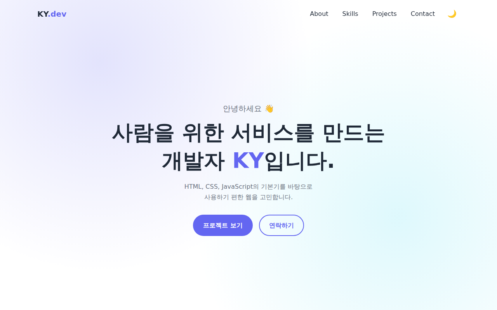
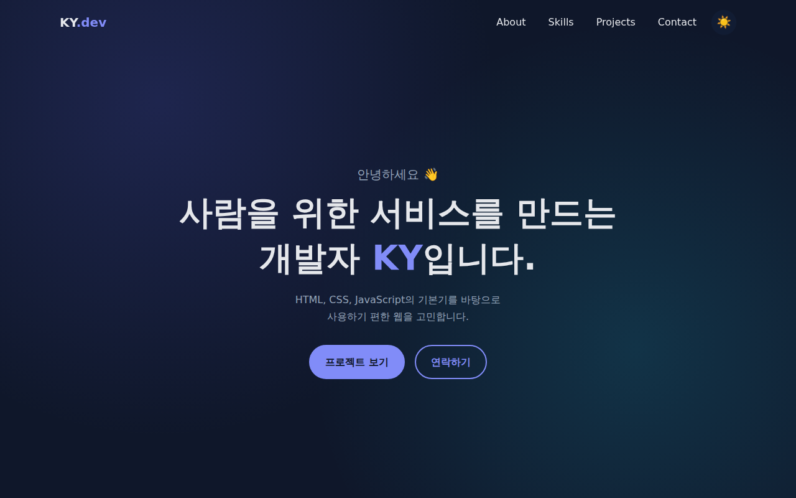
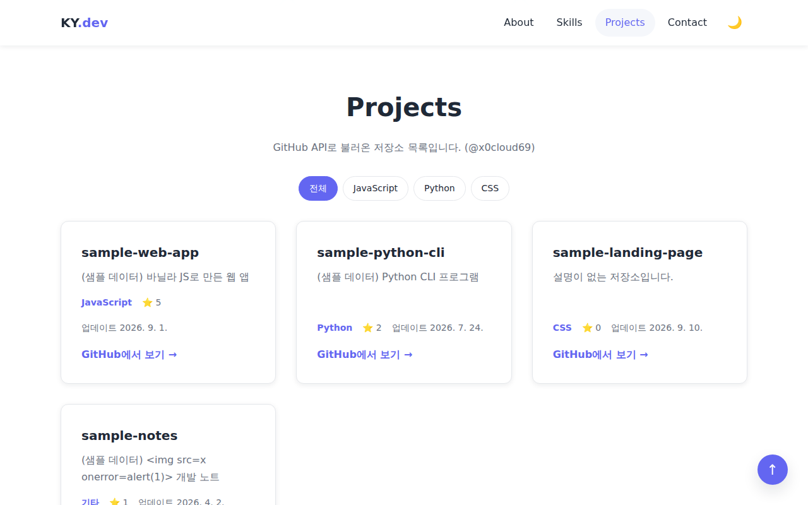
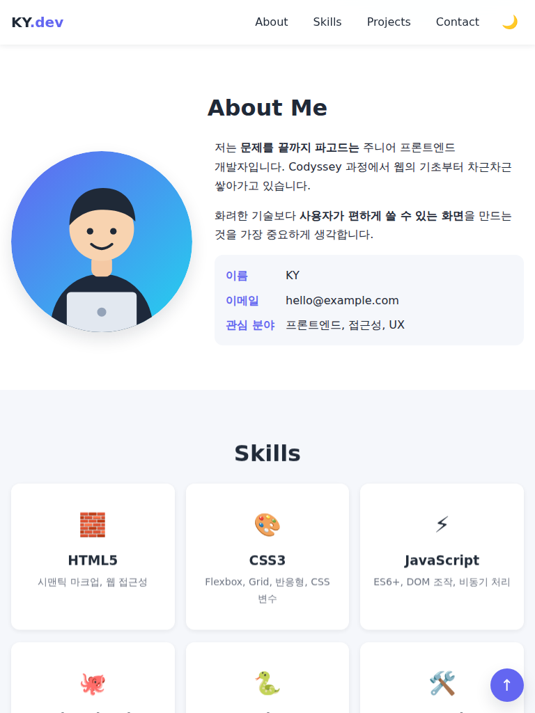
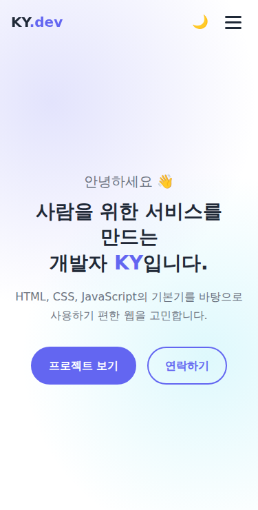
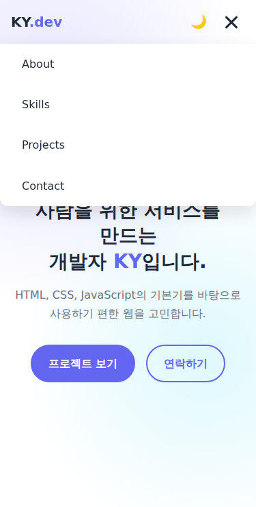
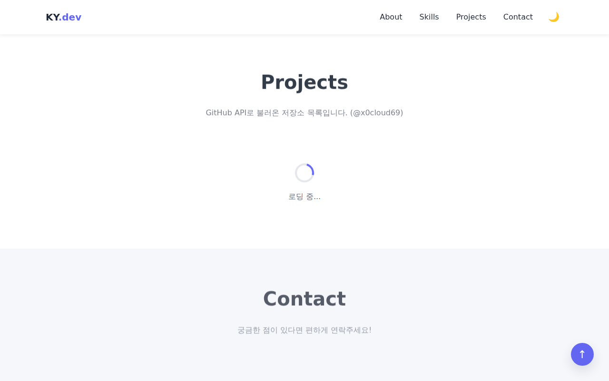
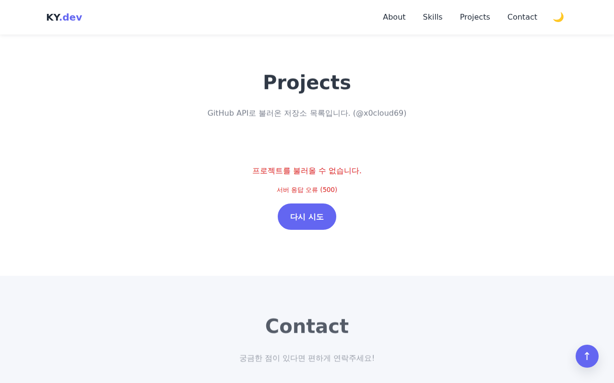
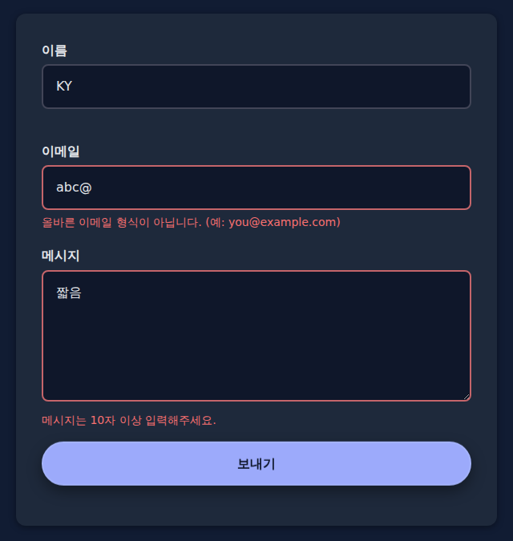

# KY Portfolio

외부 라이브러리 없이 **순수 HTML / CSS / JavaScript**로 만든 반응형 포트폴리오 웹사이트입니다.
GitHub API로 저장소 목록을 불러와 Projects 섹션에 보여주고, 로딩 · 에러 · 빈 상태를 화면으로 처리합니다.

- **배포 URL** : https://x0cloud69.github.io/portfolio/
  > 저장소 이름을 `portfolio`로 만들었을 때의 주소입니다. 저장소 이름이 다르면 `https://x0cloud69.github.io/저장소이름/` 으로 바뀝니다.

<br />

## 1. 주요 기능

| 구분 | 기능 |
| --- | --- |
| 반응형 | 모바일 퍼스트, 브레이크포인트 768px(태블릿) / 1024px(데스크톱) |
| 네비게이션 | 앵커 링크 + 부드러운 스크롤, 모바일 햄버거 메뉴 |
| 스크롤 | 헤더 배경 변경, 맨 위로 버튼, 스크롤 등장 애니메이션 |
| 다크 모드 | 토글 버튼, 로컬스토리지 저장 (새로고침 후에도 유지) |
| Projects | GitHub API 연동, 언어별 필터, 로딩 / 성공 / 에러(재시도) / 빈 상태 |
| Contact | 필수값 · 이메일 형식 · 최소 글자 수 검사, 입력칸 아래 에러 메시지, 성공 메시지 |

<br />

## 2. 동작 기준값

`js/main.js` 맨 위 `CONFIG` 객체에서 바꿀 수 있습니다.

| 항목 | 값 | 설명 |
| --- | --- | --- |
| `HEADER_SCROLL_OFFSET` | **60px** | 이 값 이상 스크롤하면 헤더 배경색이 바뀝니다 |
| `SCROLL_TOP_OFFSET` | **300px** | 이 값 이상 스크롤하면 "맨 위로" 버튼이 나타납니다 |
| `REVEAL_THRESHOLD` | **0.2** | 요소가 20% 이상 보이면 등장 애니메이션이 실행됩니다 (Intersection Observer) |
| `GITHUB_USER` | `x0cloud69` | 저장소를 불러올 GitHub 아이디 |

<br />

## 3. 사용 기술

- **HTML5** : 시맨틱 태그(`header`, `nav`, `main`, `section`, `article`, `footer`), `label for`–`id` 연결, `alt` 속성, `aria-*` 속성
- **CSS3** : CSS 변수(`:root`, `[data-theme="dark"]`), Flexbox(네비게이션), Grid(`auto-fit` + `minmax`), 미디어 쿼리, `transition`, `@keyframes`
- **JavaScript (ES6+)** : `const`/`let`, 화살표 함수, 템플릿 리터럴, 구조분해 할당, 스프레드 문법, `map`/`filter`/`forEach`, `fetch` + `async`/`await`, `try`/`catch`, Intersection Observer, localStorage
- **개발 환경** : VS Code + Live Server
- **배포** : GitHub Pages

<br />

## 4. 폴더 구조

```
Task6/
├── index.html          # 메인 페이지 (구조)
├── css/
│   └── style.css       # 스타일 (디자인 · 반응형 · 다크 모드)
├── js/
│   └── main.js         # 동작 (이벤트 · 상태 · API)
├── images/
│   ├── profile.svg     # 프로필 이미지
│   ├── favicon.svg     # 파비콘
│   └── screenshots/    # README용 스크린샷
├── README.md
└── QnA.md              # 평가 Q&A 대비 정리
```

<br />

## 5. 실행 방법

1. VS Code에서 `Task6` 폴더를 엽니다.
2. 확장 프로그램 **Live Server**를 설치합니다.
3. `index.html`에서 마우스 오른쪽 클릭 → **Open with Live Server**
4. 브라우저가 `http://127.0.0.1:5500` 으로 열리고, 저장할 때마다 자동 새로고침됩니다.

> `index.html`을 더블클릭(`file://`)으로 열어도 대부분 동작하지만, 실제 배포 환경과 같게 확인하려면 Live Server를 사용하세요.

<br />

## 6. 배포 방법 (GitHub Pages)

```bash
# 1) Task6 폴더에서 Git 시작
git init
git add .
git commit -m "feat: 반응형 포트폴리오 웹사이트"

# 2) GitHub에서 portfolio 저장소를 만든 뒤 연결
git branch -M main
git remote add origin https://github.com/x0cloud69/portfolio.git
git push -u origin main
```

3. GitHub 저장소 → **Settings** → **Pages**
4. Source : **Deploy from a branch** / Branch : **main**, 폴더 **/(root)** → **Save**
5. 1~2분 뒤 `https://x0cloud69.github.io/portfolio/` 에서 접속 확인

> 경로는 모두 상대 경로(`css/style.css`, `js/main.js`)로 작성해서 `/portfolio/` 하위 주소에서도 깨지지 않습니다.

<br />

## 7. 스크린샷

> 아래 Projects 화면은 로컬 테스트용 **샘플 데이터**로 촬영했습니다. 배포 후 실제 화면으로 교체하세요.

### 데스크톱

| 라이트 모드 | 다크 모드 |
| --- | --- |
|  |  |



### 태블릿 / 모바일

| 태블릿 (768px) | 모바일 (375px) | 모바일 메뉴 열림 |
| --- | --- | --- |
|  |  |  |

### 상태 처리 & 폼 검사

| 로딩 상태 | 에러 상태 | 폼 유효성 검사 |
| --- | --- | --- |
|  |  |  |

<br />

## 8. 상태 → 렌더링 흐름

| 기능 | 사용자 이벤트 | 상태 변수 | 화면 갱신 함수 |
| --- | --- | --- | --- |
| 다크 모드 | 토글 버튼 `click` | `theme` | `renderTheme()` |
| Projects | 페이지 로드 / 재시도 `click` | `projectState.status` | `renderProjects()` |
| 언어 필터 | 필터 버튼 `click` | `projectState.filter` | `renderProjects()` |
| 문의 폼 | `input` / `blur` / `submit` | `formErrors` | `renderFieldError()` |

<br />

## 9. 알려진 한계 & 개선 아이디어

- 문의 폼은 서버가 없어 실제로 전송되지 않습니다. (Formspree, EmailJS 등으로 확장 가능)
- GitHub API는 로그인 없이 **시간당 60회**까지만 호출할 수 있어, 초과 시 에러 상태가 표시됩니다.
- JS가 `defer`로 실행되기 때문에, 다크 모드 사용자는 새로고침 순간 아주 잠깐 밝은 화면이 보일 수 있습니다.
