# Task7 — AWS VPC 기반 웹 서비스 인프라

VPC로 격리된 네트워크(Public Subnet + IGW + Route Table)에 EC2(Nginx) 웹 서버를 배포하고,
보안 그룹·IAM 최소권한을 적용한 뒤 외부 접속 검증 · 트러블슈팅 · 리소스 정리까지 수행한다.

## 외부 접속 검증

| 항목 | 내용 |
|---|---|
| **선택 방식** | **(B) `GET http://3.36.131.116/health`** → `200 OK` + 고정 응답 `OK` |
| 접속 정보 | `http://3.36.131.116/health` (실습 당시 퍼블릭 IP · 리소스 정리 후에는 접속 불가) |
| 참고 | 같은 서버에서 `http://3.36.131.116/` 접속 시 "Hello Cloud" 페이지도 표시됨 |
| 증빙 | 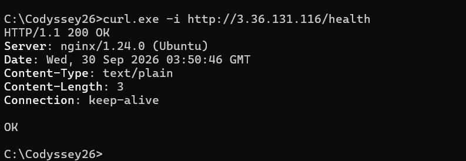 |

```text
$ curl -i http://3.36.131.116/health
HTTP/1.1 200 OK
Server: nginx/1.24.0 (Ubuntu)
Content-Type: text/plain

OK
```

---

## 제출물

| 결과물 | 경로 |
|---|---|
| 아키텍처 다이어그램 | [`docs/architecture.png`](docs/architecture.png) |
| 외부 접속 증빙 | 이 README + `docs/screenshots/external-health.png` |
| 트러블슈팅 보고서 | [`docs/troubleshooting.md`](docs/troubleshooting.md) |
| 리소스 정리 체크리스트 | [`docs/cleanup-checklist.md`](docs/cleanup-checklist.md) |

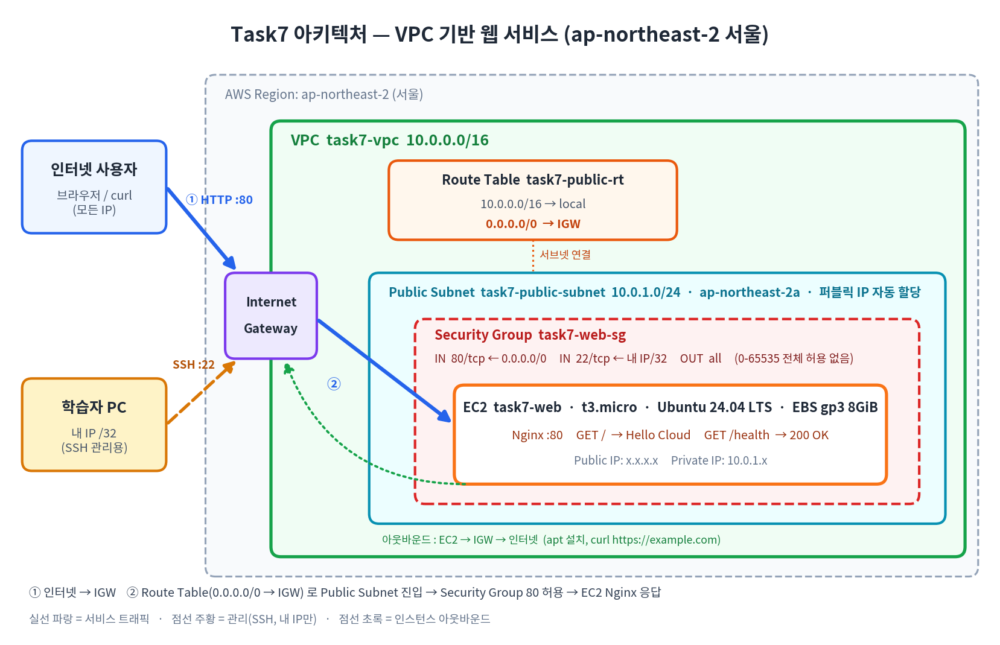

## 폴더 구조

```text
Task7/
├── README.md
├── 문제.md                              # 과제 원문 정리
├── docs/
│   ├── aws-setup.md                     # 0단계: AWS 계정·IAM·도구 준비
│   ├── architecture.png                 # 아키텍처 다이어그램
│   ├── troubleshooting.md               # 트러블슈팅 보고서
│   ├── cleanup-checklist.md             # 리소스 정리 체크리스트
│   └── screenshots/                     # 증빙 스크린샷 저장 위치
├── iam/
│   └── task7-least-privilege-policy.json  # IAM 최소권한 정책
├── scripts/
│   ├── setup-server.sh                  # EC2 user-data: Nginx + / + /health
│   ├── verify-instance.sh               # EC2 내부 점검 (아웃바운드/localhost 200/health)
│   ├── verify-external.ps1              # 내 PC(Windows) 외부 접속 검증
│   └── verify-external.sh               # 내 PC(macOS/Linux/Git Bash) 외부 접속 검증
└── infra/
    ├── provision.sh                     # AWS CLI로 전체 인프라 생성
    └── cleanup.sh                       # 역순 삭제 + 잔존 리소스 검증
```

---

## 구성 요약

| 구분 | 설정 |
|---|---|
| 리전 | `ap-northeast-2` (서울) |
| VPC | `task7-vpc` · `10.0.0.0/16` · DNS hostnames 활성화 |
| Public Subnet | `task7-public-subnet` · `10.0.1.0/24` · `ap-northeast-2a` · 퍼블릭 IP 자동 할당 |
| Internet Gateway | `task7-igw` · VPC에 Attach |
| Route Table | `task7-public-rt` · `0.0.0.0/0 → IGW` · Public Subnet 연결 |
| Security Group | `task7-web-sg` · IN `80 ← 0.0.0.0/0` · IN `22 ← 내 IP/32` · (전체 포트 허용 규칙 없음) |
| EC2 | `task7-web` · `t3.micro` · Ubuntu 24.04 LTS · EBS gp3 8GiB (종료 시 삭제) · IMDSv2 필수 |
| 웹 서버 | Nginx · `GET /` → Hello Cloud 페이지 · `GET /health` → `200 OK` |
| IAM | 사용자 `task7-user` 1명 · 정책 `Task7LeastPrivilege` (EC2/VPC/SG 한정, 서울 리전 한정) |

---

## 진행 절차

### 0단계. AWS 환경 구축 (계정이 없다면 여기부터)

👉 **[`docs/aws-setup.md`](docs/aws-setup.md)** 를 따라 진행한다.

| 순서 | 내용 | 사용 계정 |
|---|---|---|
| A | AWS 계정 가입 (Free plan) | 루트 |
| B | 루트 계정 MFA 설정 | 루트 |
| C | 과금 알림 (Zero spend budget) | 루트 |
| D | IAM 정책 `Task7LeastPrivilege` + 사용자 `task7-user` 생성 | 루트 |
| E | `task7-user` 로 로그인, 서울 리전 선택 | **task7-user (이후 계속)** |
| F | 내 PC 도구 확인 (SSH, CLI는 선택) | — |

### 1단계. IAM 최소권한 확인

> 루트 계정은 0단계 초기 설정(계정 보안·IAM 사용자 생성)에만 사용하고, 실습은 `task7-user` 로만 진행한다.

- `task7-user` 에 연결된 정책이 `Task7LeastPrivilege` **1개뿐**인지 확인 (`AdministratorAccess` 없음) → 캡처 `docs/screenshots/iam-policy_1.png`, `iam-policy_2.png`
- 정책 원본: [`iam/task7-least-privilege-policy.json`](iam/task7-least-privilege-policy.json) — 생성 방법은 [`docs/aws-setup.md`](docs/aws-setup.md) D 참고

**정책 설계 포인트**

| Statement | 허용/거부 | 이유 |
|---|---|---|
| `ReadOnlyEc2VpcInSeoul` | `ec2:Describe*` 등 조회 | 콘솔 화면 표시에 필요 |
| `NetworkVpcSubnetIgwRoute` | VPC/Subnet/IGW/Route 생성·연결·삭제 | 네트워크 구성 |
| `SecurityGroup` | SG 생성·규칙 추가/삭제 | 접근 제어 |
| `ComputeInstanceKeyVolumeEip` | 인스턴스·키페어·볼륨·EIP·태그 | 컴퓨트 및 정리 |
| `ResolvePublicAmiIdsFromSsm` | AWS 공개 AMI 파라미터 조회만 | 최신 Ubuntu AMI 조회 |
| `DecodeIamDenyMessages…` | 권한 오류 메시지 디코딩 | 트러블슈팅 근거 확보 |
| `DenyNonFreeTierInstanceTypes` | **거부**: `t2/t3.micro` 외 타입 | 과금 방지 |
| `DenyLargeVolumes` | **거부**: 10GiB 초과 볼륨 | 과금 방지 |
| (공통 조건) | `aws:RequestedRegion = ap-northeast-2` | 서울 외 리전 사용 차단 |
| (없음) | S3 / RDS / IAM 등 | 실습과 무관 → 부여하지 않음 |

### 2단계. 인프라 생성 — 둘 중 하나 선택

#### 방법 A. 콘솔 (권장: 과정을 눈으로 이해)

1. **VPC** 생성: `task7-vpc`, `10.0.0.0/16` → Actions → Edit VPC settings → DNS hostnames 활성화

   <details>
   <summary>상세 절차 (클릭)</summary>

   **(0) 리전 확인** — 콘솔 우측 상단 리전이 **아시아 태평양(서울) `ap-northeast-2`** 인지 확인

   **(1) VPC 생성**
   1. 상단 검색창 `VPC` → **VPC** 서비스 → 왼쪽 **Your VPCs(VPC)** → **Create VPC(VPC 생성)**
   2. 설정 입력

      | 항목 | 값 |
      |---|---|
      | Resources to create (생성할 리소스) | **VPC only (VPC만)** |
      | Name tag (이름 태그) | `task7-vpc` |
      | IPv4 CIDR block | IPv4 CIDR manual input (수동 입력) |
      | IPv4 CIDR | `10.0.0.0/16` |
      | IPv6 CIDR block | No IPv6 CIDR block |
      | Tenancy (테넌시) | Default (기본값) |

   3. **Create VPC** 클릭

   > ⚠️ *VPC and more(VPC 등)* 를 선택하면 서브넷·라우팅 테이블·NAT 등이 자동 생성된다. 이후 단계에서 직접 만들므로 **VPC only** 선택.

   **(2) DNS hostnames 활성화**
   1. `task7-vpc` 선택 → 우측 상단 **Actions(작업)** → **Edit VPC settings(VPC 설정 편집)**
   2. DNS settings
      - ☑ Enable DNS resolution (DNS 확인 활성화) — 기본값으로 체크됨
      - ☑ **Enable DNS hostnames (DNS 호스트 이름 활성화)** — **체크**
   3. **Save(저장)**

   **(3) 확인** — VPC **Details** 탭에서 `DNS hostnames: Enabled` 확인

   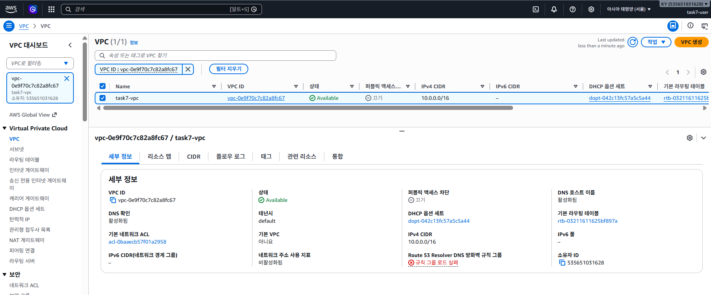

   > DNS hostnames 를 켜야 퍼블릭 IP를 받은 EC2에 `ec2-x-x-x-x.ap-northeast-2.compute.amazonaws.com` 형태의 퍼블릭 DNS 이름이 부여된다.

   </details>

2. **Subnet** 생성: `task7-public-subnet`, `10.0.1.0/24`, `ap-northeast-2a` → Edit subnet settings → *Enable auto-assign public IPv4* 체크

   <details>
   <summary>상세 절차 (클릭)</summary>

   **(1) 서브넷 생성**
   1. VPC 콘솔 왼쪽 **Subnets(서브넷)** → **Create subnet(서브넷 생성)**
   2. **VPC ID** 에서 **`task7-vpc`** 선택 (선택해야 아래 입력란이 나타남)
   3. Subnet settings(서브넷 설정)

      | 항목 | 값 |
      |---|---|
      | Subnet name (서브넷 이름) | `task7-public-subnet` |
      | Availability Zone (가용 영역) | 아시아 태평양(서울) / `ap-northeast-2a` |
      | IPv4 VPC CIDR block | `10.0.0.0/16` (자동 선택) |
      | IPv4 subnet CIDR block | `10.0.1.0/24` |

   4. **Create subnet** 클릭

   > ⚠️ VPC ID를 기본 VPC(`172.31.0.0/16`)로 잘못 선택하는 실수가 가장 흔하다. 반드시 `task7-vpc` 확인.

   **(2) 퍼블릭 IPv4 자동 할당 활성화**
   1. `task7-public-subnet` 선택 → **Actions(작업)** → **Edit subnet settings(서브넷 설정 편집)**
   2. Auto-assign IP settings → ☑ **Enable auto-assign public IPv4 address (퍼블릭 IPv4 주소 자동 할당 활성화)**
   3. **Save(저장)**

   **(3) 확인** — 서브넷 **세부 정보** 탭

   | 항목 | 기대값 |
   |---|---|
   | VPC | `task7-vpc` |
   | IPv4 CIDR | `10.0.1.0/24` (사용 가능 IP 251개 — /24 256개 중 AWS 예약 5개 제외) |
   | 가용 영역 | `apne2-az1 (ap-northeast-2a)` |
   | 퍼블릭 IPv4 주소 자동 할당 | **예** |
   | 기본 서브넷 | 아니요 |

   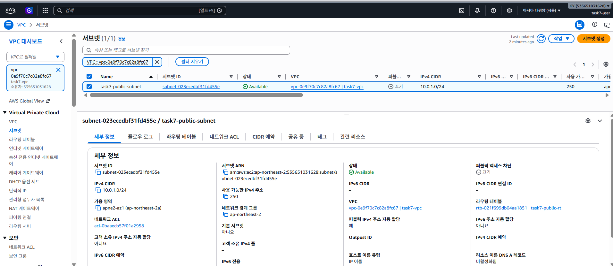

   > - 목록의 **퍼블릭 액세스 차단: 끄기** 는 자동 할당과 **별개 설정**이며 "끄기"가 정상이다.
   > - 목록의 `172.31.x.x/20` 서브넷 4개는 AWS 기본 VPC 소속이므로 건드리지 않는다.
   > - 서브넷의 가용 영역은 생성 후 변경할 수 없다(잘못 만들면 삭제 후 재생성).

   </details>

3. **Internet Gateway** 생성: `task7-igw` → Attach to VPC → `task7-vpc`

   <details>
   <summary>상세 절차 (클릭)</summary>

   **(1) 인터넷 게이트웨이 생성**
   1. VPC 콘솔 왼쪽 **Internet gateways(인터넷 게이트웨이)** → **Create internet gateway(인터넷 게이트웨이 생성)**
   2. Name tag(이름 태그): `task7-igw`
   3. **Create internet gateway** 클릭 → 이 시점 상태는 **Detached**

   **(2) VPC에 연결 (Attach)**
   1. 생성 직후 상단 초록 배너의 **Attach to a VPC(VPC에 연결)** 클릭
      (배너를 놓쳤으면 `task7-igw` 선택 → **Actions(작업)** → **Attach to VPC(VPC에 연결)**)
   2. Available VPCs(사용 가능한 VPC): **`task7-vpc`** 선택
   3. **Attach internet gateway(인터넷 게이트웨이 연결)** 클릭

   **(3) 확인**

   | 항목 | 기대값 |
   |---|---|
   | State (상태) | **Attached** |
   | VPC ID | `vpc-… \| task7-vpc` |

   

   > - IGW는 VPC당 **1개만** 연결할 수 있다. 목록에 이미 있는 다른 IGW는 기본 VPC 소속이므로 건드리지 않는다.
   > - IGW를 연결만 해서는 인터넷이 되지 않는다. 다음 단계 Route Table에 `0.0.0.0/0 → task7-igw` 경로를 추가해야 서브넷이 "퍼블릭"이 된다.
   > - 정리 시에는 **Detach → Delete** 순서 (연결된 상태로는 삭제 불가).

   </details>

4. **Route Table** 생성: `task7-public-rt` → Routes 편집 `0.0.0.0/0 → task7-igw` → Subnet associations 에 Public Subnet 연결

   <details>
   <summary>상세 절차 (클릭)</summary>

   **(1) 라우팅 테이블 생성**
   1. VPC 콘솔 왼쪽 **Route tables(라우팅 테이블)** → **Create route table(라우팅 테이블 생성)**
   2. Name(이름): `task7-public-rt` / VPC: **`task7-vpc`**
   3. **Create route table** 클릭 → 이 시점에는 `10.0.0.0/16 → local` 경로 1개만 존재

   **(2) 인터넷 경로 추가**
   1. **Routes(라우팅)** 탭 → **Edit routes(라우팅 편집)** → **Add route(라우팅 추가)**
   2. Destination(대상): `0.0.0.0/0` / Target(대상): **Internet Gateway** → `task7-igw` 선택
   3. **Save changes(변경 사항 저장)**

   **(3) 서브넷 연결**
   1. **Subnet associations(서브넷 연결)** 탭 → **명시적 서브넷 연결** 의 **Edit subnet associations(서브넷 연결 편집)**
   2. ☑ `task7-public-subnet` 체크 → **Save associations(연결 저장)**

   **(4) 확인**

   | 위치 | 항목 | 기대값 |
   |---|---|---|
   | 라우팅 탭 | `0.0.0.0/0` | → `igw-…` (task7-igw) · 활성 |
   | 라우팅 탭 | `10.0.0.0/16` | → `local` · 활성 (자동 생성) |
   | 서브넷 연결 탭 | 명시적 서브넷 연결 | `task7-public-subnet` (`10.0.1.0/24`) |
   | 세부 정보 | VPC / 기본 | `task7-vpc` / 아니요 |

   

   

   > - `0.0.0.0/0 → IGW` 경로가 있는 라우팅 테이블에 연결된 서브넷이 곧 **퍼블릭 서브넷**이다.
   > - 서브넷을 명시적으로 연결하지 않으면 VPC의 **기본(main) 라우팅 테이블**(local 경로만 있음)을 따르므로 외부 접속이 안 된다.
   > - 정리 시에는 **서브넷 연결 해제 → 라우팅 테이블 삭제** 순서.

   </details>

5. **Security Group** 생성 (`task7-vpc`): 인바운드 `HTTP 80 / 0.0.0.0/0`, `SSH 22 / My IP`

   <details>
   <summary>상세 절차 (클릭)</summary>

   **(1) 기본 세부 정보**
   1. VPC 콘솔 왼쪽 **보안 → Security groups(보안 그룹)** → **Create security group(보안 그룹 생성)**
   2. 입력

      | 항목 | 값 |
      |---|---|
      | 보안 그룹 이름 | `task7-web-sg` |
      | 설명 | `Task7 web server SG` (영문만 가능) |
      | VPC | **`task7-vpc`** (기본 VPC가 선택되어 있으므로 반드시 변경) |

   **(2) 인바운드 규칙** — **규칙 추가** 2회

   | 유형 | 프로토콜 | 포트 | 소스 | 설명 |
   |---|---|---|---|---|
   | HTTP | TCP | 80 | Anywhere-IPv4 `0.0.0.0/0` | web |
   | SSH | TCP | 22 | **내 IP** `x.x.x.x/32` (자동 입력) | my ip ssh |

   **(3) 아웃바운드 규칙** — 기본값(모든 트래픽 → `0.0.0.0/0`) 유지. 인스턴스의 `curl https://example.com` 아웃바운드 검증에 필요

   **(4) Create security group** 클릭

   **(5) 확인**

   | 항목 | 기대값 |
   |---|---|
   | 보안 그룹 이름 / VPC | `task7-web-sg` / `task7-vpc` |
   | 인바운드 규칙 수 | **2** (HTTP 80 전체, SSH 22 내 IP `/32`) |
   | 아웃바운드 규칙 수 | 1 (전체 허용, 기본값) |
   | 전체 포트 허용 인바운드 규칙 | **없음** |

   

   > - SG는 **상태 저장(stateful)** — 허용된 인바운드 요청의 응답은 아웃바운드 규칙과 무관하게 나간다.
   > - 네트워크(집/카페 등)가 바뀌면 공인 IP가 바뀌어 SSH가 타임아웃 난다 → SSH 규칙 소스를 다시 **내 IP**로 수정.
   > - "모든 트래픽"/"모든 TCP" 같은 전체 허용 인바운드 규칙은 과제 요구사항 위반.

   </details>

6. **EC2** 시작: Ubuntu 24.04 LTS, `t3.micro`, 키페어 `task7-key` 생성(.pem 보관), 네트워크 `task7-vpc` / `task7-public-subnet` / 퍼블릭 IP 자동 할당 Enable / SG `task7-web-sg`, 스토리지 8GiB gp3
   → Advanced details → **User data** 에 [`scripts/setup-server.sh`](scripts/setup-server.sh) 내용 전체 붙여넣기

   <details>
   <summary>상세 절차 (클릭)</summary>

   **(1) 인스턴스 시작 설정** — EC2 콘솔 → **인스턴스 시작**

   | 항목 | 값 |
   |---|---|
   | 이름 | `task7-web` |
   | AMI | **Ubuntu Server 24.04 LTS** (프리 티어 사용 가능, 64비트 x86) |
   | 인스턴스 유형 | **t3.micro** |
   | 키 페어 | **새 키 페어 생성** → `task7-key` / RSA / **.pem** → Task7 폴더에 저장 (`.gitignore` 로 커밋 제외) |
   | 네트워크 설정 → **편집** | VPC `task7-vpc` / 서브넷 `task7-public-subnet` / 퍼블릭 IP 자동 할당 **활성화** |
   | 방화벽(보안 그룹) | **기존 보안 그룹 선택** → `task7-web-sg` |
   | 스토리지 | 8 GiB **gp3** (종료 시 삭제) |
   | 고급 세부 정보 → 메타데이터 버전 | **V2 전용(토큰 필수)** |
   | 고급 세부 정보 → **사용자 데이터** | [`scripts/setup-server.sh`](scripts/setup-server.sh) 내용 전체 붙여넣기 |

   **(2) 인스턴스 시작** 클릭 → 2~3분 대기 (부팅 + user-data 로 Nginx 설치)

   **(3) 확인** — 인스턴스 요약

   | 항목 | 기대값 | 실제 |
   |---|---|---|
   | 인스턴스 상태 | 실행 중 | ✅ 실행 중 |
   | 인스턴스 유형 | t3.micro | ✅ |
   | VPC / 서브넷 | `task7-vpc` / `task7-public-subnet` | ✅ |
   | 퍼블릭 IPv4 / DNS | 자동 할당 / `ec2-…compute.amazonaws.com` | ✅ (VPC DNS hostnames 활성화 결과) |
   | 프라이빗 IPv4 | `10.0.1.x` | ✅ `10.0.1.173` |
   | IMDSv2 | Required | ✅ |
   | 키 페어 | `task7-key` | ✅ |

   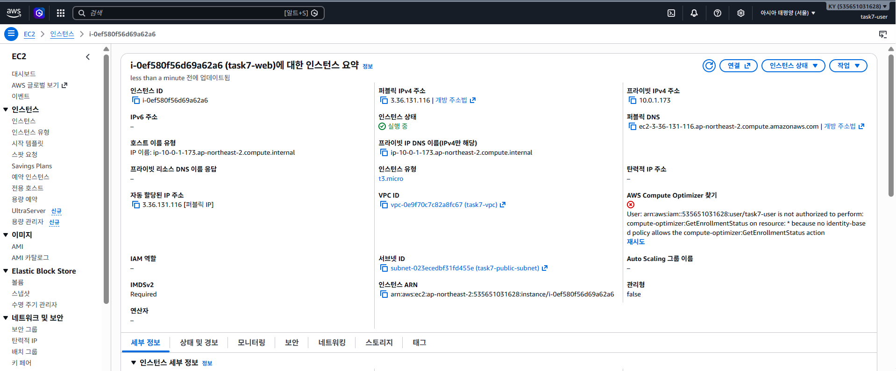

   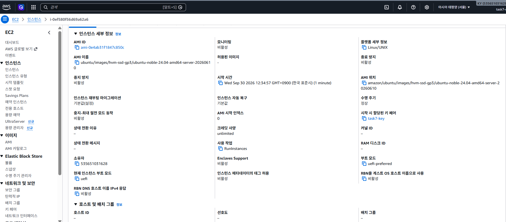

   > - 네트워크 설정은 기본값이 **기본 VPC** 이므로 반드시 **편집**해서 `task7-vpc` 로 변경.
   > - `.pem` 키는 생성 시 **한 번만** 다운로드 가능.
   > - IAM 정책상 `t2/t3.micro` 외 유형, 10GiB 초과 볼륨은 **거부**된다.
   > - 요약 화면의 *AWS Compute Optimizer* 권한 오류(`compute-optimizer:GetEnrollmentStatus … not authorized`)는 콘솔이 부가 서비스를 자동 조회하다 최소권한 정책에 막힌 것 — 실습과 무관하며 **최소권한이 적용된 근거**다.

   </details>

7. 2~3분 후 `http://<퍼블릭IP>/health` 확인

   <details>
   <summary>상세 결과 (클릭)</summary>

   | 검증 | 결과 |
   |---|---|
   | `curl.exe -i http://<퍼블릭IP>/health` | `HTTP/1.1 200 OK` · `Server: nginx/1.24.0 (Ubuntu)` · `Content-Type: text/plain` · 본문 `OK` |
   | 브라우저 `http://<퍼블릭IP>/` | Hello Cloud 페이지 (Instance ID · AZ `ap-northeast-2a` · Private IP) |
   | 브라우저 `http://<퍼블릭IP>/health` | `OK` |

   

   

   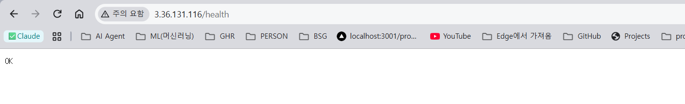

   > - 반드시 **http://** 로 접속 (콘솔의 "개방 주소법" 링크는 https 로 열려 연결 실패).
   > - 브라우저 주소창의 "주의 요함"은 HTTPS가 아니어서 표시되는 것으로 정상.

   </details>


#### 방법 B. AWS CLI 스크립트 (Git Bash / WSL / macOS)

```bash
bash infra/provision.sh          # 내 IP 자동 조회 → 전체 생성 → /health OK 대기
# 출력된 Public IP, SSH 명령 확인
```

### 3단계. 검증

```bash
# (1) SSH 접속 — Windows 는 먼저 키 권한 정리: docs/troubleshooting.md 사례 1 참고
ssh -i task7-key.pem ubuntu@<퍼블릭IP>

# (2) 인스턴스 내부 점검: 아웃바운드 / nginx active / localhost 200 / health OK
#     (내 PC에서 먼저 복사: scp -i task7-key.pem scripts/verify-instance.sh ubuntu@<퍼블릭IP>:~)
bash verify-instance.sh
```

```powershell
# (3) 내 PC에서 외부 접속 검증 (Windows PowerShell)
powershell -ExecutionPolicy Bypass -File scripts\verify-external.ps1 -PublicIp <퍼블릭IP>
# 또는
curl.exe -i http://<퍼블릭IP>/health
```

> Windows 키 권한 정리 — **cmd** 와 **PowerShell** 문법이 다르다 (docs/troubleshooting.md 사례 1)
>
> | 셸 | 명령 |
> |---|---|
> | cmd | `icacls task7-key.pem /inheritance:r` → `icacls task7-key.pem /grant:r "%USERNAME%:(R)"` |
> | PowerShell | `icacls task7-key.pem /inheritance:r` → `icacls task7-key.pem /grant:r "$($env:USERNAME):(R)"` |

<details>
<summary>검증 결과 (클릭)</summary>

| 검증 | 결과 |
|---|---|
| scp 스크립트 복사 | `verify-instance.sh 100%` |
| SSH 접속 | `ubuntu@ip-10-0-1-173` · Ubuntu 24.04.4 LTS · `10.0.1.173` |
| 아웃바운드 `curl https://example.com` | `HTTP/2 200` ✅ |
| nginx 서비스 / 80 LISTEN | `active` / LISTEN ✅ |
| `curl http://localhost` | 200 ✅ |
| `curl http://localhost/health` | `HTTP/1.1 200 OK` · 본문 `OK` ✅ |
| **종합** | **PASS=6 FAIL=0** |


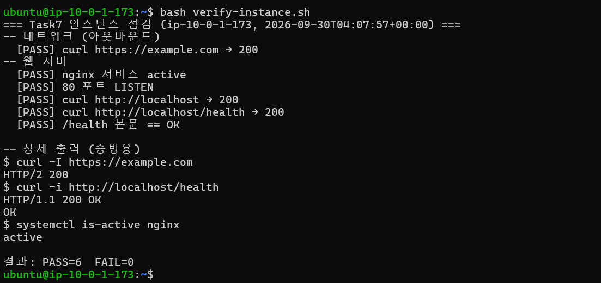

> SSH 로그인 시 표시되는 `172 updates` / `New release '26.04.1 LTS'` 안내는 과제와 무관하므로 업그레이드하지 않는다.

</details>

### 4단계. 증빙 스크린샷 (docs/screenshots/)

| 파일명(권장) | 내용 |
|---|---|
| `external-health.png` | **(필수)** 내 PC에서 `/health` 호출 결과 (200 / OK) |
| `8.검증.png` | SSH 접속 화면 (`ubuntu@ip-10-0-1-173`) |
| `instance-verify.png` | `verify-instance.sh` PASS 결과 (아웃바운드, localhost 200) |
| `5.Security Group.png` | 보안 그룹 인바운드 규칙 (80 전체, 22 내 IP) |
| `1.VPC.png` | VPC `task7-vpc` 세부 정보 (CIDR `10.0.0.0/16`, DNS 호스트 이름 활성화됨) |
| `2.Subnet.png` | Subnet `task7-public-subnet` 세부 정보 (`ap-northeast-2a`, 퍼블릭 IPv4 자동 할당: 예, RT `task7-public-rt`) |
| `3.Internet gateway.png` | IGW `task7-igw` Attached → `task7-vpc` |
| `4.Route Table-1.png`, `4.Route Table-2.png` | Route Table `0.0.0.0/0 → igw` (라우팅) + 서브넷 연결 |
| `6.EC2-1.png`, `6.EC2-2.png` | EC2 `task7-web` 인스턴스 요약 / 세부 정보 |
| `7.Hello Cloud.png`, `7.Health.png` | 브라우저 `/`, `/health` 접속 결과 |
| `iam-policy_1.png`, `iam-policy_2.png` | `task7-user` 권한 (Task7LeastPrivilege 만 연결) |
| `cleanup-ec2-confirm.png`, `cleanup-ec2.png` | EC2 종료(삭제) 확인 창 / 인스턴스 상태 **종료됨** |
| `cleanup-volume.png`, `cleanup-탄력적ip.png` | EBS 볼륨 / 탄력적 IP 목록 비어 있음 |
| `cleanup-keypair.png` | 키 페어 `task7-key` 삭제 완료 |
| `cleanup-sg.png` | 보안 그룹 `task7-web-sg` 삭제 완료 |
| `B1-cleanup-rt.png`, `B2-cleanup-rt.png`, `cleanup-rt.png` | 라우팅 테이블 서브넷 연결 해제 / 삭제 확인 / 삭제 완료 |
| `B1-cleanup-igw.png`, `B2-cleanup-igw.png`, `cleanup-igw.png` | IGW 분리 / 삭제 확인 / 삭제 완료 |
| `B1-cleanup-subnet.png`, `cleanup-subnet.png` | 서브넷 삭제 확인 / 삭제 완료 |
| `B1-cleanup-vpc.png`, `B2-cleanup-vpc.png`, `cleanup-vpc.png` | VPC 선택 / 삭제 확인 / 삭제 완료 |
| `cleanup-billing.png` | Billing 화면 (루트 계정) |

### 5단계. 리소스 정리 (필수)

```bash
bash infra/cleanup.sh            # CLI로 만든 경우 — 역순 삭제 + 잔존 리소스 0개 검증
```

콘솔로 만들었다면 [`docs/cleanup-checklist.md`](docs/cleanup-checklist.md) 순서대로 삭제하고 근거를 남긴다.

**EC2 종료 (Terminate)**

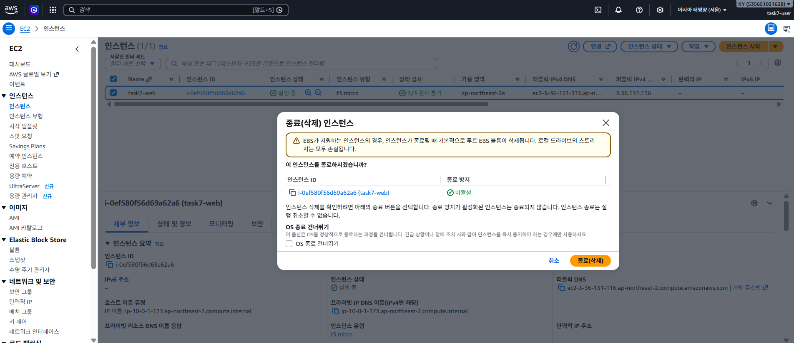

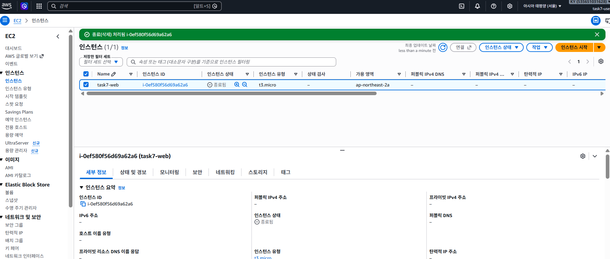

**EBS 볼륨 · 탄력적 IP 잔존 확인** — 둘 다 목록 비어 있음 (루트 볼륨은 종료 시 자동 삭제, EIP는 할당하지 않음)

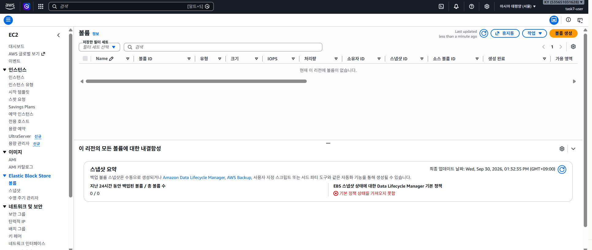


**키 페어 삭제** — `task7-key` 삭제 완료 (로컬 `task7-key.pem` 도 더 이상 사용 불가)

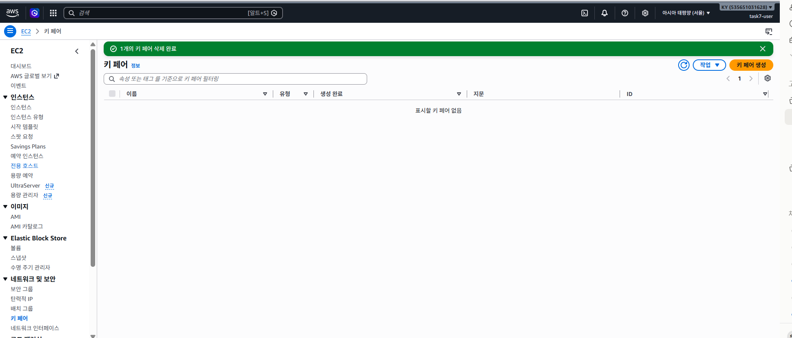

**보안 그룹 삭제** — `task7-web-sg` 삭제 완료, 각 VPC의 `default` SG만 남음 (default SG는 VPC 삭제 시 함께 삭제)

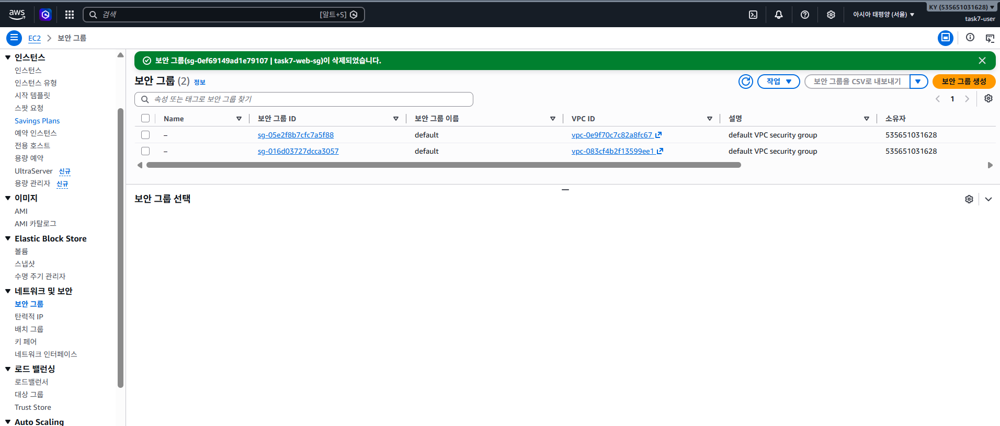

**라우팅 테이블 삭제** — 서브넷 연결 해제 → 삭제 확인(`삭제` 입력) → `task7-public-rt` 삭제 완료. 남은 2개는 각 VPC의 **기본(main)** 라우팅 테이블 (task7-vpc 것은 VPC 삭제 시 함께 삭제)

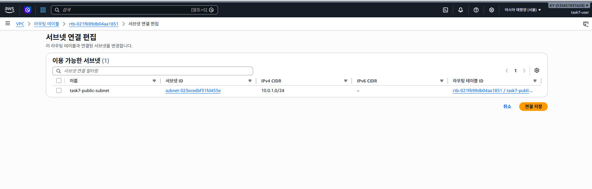

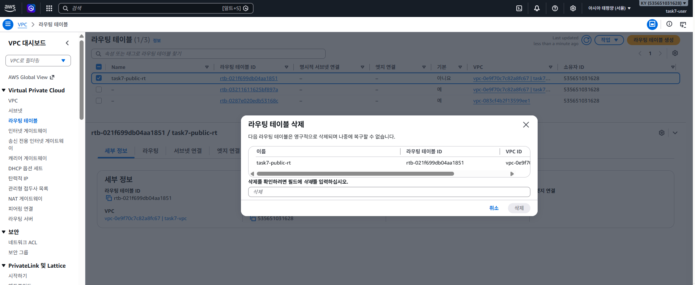

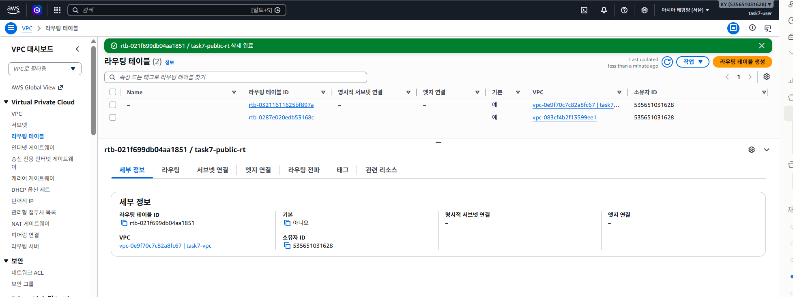

**인터넷 게이트웨이 분리 → 삭제** — `task7-igw`(`igw-0e2a1faedc86eb077`) 삭제 완료. 남은 1개는 **기본 VPC**(`vpc-083cf4b2…`)의 IGW로 원래 존재하던 것

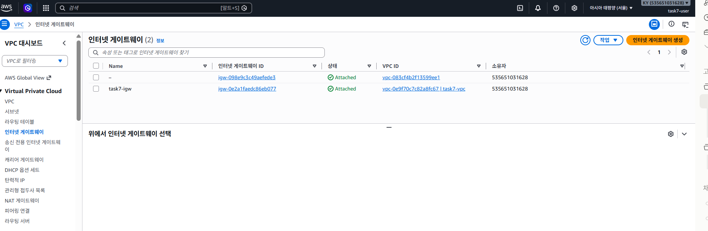

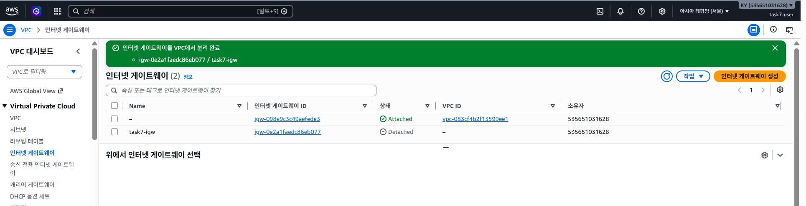

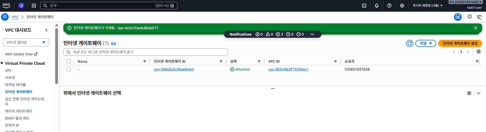

**서브넷 삭제** — `task7-public-subnet`(`subnet-023ecedbf31fd455e`) 삭제 완료. 남은 4개(`172.31.x.x/20`)는 **기본 VPC** 서브넷

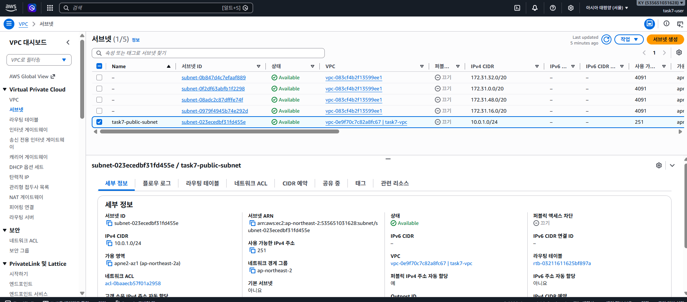

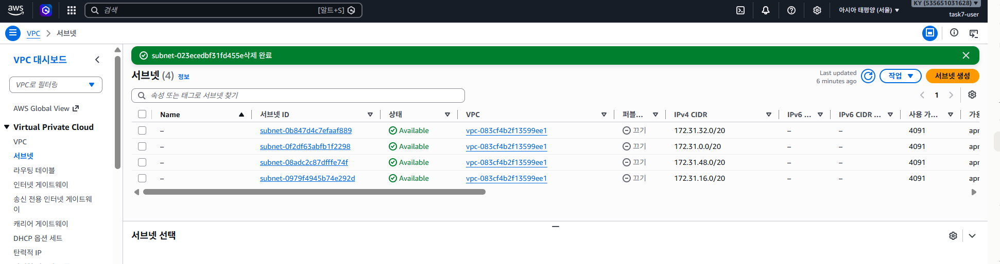

**VPC 삭제** — `task7-vpc`(`vpc-0e9f70c7c82a8fc67`) 삭제 완료 (task7-vpc의 기본 RT · 기본 SG · 기본 NACL 도 함께 삭제). 남은 1개는 **기본 VPC** `172.31.0.0/16`

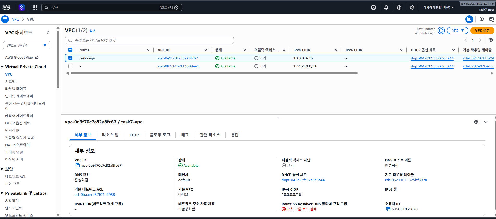

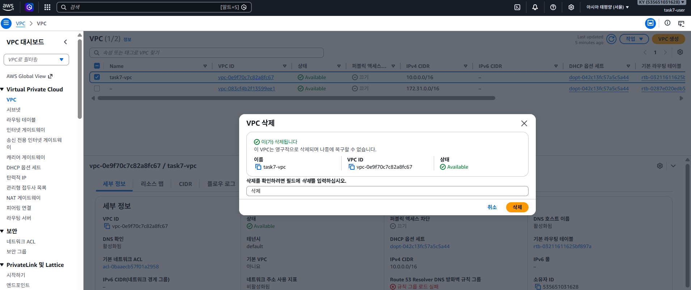

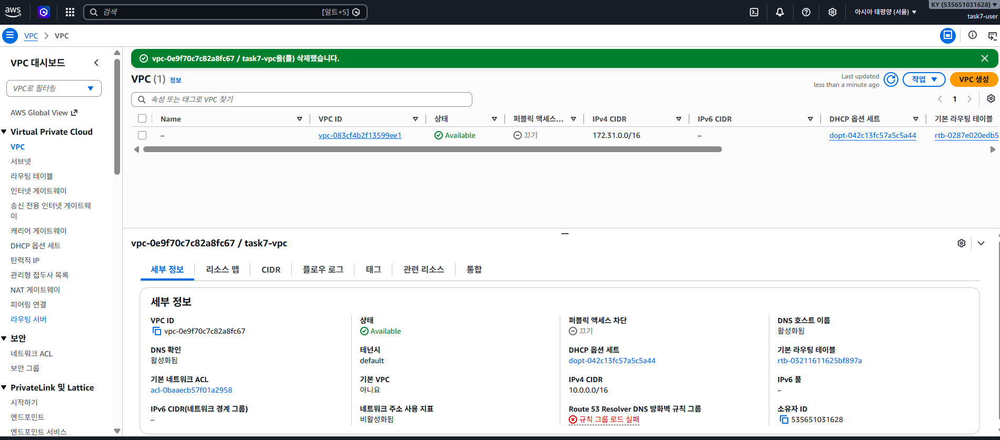


**Billing 확인 (루트 계정)** — 2026년 9월 청구서 예상 총합계 **USD 0.00** (무료 플랜 계정, 요금 청구 없음)

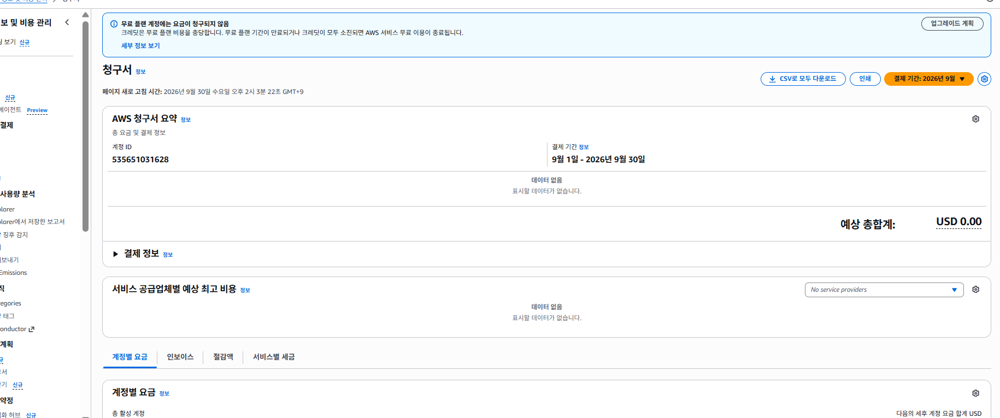

> ✅ **정리 완료 (2026-09-30)** — task7 리소스(EC2 · EBS · Key Pair · SG · RT · IGW · Subnet · VPC) 잔존 0개. 상세 근거: [`docs/cleanup-checklist.md`](docs/cleanup-checklist.md)

| 항목 | 내용 |
|---|---|
| 대상 | `i-0ef580f56d69a62a6 (task7-web)` · 종료 방지: 비활성 |
| 옵션 | *OS 종료 건너뛰기* **미체크** (정상 종료) |
| 효과 | 루트 EBS 볼륨 함께 삭제(종료 시 삭제 설정) → EBS 과금 없음 |
| 결과 | **종료됨(Terminated)** · 퍼블릭 IPv4/DNS 반납(`–`) |

> 종료(Terminate)는 되돌릴 수 없고 퍼블릭 IP `3.36.131.116` 도 반납된다. 중지(Stop)는 EBS 요금이 계속 발생하고 재시작 시 IP가 바뀌므로 사용하지 않는다.

---

## 요구사항 충족 매핑

| 요구사항 | 구현 / 근거 |
|---|---|
| VPC 1 / Public Subnet 1 / IGW 연결 | 2단계, `infra/provision.sh` 1~3 |
| `0.0.0.0/0 → IGW` 경로 | Route Table `task7-public-rt` (screenshot `4.Route Table-1.png`, `4.Route Table-2.png`) |
| 인스턴스 아웃바운드 (`curl https://example.com`) | `verify-instance.sh` 첫 항목 |
| EC2 1대 + SSH 접속 | 3단계 (1) |
| Nginx 설치·실행 / `curl http://localhost` 200 | `setup-server.sh`, `verify-instance.sh` |
| SG: 80 전체, 22 내 IP, 전체 포트 허용 없음 | `task7-web-sg` (screenshot `5.Security Group.png`) |
| IAM 사용자 1개, EC2/VPC/SG 범위, Admin 없음 | `iam/task7-least-privilege-policy.json` |
| 외부 접속 검증 (B) | 상단 "외부 접속 검증" 표 + `external-health.png` |
| 리소스 정리 (EC2, EBS, EIP, IGW, VPC) | `infra/cleanup.sh`, `docs/cleanup-checklist.md` |

---

## 개념 정리 (과제 목표)

**트래픽 흐름** — 인터넷 요청은 `IGW`(VPC의 인터넷 출입문) → `Route Table`(`0.0.0.0/0 → IGW` 경로가 있어야 "퍼블릭" 서브넷) → `Public Subnet` → `Security Group`(인스턴스 단위 방화벽, 80 허용) → `EC2 Nginx` 순으로 도달한다. 응답은 SG가 **상태 저장(stateful)** 이므로 별도 아웃바운드 규칙 없이 돌아간다.

**외부 접속에 필요한 3가지** — ① 퍼블릭 IP(또는 EIP) ② IGW로 가는 라우팅 ③ SG 인바운드 허용. 하나라도 빠지면 타임아웃이 난다.

**Security Group vs IAM** — SG는 *네트워크 패킷*이 인스턴스에 들어올 수 있는지(누가 어느 포트로), IAM은 *AWS API 호출*을 누가 할 수 있는지(누가 무엇을 만들고 지울지)를 통제한다. 둘 다 "필요한 것만 허용"하는 최소권한 원칙을 적용한다 — SG는 22번을 내 IP로 제한, IAM은 서비스·리전·인스턴스 타입을 제한.

**과금 요인과 정리 순서** — 실행 중 EC2, EBS 볼륨(중지 상태에도 과금), 할당된 Elastic IP/퍼블릭 IPv4, NAT Gateway·ALB·RDS가 대표적이다. 리소스 간 참조 관계 때문에 EC2 → EIP → SG → RT → IGW → Subnet → VPC 순서로 지운다.
