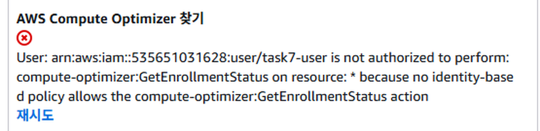
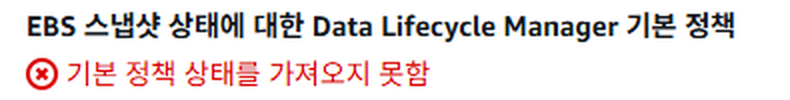
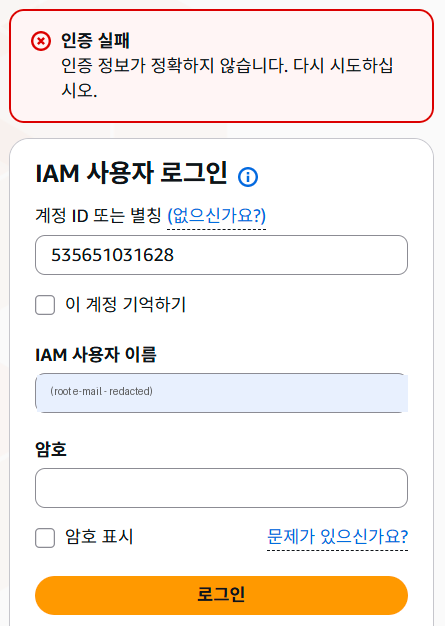

# 트러블슈팅 보고서

> 작성 규칙: 각 건마다 **증상 → 가설 → 검증 → 조치 → 결과 → 재발방지** 순서로, 근거(로그·명령 출력·스크린샷)를 함께 남긴다.
>
> 아래 3건은 이 실습(2026-09-30, `ap-northeast-2`, 사용자 `task7-user`)에서 **실제로 발생한 사례**다.

## 사례 요약

| # | 사례 | 분류 | 결과 |
|---|---|---|---|
| 1 | Windows `.pem` 권한 정리 중 셸 문법 차이로 SSH 키를 읽지 못함 | 로컬 환경 (cmd vs PowerShell) | ✅ 해결 → SSH 접속 · PASS=6 |
| 2 | 콘솔 곳곳에 뜬 부가 서비스 권한 거부 오류 (Compute Optimizer 외 2건) | IAM 최소권한 | ✅ 정상 동작 확인 (정책 변경 없음) |
| 3 | 루트 로그인 시도 중 "인증 실패" — IAM 사용자 로그인 화면에 루트 이메일 입력 | 로그인 절차 | ✅ 루트 로그인 화면으로 이동해 해결 |

---

## 0. 외부 접속 불가 시 점검 순서 (바깥 → 안쪽)

외부 요청은 아래 순서로 통과해야 EC2 웹 서버에 도달한다. 한 단계씩 확인하면 원인을 빠르게 좁힐 수 있다.

| 단계 | 확인 대상 | 확인 방법 | 정상 기준 |
|---|---|---|---|
| 1 | 퍼블릭 IP | EC2 콘솔 → 인스턴스 상세 | Public IPv4 주소 존재 |
| 2 | IGW 연결 | VPC 콘솔 → Internet Gateways | State = `Attached` (task7-vpc) |
| 3 | 라우팅 | Route Tables → Routes / Subnet associations | `0.0.0.0/0 → igw-…` + Public Subnet 연결 |
| 4 | 보안 그룹 | SG → Inbound rules | `80 ← 0.0.0.0/0`, `22 ← 내 IP/32` |
| 5 | 웹 서버 | (SSH) `systemctl status nginx`, `ss -ltn` | `active (running)`, `:80 LISTEN` |
| 6 | 로컬 응답 | (SSH) `curl -i http://localhost/health` | `200 OK` / `OK` |
| 7 | 서버 로그 | `/var/log/nginx/error.log`, `/var/log/setup-server.log` | 에러 없음 |

> 팁: **타임아웃**(응답 없음)은 보통 네트워크 계층(IGW·라우팅·SG) 문제, **Connection refused / 4xx / 5xx** 는 서버(Nginx) 문제다.

---

## 사례 1. Windows에서 `.pem` 권한 정리 중 셸 문법 차이로 키를 읽지 못함

| 항목 | 내용 |
|---|---|
| **증상** | `scp -i task7-key.pem …` 실행 시 `Load key "task7-key.pem": Permission denied` → `Permission denied (publickey).` → `scp: Connection closed` |
| **배경** | Windows OpenSSH는 키 파일에 **본인 외 사용자 권한**이 있으면 사용을 거부하므로, 먼저 `icacls` 로 권한을 정리하려 했다 |
| **원인 가설** | ① 키 파일 권한이 **너무 넓음**(Users 그룹 읽기) → 보통 `UNPROTECTED PRIVATE KEY FILE` 경고가 뜸<br>② 권한이 **아예 없음** → `Load key … Permission denied` 가 뜸 → **이번 증상은 ②** |
| **검증** | 실행 기록(아래 로그) 확인:<br>`icacls … /inheritance:r` → **성공** (상속 권한 전부 제거)<br>`icacls … /grant:r "$($env:USERNAME):(R)"` → `매개 변수가 잘못되었습니다` **실패**<br>→ `$($env:USERNAME)` 은 **PowerShell 문법**인데 **cmd** 에서 실행 → 본인 읽기 권한이 부여되지 않아 **아무도 읽을 수 없는 파일**이 됨 |
| **조치** | cmd 문법으로 재실행: `icacls task7-key.pem /grant:r "%USERNAME%:(R)"` |
| **결과** | `scp` 100% 전송, SSH 접속 성공 → `verify-instance.sh` **PASS=6 FAIL=0** |
| **재발 방지** | README에 **cmd / PowerShell 명령을 구분**해 표기 / 실행 전 프롬프트 확인(`C:\>` = cmd, `PS C:\>` = PowerShell) / 키 파일은 `.gitignore`(`*.pem`)로 커밋 차단 |

**① 증상 — 실행 로그 (cmd 터미널 출력 원문)**

```text
C:\Codyssey26\본과정\Task7>icacls task7-key.pem /inheritance:r
처리된 파일: task7-key.pem
1 파일을 처리했으며 0 파일은 처리하지 못했습니다.

C:\Codyssey26\본과정\Task7>icacls task7-key.pem /grant:r "$($env:USERNAME):(R)"
"$($env:USERNAME):(R)" 매개 변수가 잘못되었습니다.          ← PowerShell 문법을 cmd에서 실행

C:\Codyssey26\본과정\Task7>scp -i task7-key.pem scripts/verify-instance.sh ubuntu@3.36.131.116:~
...
Load key "task7-key.pem": Permission denied                 ← 키 파일을 읽을 권한이 없음
ubuntu@3.36.131.116: Permission denied (publickey).
scp: Connection closed
```

**② 조치 → 결과 — cmd 문법으로 권한 부여 후 scp · SSH 성공**


**③ 최종 확인 — 인스턴스 내부 점검 PASS=6**


**cmd vs PowerShell 권한 정리 명령 비교**

| 셸 | 프롬프트 모양 | 사용자 이름 변수 | 권한 부여 명령 |
|---|---|---|---|
| cmd (명령 프롬프트) | `C:\>` | `%USERNAME%` | `icacls task7-key.pem /grant:r "%USERNAME%:(R)"` |
| PowerShell | `PS C:\>` | `$env:USERNAME` | `icacls task7-key.pem /grant:r "$($env:USERNAME):(R)"` |

---

## 사례 2. 콘솔에 부가 서비스 권한 거부 오류 표시 (Compute Optimizer 외 2건)

| 항목 | 내용 |
|---|---|
| **증상** | 실습 중 콘솔 3곳에 빨간 오류 표시<br>① EC2 인스턴스 요약 — **AWS Compute Optimizer 찾기**: `task7-user is not authorized to perform: compute-optimizer:GetEnrollmentStatus … because no identity-based policy allows …`<br>② VPC 세부 정보 — **Route 53 Resolver DNS 방화벽 규칙 그룹**: `규칙 그룹 로드 실패`<br>③ EBS 볼륨 — **Data Lifecycle Manager 기본 정책**: `기본 정책 상태를 가져오지 못함` |
| **원인 가설** | ① 인스턴스·네트워크 설정 오류로 서비스가 비정상 동작<br>② 콘솔이 화면을 채우려고 **부가 서비스 API를 자동 호출**했는데, `task7-user` 정책에 해당 권한이 없어 거부됨 |
| **검증** | ① 인스턴스 `실행 중`, 외부 `curl -i http://3.36.131.116/health` → `200 OK`/`OK`, 내부 `verify-instance.sh` PASS=6 → **서비스 정상** → 가설 ① 기각<br>② 오류 문구 `no identity-based policy allows` → 명시적 Deny가 아닌 **허용 누락(암묵적 거부)**<br>③ `iam/task7-least-privilege-policy.json` 에 `compute-optimizer:*` · `route53resolver:*` · `dlm:*` 액션 **없음** 확인 → **가설 ② 채택** |
| **조치** | **정책을 변경하지 않음.** 세 서비스(인스턴스 크기 추천 · DNS 방화벽 · 스냅샷 자동화)는 과제 범위(EC2/VPC/SG) 밖 → 권한을 추가하지 않는 것이 최소권한 원칙에 맞다 |
| **결과** | 오류 표시는 남지만 실습 기능에 영향 없음. 오히려 `task7-user` 가 **허용된 서비스 외에는 호출할 수 없음**을 보여주는 증거 |
| **재발 방지 / 교훈** | 권한 오류는 곧바로 권한을 넓히지 말고 **① 과제 기능에 영향이 있는지 ② 어떤 액션이 거부됐는지 ③ 그 액션이 정말 필요한지** 순서로 판단 / `explicit deny`(정책의 Deny 문) 와 `no identity-based policy allows`(허용 누락) 를 구분 |

**① 증상 — EC2 인스턴스 요약의 Compute Optimizer 권한 거부 (확대)**



**② 증상 — VPC 세부 정보의 Route 53 Resolver DNS 방화벽 로드 실패 (확대)**


**③ 증상 — EBS 볼륨 화면의 Data Lifecycle Manager 정책 조회 실패 (확대)**



**④ 검증 — 같은 시점 인스턴스는 `실행 중`, 서비스 정상 (원본 전체 화면)**


**⑤ 검증 — 외부 `/health` 200 OK**


**오류 유형 구분 (이번 사례 = 허용 누락)**

| 오류 문구 | 의미 | 원인 위치 |
|---|---|---|
| `… because no identity-based policy allows …` | **허용 누락** (암묵적 거부) | 정책에 해당 `Allow` 가 없음 |
| `… with an explicit deny in an identity-based policy` | **명시적 거부** | 정책의 `Deny` 문에 걸림 (예: `t3.small` 생성 시 `DenyNonFreeTierInstanceTypes`) |

---

## 사례 3. 루트 로그인 시도 중 "인증 실패" — IAM 사용자 로그인 화면에 루트 이메일 입력

| 항목 | 내용 |
|---|---|
| **증상** | Billing(결제) 화면 확인을 위해 루트로 로그인하려는데 `인증 실패 — 인증 정보가 정확하지 않습니다` |
| **배경** | `task7-user` 에게는 결제 조회 권한이 없어, Billing 확인(정리 체크리스트 13번)은 **루트 계정**으로만 가능 |
| **원인 가설** | ① 루트 비밀번호 오입력<br>② **로그인 화면 종류가 다름** — 화면 제목이 **"IAM 사용자 로그인"** 이고 입력칸이 `계정 ID` + `IAM 사용자 이름` + `암호` |
| **검증** | 화면 캡처 확인: 계정 ID 칸에 `535651031628`, **IAM 사용자 이름 칸에 루트 이메일**을 입력 → IAM 사용자 중 그런 이름은 없으므로 인증 실패 → **가설 ② 채택** |
| **조치** | 루트 전용 로그인 화면(`https://signin.aws.amazon.com/console` → **루트 사용자** 선택)에서 **이메일 → 비밀번호 → MFA 코드** 순으로 로그인 |
| **결과** | 루트 로그인 성공 → Billing 청구서 **예상 총합계 USD 0.00** 확인 → 캡처 후 즉시 로그아웃 |
| **재발 방지** | 로그인 전 **화면 제목** 확인 (IAM 사용자 로그인 vs 루트 사용자) / 평소 작업은 IAM 사용자, 루트는 결제·계정 설정에만 짧게 사용 / 시크릿 창으로 로그인해 IAM 세션과 분리 |

**① 증상 — IAM 사용자 로그인 화면에서 인증 실패** (루트 이메일은 가림 처리)



**② 결과 — 루트 로그인 후 Billing 확인 (USD 0.00)**


**로그인 화면 구분**

| 화면 제목 | 입력칸 | 용도 |
|---|---|---|
| **IAM 사용자 로그인** | 계정 ID · IAM 사용자 이름 · 암호 | `task7-user` 등 IAM 사용자 |
| **로그인 → 루트 사용자** | 이메일 → 암호 → MFA | 루트 계정 (결제 · 계정 설정) |

---

## 부록. 로그 확인 명령 모음

```bash
# 웹 서버
sudo systemctl status nginx --no-pager
sudo ss -ltnp | grep ':80'
sudo tail -n 50 /var/log/nginx/error.log
sudo tail -n 20 /var/log/nginx/access.log      # 외부 요청이 서버까지 왔는지 확인

# 초기 설정(user-data) 실행 로그
sudo tail -n 50 /var/log/setup-server.log
sudo tail -n 50 /var/log/cloud-init-output.log

# 인스턴스 요구사항 자체 점검
bash verify-instance.sh
```

```powershell
# 내 PC(Windows)
curl.exe -i http://<퍼블릭IP>/health        # 실습 당시: 3.36.131.116
Test-NetConnection <퍼블릭IP> -Port 80
Test-NetConnection <퍼블릭IP> -Port 22
```
