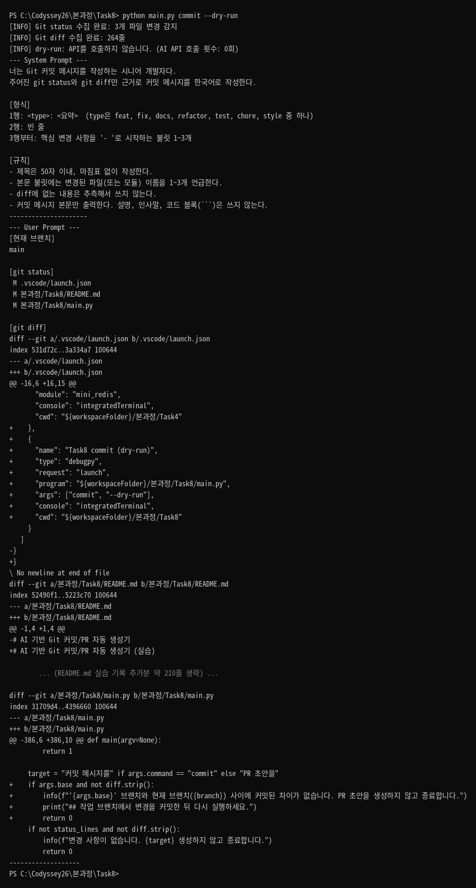
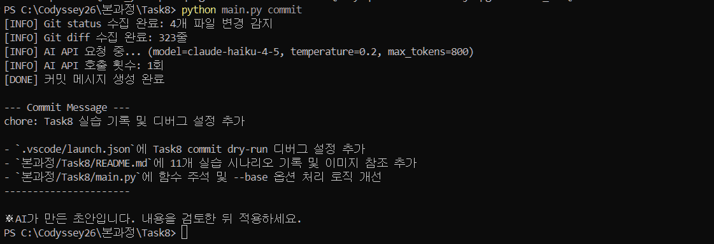
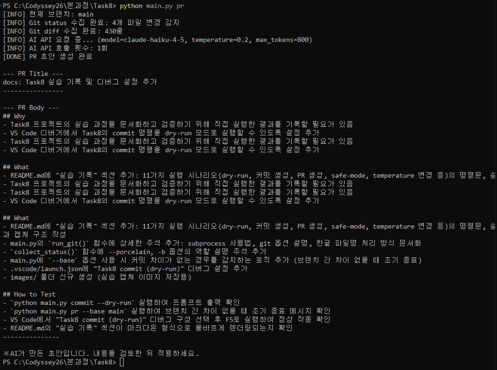
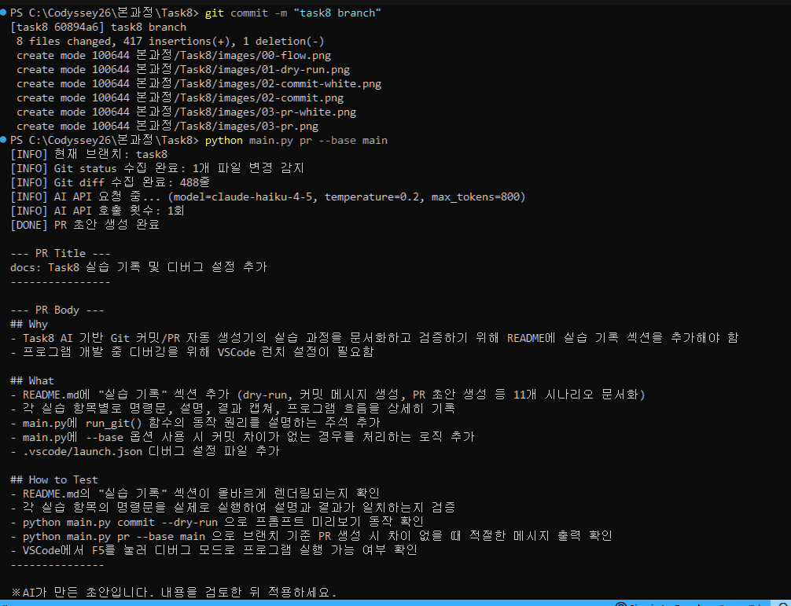
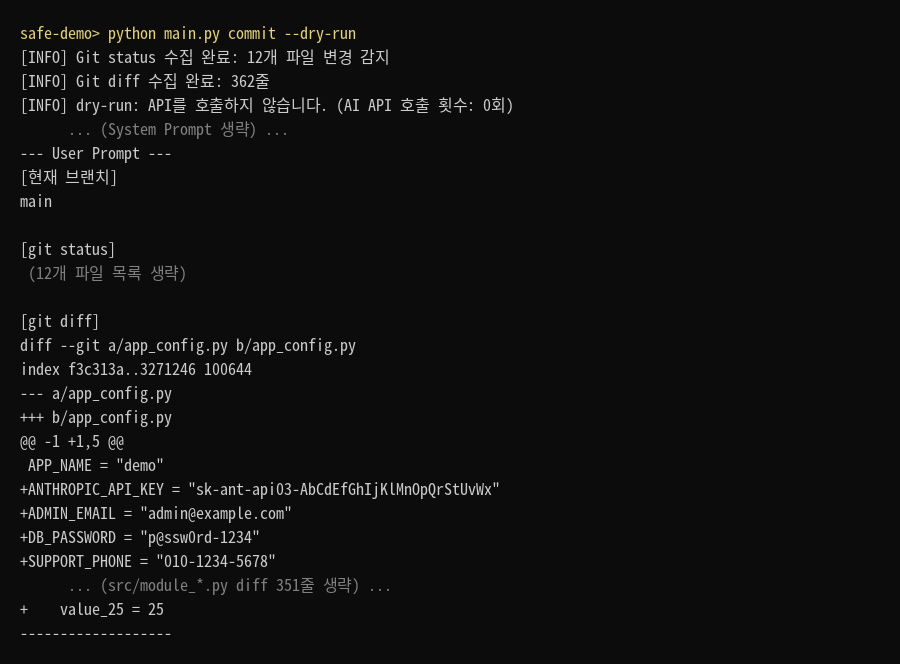
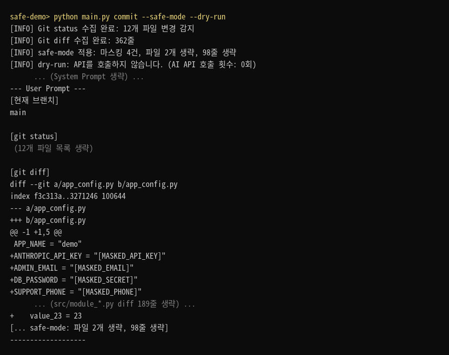
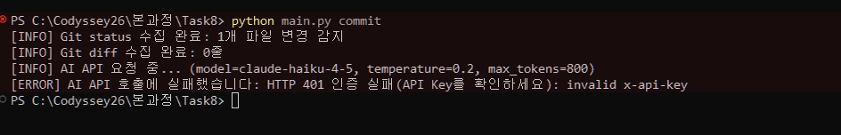
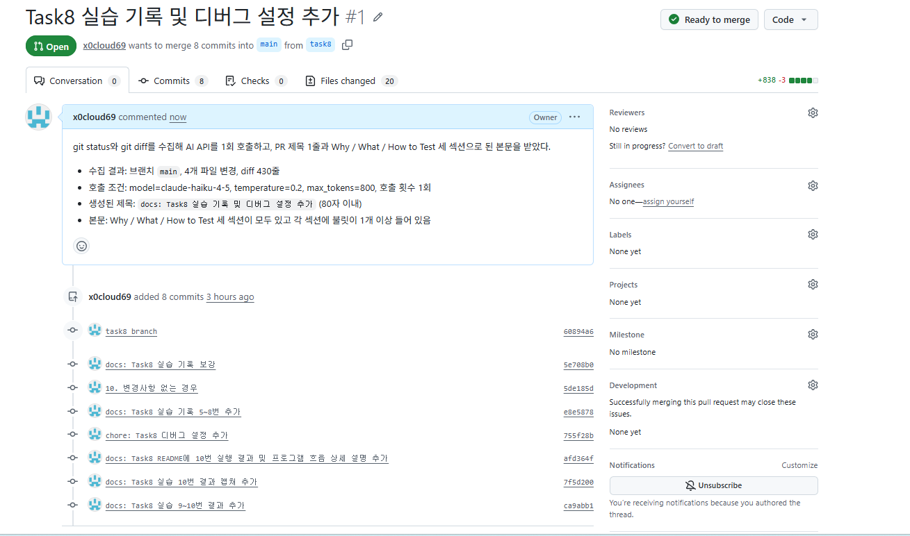

# AI 기반 Git 커밋/PR 자동 생성기 (실습)

`git status`, `git diff` 결과를 AI API(Anthropic Claude)에 넘겨 **커밋 메시지**와 **PR 초안**을 만들어 주는 Python CLI 도구입니다. 결과는 터미널에 출력만 하며, 실제 커밋·push·PR 생성은 하지 않습니다.

## 동작 흐름

1. `git status`로 변경 파일 목록과 현재 브랜치를 수집합니다.
2. `git diff`로 변경 내용을 수집합니다.
3. (선택) `--safe-mode`로 민감정보를 마스킹하고 diff 분량을 제한합니다.
4. 양식과 규칙을 담은 프롬프트와 함께 AI API를 **1회** 호출합니다.
5. 응답을 길이/형식 규칙에 맞게 검증·후처리한 뒤 구분선과 함께 출력합니다.

## 설치

- Python 3.10 이상, Git
- 외부 패키지 없이 표준 라이브러리만 사용하므로 `pip install`이 필요 없습니다.

```bash
git clone <이 리포지토리 주소>
cd <리포지토리 폴더>
```

## 환경변수(API Key) 설정

API Key는 `AI_API_KEY` 환경변수로만 읽습니다. 코드나 파일에 적지 마세요.

```powershell
# Windows PowerShell
$env:AI_API_KEY="YOUR_KEY"
```

```bash
# macOS / Linux / Git Bash
export AI_API_KEY="YOUR_KEY"
```

## 실행 방법

Git이 초기화된 프로젝트 폴더에서 실행합니다.

```bash
python main.py commit            # 커밋 메시지 생성
python main.py pr                # PR 제목/본문 초안 생성
python main.py pr --base main    # main 브랜치와 비교한 diff로 PR 초안 생성
python main.py commit --safe-mode
python main.py commit --dry-run  # API 호출 없이 전송될 프롬프트만 확인
```

### 옵션

| 옵션 | 기본값 | 설명 |
| --- | --- | --- |
| `--model` | `claude-haiku-4-5` | 사용할 모델 |
| `--temperature` | `0.2` | 0.0~1.0. 낮을수록 일관되고, 높을수록 표현이 다양해집니다 |
| `--max-tokens` | `800` | 응답 최대 길이. 너무 작으면 결과가 중간에 잘립니다 |
| `--safe-mode` | 꺼짐 | 민감정보 마스킹 + diff 제한 |
| `--base` | 없음 | (pr 전용) 비교 기준 브랜치 |
| `--dry-run` | 꺼짐 | API를 호출하지 않고 프롬프트만 출력 |

## 출력 예시

> 아래 문구는 예시이며, 실제 결과는 변경 내용에 따라 달라집니다.

### 커밋 메시지

```text
[INFO] Git status 수집 완료: 3개 파일 변경 감지
[INFO] Git diff 수집 완료: 128줄
[INFO] AI API 요청 중... (model=claude-haiku-4-5, temperature=0.2, max_tokens=800)
[INFO] AI API 호출 횟수: 1회
[DONE] 커밋 메시지 생성 완료

--- Commit Message ---
feat: Git 변경 사항 기반 커밋 메시지 자동 생성 기능 추가

- main.py에 git status/diff 수집 로직 추가
- API Key 미설정 시 안내 메시지 출력
----------------------
```

### PR 초안

```text
[INFO] 현재 브랜치: feature/commit-pr-generator
[INFO] Git status 수집 완료: 3개 파일 변경 감지
[INFO] Git diff 수집 완료: 128줄
[INFO] AI API 요청 중... (model=claude-haiku-4-5, temperature=0.2, max_tokens=800)
[INFO] AI API 호출 횟수: 1회
[DONE] PR 초안 생성 완료

--- PR Title ---
feat: 커밋/PR 자동 생성 기능 추가
----------------

--- PR Body ---
## Why
- 커밋 메시지와 PR 설명 작성에 드는 시간을 줄이기 위해

## What
- git status, git diff 결과를 AI 입력으로 전달하는 로직 추가
- commit / pr 명령 구현

## How to Test
- python main.py commit
- python main.py pr
---------------
```

### 오류/예외 상황

```text
[ERROR] AI_API_KEY 환경변수가 설정되지 않았습니다.
[ERROR] AI API 호출에 실패했습니다: HTTP 401 인증 실패(API Key를 확인하세요): ...
[INFO] 변경 사항이 없습니다. 커밋 메시지를 생성하지 않고 종료합니다.
```

## 출력 형식 검증(후처리)

AI 응답은 재호출 없이 후처리로 규칙에 맞춥니다. 고친 부분은 `[WARN]`으로 알려 줍니다.

| 대상 | 규칙 | 어겼을 때 |
| --- | --- | --- |
| 커밋 제목 | 50자 이내 권장, 최대 72자 | 72자 초과분을 잘라내고, 50자 초과 시 경고 |
| PR 제목 | 최대 80자 | 80자 초과분을 잘라냄 |
| PR 본문 | Why / What / How to Test 헤더 + 섹션별 불릿 1개 이상 | 빠진 섹션을 추가하고, 불릿이 없으면 불릿 형식으로 변환 |

## 주의사항

### 민감정보

`git diff`에는 API Key, 이메일 같은 민감정보가 섞일 수 있고, 이 내용은 외부 AI API로 전송됩니다. 공개하면 안 되는 내용이 있을 수 있으면 `--safe-mode`를 쓰세요.

- **마스킹**: API Key 형태(`sk-...`, `AIza...`, `AKIA...`, `ghp_...`), Bearer 토큰, `password=`/`secret=`/`token=` 값, 이메일, 휴대폰 번호를 `[MASKED_...]`로 바꿉니다.
- **전송 제한**: diff를 최대 10개 파일, 200줄까지만 보냅니다.

정규표현식 기반이라 모든 민감정보를 잡아내지는 못합니다. `--dry-run`으로 실제 전송될 내용을 먼저 확인할 수 있습니다.

### 비용/요청 횟수

- `commit`, `pr` 명령은 실행당 AI API를 1회만 호출하고, 호출 횟수를 로그에 출력합니다.
- diff가 크면 입력 토큰 비용이 늘어납니다. 큰 변경은 `--safe-mode`로 분량을 줄이거나 커밋을 나눠서 실행하세요.

### 결과 검토

생성된 문구는 초안입니다. 반드시 내용을 검토하고 필요한 부분을 고친 뒤 사용하세요.

---

## 실습 기록

직접 실행해 본 결과입니다. 캡쳐 이미지는 `images/` 폴더에 아래 파일 이름으로 저장하면 자동으로 표시됩니다.

- 실습 일자: (작성)
- 실행 환경: Windows PowerShell, Python (버전 작성)
- 사용 모델: claude-haiku-4-5

### 1. 전송 내용 미리 보기 (dry-run)

**명령문**

```powershell
python main.py commit --dry-run
```

**설명**

API를 호출하지 않고 AI에게 전달될 시스템 프롬프트와 사용자 프롬프트(브랜치, git status, git diff)를 확인했다. 비용 없이 입력 내용을 점검할 수 있다.

**결과 캡쳐**



**프로그램 흐름**

`main()` 함수가 아래 순서로 함수를 호출한다. `--dry-run`이라 6번까지만 실행하고 끝난다.

| 순서 | 호출되는 함수 | 이번 실행에서 |
| --- | --- | --- |
| 1 | `parse_args()` | 실행 |
| 2 | `os.environ.get("AI_API_KEY")` | 값은 읽지만 검사는 통과 (`--dry-run`) |
| 3 | `collect_status()` → `run_git()` | 실행 |
| 4 | `collect_diff()` → `run_git()` | 실행 |
| 5 | `mask_sensitive()`, `limit_diff()` | 건너뜀 (`--safe-mode` 없음) |
| 6 | `build_user_prompt()` | 실행 |
| 7 | `print_block()` 2회 | 프롬프트를 출력하고 종료 |
| - | `call_ai()`, `polish_commit()` | 도달하지 않음 |

**1. `parse_args()` : 입력 해석**

- `argparse`로 받을 수 있는 명령과 옵션의 규칙을 등록한 뒤, 터미널에 입력한 `commit --dry-run`을 그 규칙에 맞춰 해석한다.
- 결과로 `args.command = "commit"`, `args.dry_run = True`가 만들어지고, 생략한 옵션에는 기본값(`model = claude-haiku-4-5`, `temperature = 0.2`, `max_tokens = 800`)이 들어간다.
- 해석이 끝나면 값의 범위와 조합을 추가로 검사한다. `--temperature`가 0.0~1.0을 벗어나거나, `--base`를 `commit`과 함께 쓰면 여기서 오류를 내고 끝난다.

**2. `os.environ.get("AI_API_KEY")` : API Key 확인**

- 환경변수에서 키를 읽는다. 키를 코드에 적지 않기 위한 방식이다.
- 키가 없으면 설정 방법을 안내하고 종료하지만, `--dry-run`일 때는 API를 호출하지 않으므로 키가 없어도 통과시킨다.

**3. `collect_status()` : 변경 파일 목록과 브랜치 수집 합니다**

- 내부에서 `run_git(["status", "--porcelain", "-b"])`를 호출한다.
- `run_git()`은 `subprocess.run`으로 git 명령을 실행하고, 화면에 찍힐 출력을 붙잡아 문자열로 돌려주는 공통 함수다. git이 실패하면(저장소가 아닌 폴더 등) 오류 메시지를 담아 예외를 낸다.
- 돌려받은 출력의 첫 줄(`## main...origin/main`)에서 브랜치 이름을 뽑고, 나머지 줄을 변경 파일 목록으로 쓴다.
- 이번 실행 결과: 브랜치 `main`, 변경 파일 3개.

**4. `collect_diff()` : 변경 내용 수집**

- 내부에서 `run_git(["diff", "HEAD"])`를 호출해 마지막 커밋 이후 바뀐 내용을 가져온다.
- 커밋이 하나도 없는 저장소라면 `git diff --cached`와 `git diff`를 합쳐서 쓰고, `--base`가 지정되면 `git diff <base>...HEAD`를 쓴다.
- 이번 실행 결과: 264줄. 여기까지 끝나면 `[INFO] Git status 수집 완료`, `[INFO] Git diff 수집 완료` 두 줄이 출력된다.
- 변경 파일도 없고 diff도 비어 있으면 "변경 사항이 없습니다"를 출력하고 여기서 끝난다.

**5. `mask_sensitive()`, `limit_diff()` : 민감정보 처리 (이번에는 건너뜀)**

- `--safe-mode`를 붙였을 때만 실행된다.
- `mask_sensitive()`는 정규표현식으로 API Key, 토큰, 이메일, 전화번호 형태를 찾아 `[MASKED_...]`로 바꾸고 몇 건을 바꿨는지 센다.
- `limit_diff()`는 diff를 파일 단위로 나눠 앞의 10개 파일, 200줄까지만 남긴다.

**6. `build_user_prompt()` : 프롬프트 조립**

- 3, 4번에서 모은 브랜치 이름, 변경 파일 목록, diff에 `[현재 브랜치]`, `[git status]`, `[git diff]` 제목을 붙여 하나의 글로 묶는다. 이것이 사용자 프롬프트다.
- 시스템 프롬프트는 명령에 따라 고른다. `commit`이므로 커밋 메시지의 형식과 규칙을 적어 둔 `COMMIT_SYSTEM_PROMPT`가 선택된다.

**7. `print_block()` : 프롬프트 출력 후 종료**

- `--dry-run`이므로 "API를 호출하지 않습니다. (AI API 호출 횟수: 0회)"를 출력한다.
- `print_block("System Prompt", ...)`, `print_block("User Prompt", ...)`를 차례로 호출한다. 이 함수는 `--- 제목 ---`, 내용, 구분선 순서로 출력한다.
- `return 0`으로 프로그램이 끝나고, 그 아래에 있는 `call_ai()`는 실행되지 않는다.

### 2. 커밋 메시지 생성

**명령문**

```powershell
python main.py commit
```

**설명**

git status와 git diff를 수집해 AI API를 1회 호출하고, 제목 1줄과 본문 불릿으로 된 커밋 메시지를 받았다.

- 수집 결과: 4개 파일 변경, diff 323줄
- 호출 조건: model=claude-haiku-4-5, temperature=0.2, max_tokens=800, 호출 횟수 1회
- 생성된 제목: `chore: Task8 실습 기록 및 디버그 설정 추가` (50자 이내)
- 본문: 불릿 3개에 변경 파일 3개(`.vscode/launch.json`, `README.md`, `main.py`)가 각각 언급됨

**결과 캡쳐**



**프로그램 흐름**

6번까지는 실습 1번과 같고, `--dry-run`이 없으므로 7~9번이 이어서 실행된다.

| 순서 | 호출되는 함수 | 이번 실행에서 |
| --- | --- | --- |
| 1 | `parse_args()` | `args.command = "commit"`, 옵션은 모두 기본값 |
| 2 | `os.environ.get("AI_API_KEY")` | 키가 있어 통과 (없으면 여기서 종료) |
| 3 | `collect_status()` → `run_git()` | 브랜치 `main`, 변경 파일 4개 |
| 4 | `collect_diff()` → `run_git()` | diff 323줄 |
| 5 | `mask_sensitive()`, `limit_diff()` | 건너뜀 (`--safe-mode` 없음) |
| 6 | `build_user_prompt()` | 프롬프트 조립 |
| 7 | `call_ai()` | AI API 1회 호출 |
| 8 | `polish_commit()` → `strip_code_fence()`, `clean_title()` | 형식 검증과 후처리 |
| 9 | `print_block()` | 커밋 메시지 출력 |

1~6번의 자세한 역할은 실습 1번의 설명과 같다. 달라지는 점은 2번에서 **키가 반드시 있어야** 한다는 것이다. 아래는 새로 실행되는 7~9번이다.

**7. `call_ai()` : AI API 호출**

호출 직전에 `[INFO] AI API 요청 중... (model=..., temperature=..., max_tokens=...)`가 출력된다. 함수 안에서는 세 가지 일을 한다.

- **요청 구성**: 모델, `max_tokens`, `temperature`, 시스템 프롬프트, 사용자 프롬프트를 담은 본문(JSON)을 만든다. 헤더에는 API Key(`x-api-key`), API 버전(`anthropic-version`), 본문 형식(`content-type`)을 넣고, `https://api.anthropic.com/v1/messages`로 보낼 POST 요청을 준비한다.
- **전송과 예외 대응**: `urllib.request.urlopen`으로 보내고 최대 60초를 기다린다. 실패는 종류별로 나눠 잡는다. 서버가 오류 코드를 준 경우(`HTTPError`)는 `describe_http_error()`가 401(인증 실패), 404(모델명 오류), 429(요청 한도 초과) 등을 사람이 읽을 문장으로 바꾼다. 서버에 닿지 못한 경우(`URLError`)와 시간 초과(`TimeoutError`)도 따로 처리한다. 어느 경우든 `[ERROR] AI API 호출에 실패했습니다: 원인`을 출력하고 종료한다.
- **응답 처리**: 받은 JSON의 `content` 안에서 글자(`text`) 부분만 꺼내 돌려준다. `stop_reason`이 `max_tokens`이면 답이 중간에 잘린 것이므로 경고를 출력한다.

호출이 끝나면 `[INFO] AI API 호출 횟수: 1회`가 출력된다.

**8. `polish_commit()` : 형식 검증과 후처리**

AI가 규칙을 항상 지키는 것은 아니므로, 받은 글을 검사하고 어긴 부분을 고친다. 다시 호출하지 않고 프로그램이 직접 고치기 때문에 API 호출은 1회로 끝난다.

- `strip_code_fence()`: AI가 답을 코드 블록 기호로 감싼 경우 그 줄을 지운다.
- `clean_title()`: 첫 줄을 제목으로 보고 앞뒤의 따옴표, `#` 같은 군더더기를 뗀다. 72자를 넘으면 잘라내고 `[WARN]`으로 알린다.
- 제목이 권장 길이인 50자를 넘으면 경고를 출력한다.
- 제목과 본문 사이를 빈 줄 하나로 맞춰 최종 메시지를 만든다.

이번 실행에서는 제목이 50자 이내였고 고칠 부분이 없어 경고가 출력되지 않았다.

**9. `print_block()` : 결과 출력**

- `[DONE] 커밋 메시지 생성 완료`를 출력한다.
- `print_block("Commit Message", ...)`로 `--- Commit Message ---`, 메시지 내용, 구분선을 출력한다. 구분선은 사용자가 어디부터 어디까지 복사하면 되는지 알 수 있게 하기 위한 것이다.
- 마지막으로 "AI가 만든 초안입니다. 내용을 검토한 뒤 적용하세요."를 출력하고 종료한다.

### 3. PR 초안 생성

**명령문**

```powershell
python main.py pr
```

**설명**

git status와 git diff를 수집해 AI API를 1회 호출하고, PR 제목 1줄과 Why / What / How to Test 세 섹션으로 된 본문을 받았다.

- 수집 결과: 브랜치 `main`, 4개 파일 변경, diff 430줄
- 호출 조건: model=claude-haiku-4-5, temperature=0.2, max_tokens=800, 호출 횟수 1회
- 생성된 제목: `docs: Task8 실습 기록 및 디버그 설정 추가` (80자 이내)
- 본문: Why / What / How to Test 세 섹션이 모두 있고 각 섹션에 불릿이 1개 이상 들어 있음

**결과 캡쳐**



**프로그램 흐름**

호출 순서는 실습 2번(`commit`)과 같고, `pr` 명령이라 세 곳이 달라진다. 시스템 프롬프트가 PR용으로 바뀌고, 후처리 함수가 `polish_pr()`이며, 출력이 제목과 본문 두 구획으로 나뉜다.

| 순서 | 호출되는 함수 | 이번 실행에서 |
| --- | --- | --- |
| 1 | `parse_args()` | `args.command = "pr"`, 옵션은 모두 기본값 |
| 2 | `os.environ.get("AI_API_KEY")` | 키가 있어 통과 |
| 3 | `collect_status()` → `run_git()` | 브랜치 `main`, 변경 파일 4개 |
| 4 | `collect_diff()` → `run_git()` | `--base`가 없어 `git diff HEAD` 사용, 430줄 |
| 5 | `mask_sensitive()`, `limit_diff()` | 건너뜀 (`--safe-mode` 없음) |
| 6 | `build_user_prompt()` | 프롬프트 조립, 시스템 프롬프트는 `PR_SYSTEM_PROMPT` |
| 7 | `call_ai()` | AI API 1회 호출 |
| 8 | `polish_pr()` → `strip_code_fence()`, `clean_title()` | 제목 분리, 섹션 검증과 후처리 |
| 9 | `print_block()` 2회 | PR 제목과 PR 본문을 각각 출력 |

1~5번과 7번의 역할은 실습 1, 2번의 설명과 같다. 아래는 `pr` 명령에서 달라지는 부분이다.

**3~4. 수집 결과 출력에 브랜치가 추가됨**

- `pr` 명령일 때만 `[INFO] 현재 브랜치: main`을 먼저 출력한다. PR은 브랜치 단위로 만들기 때문에 어느 브랜치의 변경인지 보여 주는 것이다.
- 브랜치 이름은 `collect_status()`가 `git status --porcelain -b` 출력의 첫 줄에서 뽑아 둔 값이다.
- `--base main`처럼 기준 브랜치를 주면 `collect_diff()`가 `git diff main...HEAD`를 실행해 두 브랜치의 차이를 가져온다. 이번에는 주지 않았으므로 커밋하지 않은 변경(`git diff HEAD`)을 썼다.

**6. `build_user_prompt()` : PR용 프롬프트 선택**

- 사용자 프롬프트(브랜치, git status, git diff)를 조립하는 방식은 `commit`과 같다.
- 시스템 프롬프트는 `PR_SYSTEM_PROMPT`가 선택된다. 첫 줄을 `TITLE: <type>: <요약>` 형식으로 쓰고, 이어서 `## Why`, `## What`, `## How to Test` 세 섹션을 반드시 넣고, 각 섹션에 불릿을 1개 이상 쓰라는 규칙이 들어 있다.
- 같은 입력이라도 이 지시문이 달라서 커밋 메시지가 아닌 PR 양식의 답이 나온다.

**8. `polish_pr()` : 제목 분리와 섹션 검증**

AI의 답 하나에서 제목과 본문을 나누고, 본문이 템플릿 규칙을 지켰는지 검사한다.

- `strip_code_fence()`로 코드 블록 기호가 있는 줄을 지운다.
- `TITLE:`로 시작하는 줄을 찾아 제목으로 삼는다. 없으면 첫 줄을 제목으로 본다.
- `clean_title()`로 제목 앞의 `TITLE:`과 따옴표를 떼고, 80자를 넘으면 잘라낸 뒤 `[WARN]`으로 알린다.
- 제목 아래의 본문을 `##` 헤더 기준으로 섹션별로 나눈다.
- Why, What, How to Test 순서로 하나씩 확인한다.
  - 섹션이 없으면 새로 추가하고 `- (작성 필요)`를 넣은 뒤 경고를 출력한다.
  - 섹션은 있는데 불릿이 없으면 각 줄 앞에 `- `를 붙여 불릿 형식으로 바꾸고 경고를 출력한다.
- 세 섹션을 정해진 순서로 다시 조립한다. AI가 추가로 쓴 다른 섹션이 있으면 뒤에 붙인다.

이번 실행에서는 제목이 80자 이내였고 세 섹션과 불릿이 모두 있어 경고가 출력되지 않았다.

**9. `print_block()` : 제목과 본문을 나눠 출력**

- `[DONE] PR 초안 생성 완료`를 출력한다.
- `print_block("PR Title", ...)`로 제목을, `print_block("PR Body", ...)`로 본문을 각각 구분선으로 감싸 출력한다. GitHub의 PR 작성 화면이 제목 칸과 본문 칸으로 나뉘어 있어, 따로 복사하기 쉽게 한 것이다.
- 마지막으로 "AI가 만든 초안입니다. 내용을 검토한 뒤 적용하세요."를 출력하고 종료한다.

### 4. 브랜치 기준 PR 초안 생성 (--base)

**명령문**

```powershell
git checkout -b task8
git add .
git commit -m "task8 branch"
python main.py pr --base main
```

**설명**

`main`에서 갈라진 작업 브랜치 `task8`을 만들어 지금까지의 작업을 커밋한 뒤, `main` 브랜치와의 차이를 기준으로 PR 초안을 만들었다. 실제로 GitHub에 PR을 올릴 때와 같은 방식이다.

- 브랜치: `feature/task8`로 만들려 했으나 예전 과제에서 만든 `feature` 브랜치가 있어 이름이 충돌했고, `task8`로 만들었다.
- 커밋 결과: `[task8 60894a6]`, 8개 파일 변경(이미지 6개 추가 포함), 417줄 추가
- 수집 결과: 현재 브랜치 `task8`, `main...HEAD` 차이 488줄
- 생성된 제목: `docs: Task8 실습 기록 및 디버그 설정 추가`
- 본문: Why 2개, What 5개, How to Test 5개 불릿으로 세 섹션이 모두 채워짐

**결과 캡쳐**



**프로그램 흐름**

호출 순서는 실습 3번(`pr`)과 같다. `--base main`을 주었기 때문에 **4번 `collect_diff()`가 가져오는 diff가 달라지는 것**이 핵심이다.

| 순서 | 호출되는 함수 | 이번 실행에서 |
| --- | --- | --- |
| 1 | `parse_args()` | `args.command = "pr"`, `args.base = "main"` |
| 2 | `os.environ.get("AI_API_KEY")` | 키가 있어 통과 |
| 3 | `collect_status()` → `run_git()` | 브랜치 `task8`, 아직 커밋하지 않은 파일 1개 |
| 4 | `collect_diff()` → `run_git()` | `git diff main...HEAD` 실행, 488줄 |
| - | `--base` 차이 확인 | 차이가 있어 통과 |
| 5 | `mask_sensitive()`, `limit_diff()` | 건너뜀 (`--safe-mode` 없음) |
| 6 | `build_user_prompt()` | 프롬프트 조립, 시스템 프롬프트는 `PR_SYSTEM_PROMPT` |
| 7 | `call_ai()` | AI API 1회 호출 |
| 8 | `polish_pr()` → `strip_code_fence()`, `clean_title()` | 제목 분리, 섹션 검증과 후처리 |
| 9 | `print_block()` 2회 | PR 제목과 PR 본문을 각각 출력 |

**1. `parse_args()` : `--base` 옵션 해석과 검사**

- `--base main`이 `args.base = "main"`으로 들어간다.
- `--base`는 PR에서만 의미가 있으므로, `commit` 명령과 함께 쓰면 여기서 "`--base`는 pr 명령에서만 쓸 수 있습니다" 오류를 내고 끝난다.

**3. `collect_status()` : 브랜치 이름이 `task8`로 바뀜**

- `git status --porcelain -b`의 첫 줄이 `## task8`이 되어, `[INFO] 현재 브랜치: task8`이 출력된다.
- "1개 파일 변경 감지"는 커밋 후에도 남아 있는, 아직 커밋하지 않은 파일 수다. `--base`를 쓸 때는 이 파일의 내용이 AI에게 전달되는 diff에는 들어가지 않는다(아래 4번 참고).

**4. `collect_diff()` : 비교 기준이 브랜치로 바뀜**

`--base` 유무에 따라 실행하는 git 명령이 달라진다.

| 상황 | 실행 명령 | 가져오는 내용 |
| --- | --- | --- |
| `--base` 없음 (실습 2, 3번) | `git diff HEAD` | 마지막 커밋 이후 아직 **커밋하지 않은** 변경 |
| `--base main` (이번) | `git diff main...HEAD` | `main`에서 갈라진 뒤 `task8`에 **커밋한** 변경 전체 |

- `main...HEAD`의 점 세 개는 "두 브랜치가 갈라진 지점부터 지금 브랜치(`HEAD`)까지"를 뜻한다. 그사이 `main`에 다른 커밋이 쌓여도 그 내용은 섞이지 않고, 이 브랜치에서 한 작업만 나온다.
- PR은 "이 브랜치를 `main`에 합치면 무엇이 바뀌는가"를 설명하는 글이므로, 이 방식이 실제 PR 내용과 일치한다.

**`--base` 차이 확인 : 차이가 없으면 API를 호출하지 않음**

- `main()`에서 `args.base`가 있는데 diff가 비어 있으면 "'main' 브랜치와 현재 브랜치 사이에 커밋된 차이가 없습니다"를 출력하고 종료한다.
- `main` 브랜치에서 `--base main`을 실행하거나, 작업 브랜치를 만들고 아직 커밋하지 않은 경우가 여기에 해당한다. 내용 없이 AI를 호출해 비용을 쓰는 것을 막기 위한 검사다.
- 이번에는 커밋된 차이가 488줄 있어 통과했다.

**6~9. 이후 단계**

프롬프트 조립, AI 호출, `polish_pr()`의 섹션 검증, 출력 방식은 실습 3번과 같다. 이번에는 제목이 80자 이내였고 세 섹션에 불릿이 모두 있어 경고가 출력되지 않았다.

### 5. safe-mode 켜기/끄기 비교

**명령문**

```powershell
python main.py commit --dry-run
python main.py commit --safe-mode --dry-run
```

**설명**

실제 과제 저장소를 건드리지 않도록 테스트용 저장소(`safe-demo`)를 따로 만들어 실행했다. 비교가 잘 보이도록 아래처럼 변경을 준비했다.

- `app_config.py`: 가짜 API Key, 이메일, 비밀번호, 휴대폰 번호 4줄 추가
- `src/module_01.py` ~ `module_11.py`: 11개 파일에 25줄씩 추가 (총 12개 파일, diff 362줄)

`--dry-run`을 함께 써서 API는 호출하지 않고, AI에게 **전송될 내용**만 비교했다.

| 항목 | safe-mode 끔 | safe-mode 켬 |
| --- | --- | --- |
| API Key `sk-ant-api03-...` | 그대로 전송 | `[MASKED_API_KEY]` |
| 이메일 `admin@example.com` | 그대로 전송 | `[MASKED_EMAIL]` |
| 비밀번호 `p@ssw0rd-1234` | 그대로 전송 | `[MASKED_SECRET]` |
| 휴대폰 `010-1234-5678` | 그대로 전송 | `[MASKED_PHONE]` |
| 전송 파일 수 | 12개 | 10개 (2개 생략) |
| 전송 diff 줄 수 | 362줄 | 200줄 (162줄 생략) |

- 마스킹 건수: 4건 (넣은 민감정보 4개가 모두 가려짐)
- 생략된 파일/줄 수: 파일 2개, 이후 98줄 (아래 흐름 설명 참고)

safe-mode를 끄면 민감정보가 그대로 외부 AI 서버로 전송된다. 켜면 가려진 상태로 전송되고, 보내는 양도 줄어 비용도 줄어든다. 대신 diff 일부가 빠지므로 AI가 변경 내용을 덜 알고 쓰게 된다.

**결과 캡쳐**

출력이 길어 System Prompt, 파일 목록, `src/module_*.py`의 diff는 생략 표시로 줄였다. 위쪽의 `[INFO]` 줄과 `app_config.py` 부분은 출력 그대로다.

safe-mode 끔



safe-mode 켬



**프로그램 흐름**

두 실행 모두 `--dry-run`이라 실습 1번과 같은 순서로 진행되고, safe-mode를 켰을 때만 **5번 단계가 실행되는 것**이 차이다.

| 순서 | 호출되는 함수 | safe-mode 끔 | safe-mode 켬 |
| --- | --- | --- | --- |
| 1 | `parse_args()` | `args.safe_mode = False` | `args.safe_mode = True` |
| 2 | `os.environ.get("AI_API_KEY")` | 통과 (`--dry-run`) | 통과 (`--dry-run`) |
| 3 | `collect_status()` → `run_git()` | 12개 파일 | 12개 파일 |
| 4 | `collect_diff()` → `run_git()` | 362줄 | 362줄 |
| 5 | `mask_sensitive()` → `limit_diff()` | 건너뜀 | **실행** |
| 6 | `build_user_prompt()` | 원본 diff로 조립 | 가공된 diff로 조립 |
| 7 | `print_block()` 2회 | 출력 후 종료 | 출력 후 종료 |

3, 4번에서 수집하는 양은 같다. safe-mode는 **수집한 뒤, AI에게 보내기 전에** diff를 가공하는 단계다.

**5-1. `mask_sensitive()` : 민감정보 가리기**

- `MASK_PATTERNS`에 등록된 정규표현식을 위에서부터 하나씩 적용해, 찾은 값을 정해진 글자로 바꾼다.
- `pattern.subn()`은 바꾼 결과와 함께 몇 건을 바꿨는지 돌려준다. 이 숫자를 모두 더한 것이 `마스킹 4건`이다.

| 패턴 | 찾는 형태 | 바뀌는 글자 |
| --- | --- | --- |
| API Key | `sk-ant-...`, `sk-...`, `AIza...`, `AKIA...`, `ghp_...` | `[MASKED_API_KEY]` 등 |
| Bearer 토큰 | `Bearer 긴문자열` | `[MASKED_TOKEN]` |
| 비밀값 | `password`, `secret`, `token`, `api_key`로 끝나는 이름에 `=` 또는 `:`로 넣은 값 | `[MASKED_SECRET]` |
| 이메일 | `아이디@도메인.com` | `[MASKED_EMAIL]` |
| 휴대폰 번호 | `010-1234-5678` 형태 | `[MASKED_PHONE]` |

- 이번 실행에서 `ANTHROPIC_API_KEY` 줄은 값이 `sk-ant-`로 시작해 API Key 패턴에, `DB_PASSWORD` 줄은 이름에 `PASSWORD`가 있어 비밀값 패턴에 걸렸다.
- 정규표현식 기반이라 정해진 형태가 아닌 민감정보(예: 이름 없이 적힌 주민번호, 사내 서버 주소)는 잡지 못한다. 그래서 `--dry-run`으로 실제 전송 내용을 확인하는 습관이 함께 필요하다.

**5-2. `limit_diff()` : 전송 분량 제한**

두 단계로 자른다.

1. **파일 수 제한**: diff를 `diff --git` 줄을 기준으로 파일별로 나눈 뒤 앞의 10개만 남긴다. 12개 중 2개(`module_10.py`, `module_11.py`)가 빠졌다.
2. **줄 수 제한**: 남은 10개 파일의 diff는 298줄이었고, 이를 앞에서부터 200줄까지만 남겼다. 98줄이 빠졌다.

그래서 메시지가 `파일 2개 생략, 98줄 생략`으로 나오고, 처음 362줄에서 실제로 전송된 것은 200줄이다. 잘린 사실은 diff 맨 끝에 `[... safe-mode: 파일 2개 생략, 98줄 생략]` 한 줄로 붙여 AI에게도 알린다. 그래야 AI가 diff가 전부라고 오해하지 않는다.

**5-3. 결과 안내**

`main()`이 두 함수의 결과를 모아 `[INFO] safe-mode 적용: 마스킹 4건, 파일 2개 생략, 98줄 생략` 한 줄로 출력한다. safe-mode를 끈 쪽에는 이 줄이 없다.

**실습 중 고친 점**

처음 실행했을 때는 API Key 한 줄이 두 번 세어져 `마스킹 5건`으로 나왔다. API Key 패턴이 값을 `[MASKED_API_KEY]`로 바꾼 뒤, 이름에 `API_KEY`가 들어 있어 비밀값 패턴이 그 결과를 다시 `[MASKED_SECRET]`으로 바꿨기 때문이다. 비밀값 패턴이 이미 `[MASKED_`로 시작하는 값은 건너뛰도록 정규표현식에 조건(`(?!\[MASKED_)`)을 추가해, 건수가 실제 개수와 같은 4건으로 나오고 API Key도 `[MASKED_API_KEY]`로 정확히 표시되게 했다.

### 6. temperature 변경 비교

**명령문**

```powershell
python main.py commit --temperature 0.0
python main.py commit --temperature 1.0
```

**설명**

같은 변경 사항으로 temperature만 바꿔 실행했다.

- 0.0일 때: (관찰한 내용 작성. 예: 여러 번 실행해도 문구가 거의 같다)
- 1.0일 때: (관찰한 내용 작성. 예: 실행할 때마다 표현이 달라진다)

**결과 캡쳐**


### 7. max-tokens 변경 비교

**명령문**

```powershell
python main.py pr --max-tokens 50
```

**설명**

응답 길이를 50 토큰으로 제한했다. 답이 중간에 잘려 경고가 출력되고, 빠진 섹션은 후처리에서 `- (작성 필요)`로 채워지는 것을 확인했다.

- 관찰한 내용: (작성)

**결과 캡쳐**


### 8. 오류 상황: API Key 미설정

**명령문**

```powershell
Remove-Item Env:AI_API_KEY
python main.py commit
```

**설명**

환경변수가 없으면 API를 호출하지 않고 설정 방법을 안내한 뒤 종료한다.

**결과 캡쳐**


### 9. 오류 상황: 잘못된 API Key

**명령문**

```powershell
$env:AI_API_KEY="wrong-key"
python main.py commit
```

**설명**

서버가 401을 돌려주고, 프로그램은 "인증 실패"라는 원인과 함께 오류 메시지를 출력한다.

**결과 캡쳐**



### 10. 변경 사항이 없는 경우

**명령문**

```powershell
git status
python main.py commit
```

**설명**

모든 변경을 커밋한 상태에서 실행했다. "변경 사항이 없습니다"를 출력하고 API를 호출하지 않는다.

**결과 캡쳐**


### 11. GitHub에 push 및 PR 작성

**명령문**

```powershell
git push -u origin task8
```

**설명**

작업 브랜치를 push하고, 4번에서 생성한 PR 제목과 본문을 붙여넣어 GitHub에서 PR을 만들었다.

- PR 링크: (작성)
- AI 초안에서 고친 부분: (작성)

**결과 캡쳐**


