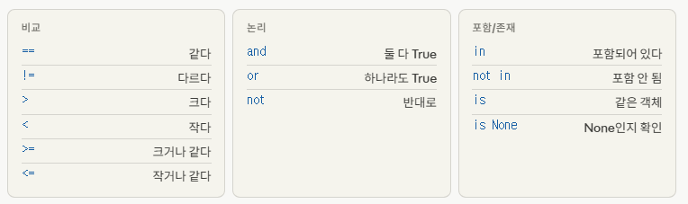
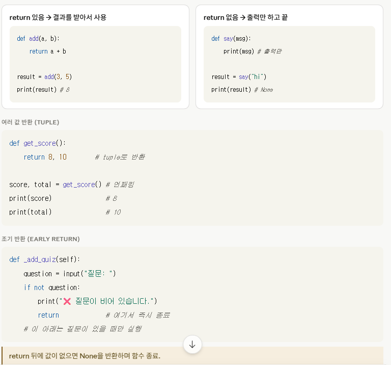
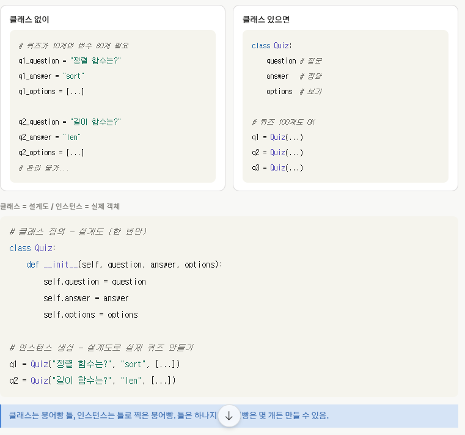
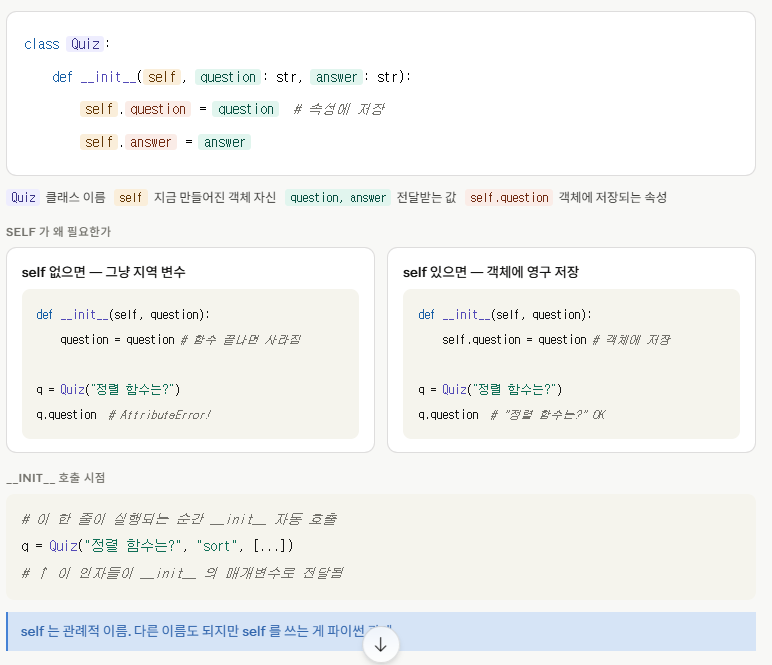
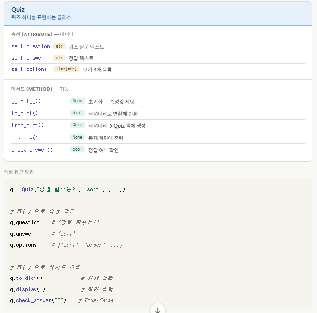
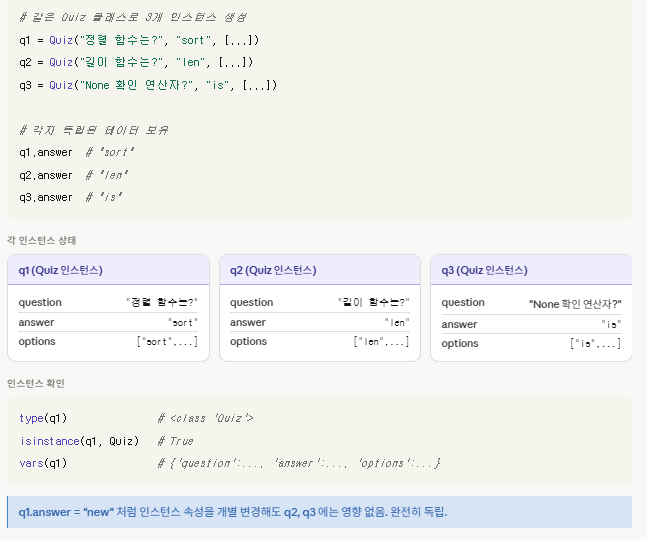

### Import 설명

#### import json

```
  JSON 문자열 -- 파일썬 자료형(딕셔너리, 리스트, 문자열 등) 변환
  json.loads(문자열) - 문자열을 파이썬 개첵로 읽기
  json.dump(객체) - 파이썬 객체를 JSON 문자열로 만들기
  json.load(파일) - 파일에서 읽기
  json.dump(객체, 파일) - 파일에 쓰기
```

### python 기초

변수란 ?
```
변수 : 데이타를 담아두는 이름 붙은 상자

사용이유 : 값을 직접 매번 쓰는 대신 이름을 붙여서 재사용하기 위해

print(3.14159 * 5 * 5)

pi = 3.14159
print(pi*5*5)

1. 값 저장
score = 0

2. 값 변경
score = score +1

3. 값 재사용
print(score)

```

### 타입비교 
|타입|저장하는것|예시값|
|:----------|:----------|:----------|
|int|정수|0, 100, -1|
|str|텍스트|"sort", "alice"|	
|bool|참/거짓|True|
|list|순서 있는 목록|["sort","order"]|
|dict|키-값 쌍|{"answer":"sort"}|
||


### if/elif/else

```
score = 85

if score >= 90:
    print("A등급")    # score가 90 이상일 때
elif score >= 80:
    print("B등급")    # score가 80 이상일 때 → 여기 실행
elif score >= 70:
    print("C등급")
else:
    print("D등급")    # 아무것도 안 맞을 때
```

```# 비교
5 == 5 # True
"sort" != "order" # True
10 >= 10 # True

# 논리
5 > 3 and 2 < 4 # True (둘 다 True)
5 > 10 or 2 < 4 # True (하나만 True)
not True # False

# 포함
"sort" in ["sort", "order"] # True
x = None
x is None # True

```


### for vs while
|구분|for|while|
|:----------|:----------|:----------|
|언제사용|회수/목록이 정해진 경우|조건이 만족되는 동안
|반복기준|목록/범위의 요소|조건식(True/False)
|무한루프|어려움|while True: 로 쉽게 구현
||

### break vs continue
```
(반복 즉시 탈출출)
for i in range(10):
    if i == 3:
        break      # 3에서 즉시 중단
    print(i)    # 0 → 1 → 2

(이번 회차만 건너뜀)
 for i in range(5):
    if i == 2:
        continue   # 2만 건너뛰고 계속
    print(i)    # 0 → 1 → 3 → 4   
```

### 함수란
```
자주 쓰는 코드를 이름 붙여 묶어두는 것. 필요할 때 이름만 불러서 재사용.

def greet(name: str,age: int) -> str:
    """함수 설명 (docstring)"""
    return f"안녕 {name}, {age}살이구나"

greet("alice", 25)  # "안녕 alice, 25살이구나"
```

### 함수반환값값
반환값
함수가 처리한 결과를 돌려주는 것. return 키워드로 반환.



## 클래스 란
```
클래스 — 데이터와 기능을 묶은 설계도

변수(데이터)와 함수(기능)를 하나로 묶어 이름 붙인 것. 설계도를 만들고, 그 설계도로 실제 객체를 찍어냄.
```



### init vs self
```
__init__ 은 객체가 만들어질 때 자동 실행되는 초기화 함수. self 는 지금 만들어진 그 객체 자신을 가리키는 이름.
```



### 속성과 메서드
속성은 객체가 가진 데이터, 메서드는 객체가 할 수 있는 기능(함수).



### 인스턴스 - 클래스로 만든 실제 객체

같은 클래스로 만들었지만 각자 다른 데이터를 가짐. 서로 독립적.




```
```

# Python 파일 입출력 / JSON / try·except 정리

 
## 1. 파일 읽기/쓰기

프로그램이 꺼져도 데이터가 남으려면 파일에 저장해야 함.

### 파일 작업 흐름

```
열기 (open()) → 읽기/쓰기 (read/write) → 닫기 (자동)
```

### 모드 종류

| 모드 | 의미 | 특징 |
|------|------|------|
| `"r"` | 읽기 (기본값) | 파일 없으면 오류 |
| `"w"` | 쓰기 | 없으면 생성, 있으면 덮어씀 |
| `"a"` | 이어쓰기 | 기존 내용 뒤에 추가 |
| `"x"` | 새로 만들기 | 이미 있으면 오류 |

### 파일 쓰기

```python
# with 문 — 블록 끝나면 자동으로 닫힘 (권장)
with open("data.txt", "w", encoding="utf-8") as f:
    f.write("안녕하세요\n")
    f.write("파이썬 파일 저장")
# with 블록 끝나면 자동으로 f.close()
```

### 파일 읽기

```python
# 전체 읽기
with open("data.txt", "r", encoding="utf-8") as f:
    content = f.read()      # 전체 문자열
    print(content)

# 한 줄씩 읽기
with open("data.txt", "r", encoding="utf-8") as f:
    for line in f:
        print(line.strip())

# 전체를 리스트로 읽기
with open("data.txt", "r", encoding="utf-8") as f:
    lines = f.readlines()   # ["줄1\n", "줄2\n", ...]
```

> **주의:** `encoding="utf-8"` 항상 명시 — 없으면 한글이 깨질 수 있음.

---

## 2. JSON

사람도 읽을 수 있고 프로그램도 쉽게 파싱 가능한 데이터 형식.  
파이썬 `dict` / `list` 와 구조가 거의 동일해서 변환이 쉬움.

### JSON 형식 예시

```json
{
  "high_score": 5,
  "quizzes": [
    {
      "question": "파이썬에서 리스트를 정렬하는 내장 함수는?",
      "answer": "sort",
      "options": ["sort", "order", "arrange", "rank"]
    }
  ]
}
```

### Python dict ↔ JSON 변환

```python
import json

# Python dict → JSON 문자열 (직렬화)
data = {"high_score": 5, "name": "alice"}
json_str = json.dumps(data, ensure_ascii=False, indent=2)
print(json_str)
# {"high_score": 5, "name": "alice"}

# JSON 문자열 → Python dict (역직렬화)
parsed = json.loads(json_str)
parsed["high_score"]    # 5
```

### 파일로 저장 / 불러오기

```python
# 저장 — json.dump()
with open("state.json", "w", encoding="utf-8") as f:
    json.dump(data, f, ensure_ascii=False, indent=2)

# 불러오기 — json.load()
with open("state.json", "r", encoding="utf-8") as f:
    data = json.load(f)

data["high_score"]  # 5
```

### dump vs dumps / load vs loads

| 함수 | 대상 | 설명 |
|------|------|------|
| `json.dump(data, f)` | 파일 | dict → 파일에 저장 |
| `json.dumps(data)` | 문자열 | dict → 문자열로 변환 |
| `json.load(f)` | 파일 | 파일 → dict로 읽기 |
| `json.loads(json_str)` | 문자열 | 문자열 → dict로 변환 |

> `s` 가 붙으면 **string(문자열)** 을 의미.

---

## 3. try / except

오류가 예상되는 코드를 `try` 에 넣고, 오류 발생 시 처리할 코드를 `except` 에 작성.  
오류가 나도 프로그램이 멈추지 않게 함.

### 전체 구조

```python
try:
    # 오류가 날 수 있는 코드
    result = int("abc")

except ValueError:
    # ValueError 발생 시 처리
    print("❌ 숫자를 입력해주세요")

except (KeyError, TypeError):
    # 여러 오류를 한 번에 처리
    print("❌ 키 또는 타입 오류")

else:
    # 오류 없을 때만 실행 (선택)
    print("✅ 성공")

finally:
    # 오류 여부 상관없이 무조건 실행 (선택)
    print("항상 실행")
```

### 기본 예시

```python
# 숫자 변환 오류 처리
user_input = "abc"

try:
    number = int(user_input)    # "abc" → int 불가 → ValueError
except ValueError:
    print("❌ 숫자를 입력해주세요")
```

### 오류 메시지 받기

```python
try:
    result = 10 / 0
except ZeroDivisionError as e:  # as e → 오류 내용 담기
    print(f"오류 발생: {e}")
# 오류 발생: division by zero
```

### 여러 오류 처리

```python
try:
    with open("data.json") as f:
        data = json.load(f)
except FileNotFoundError:
    print("파일이 없습니다")          # 파일 없을 때
except json.JSONDecodeError:
    print("JSON 형식이 잘못됐습니다")  # JSON 깨졌을 때
```

> `except:` 만 단독으로 쓰면 모든 오류를 잡아 디버깅이 어려워짐.  
> 오류 종류를 명시하는 것이 좋음.

---

## 4. 주요 에러 종류

| 에러 이름 | 원인 | 예시 |
|-----------|------|------|
| `ValueError` | 타입은 맞는데 값이 부적절 | `int("abc")` |
| `TypeError` | 타입이 맞지 않는 연산 | `"1" + 2` |
| `KeyError` | dict에 없는 키 접근 | `d["없는키"]` |
| `IndexError` | list 범위 초과 접근 | `[1,2,3][5]` |
| `FileNotFoundError` | 파일이 존재하지 않음 | `open("없는파일.txt")` |
| `AttributeError` | 없는 속성/메서드 접근 | `객체.없는메서드()` |
| `ZeroDivisionError` | 0으로 나누기 | `10 / 0` |
| `json.JSONDecodeError` | JSON 형식이 잘못됨 | `json.loads("잘못된형식")` |

---

## 5. quiz_game.py 실제 사용 예시

### _save_state — JSON 파일로 저장

```python
def _save_state(self) -> None:
    data = {
        "quizzes": [q.to_dict() for q in self.quizzes],
        "high_score": self.high_score,
    }
    with open(STATE_FILE, "w", encoding="utf-8") as f:
        json.dump(data, f, ensure_ascii=False, indent=2)
```

### _load_state — 파일 읽기 + 오류 처리

```python
def _load_state(self) -> None:
    if os.path.exists(STATE_FILE):      # 파일 있으면
        try:
            with open(STATE_FILE, "r", encoding="utf-8") as f:
                data = json.load(f)     # JSON 읽기
            self.quizzes = [Quiz.from_dict(q) for q in data["quizzes"]]
            self.high_score = data["high_score"]
            return
        except (json.JSONDecodeError, KeyError):    # JSON 깨졌거나 키 없으면
            print("⚠ 저장 파일 오류. 기본 데이터 사용")

    # 파일 없거나 오류나면 기본 데이터로 초기화
    self.quizzes = [Quiz.from_dict(q) for q in DEFAULT_QUIZZES]
```

### check_answer — 숫자 변환 오류 처리

```python
def check_answer(self, user_input: str) -> bool:
    try:
        choice = int(user_input)        # "abc" 입력하면 ValueError
        if 1 <= choice <= len(self._shuffled_options):
            return self._shuffled_options[choice - 1] == self.answer
    except (ValueError, AttributeError):
        pass                            # 오류나면 그냥 무시
    return False                        # 최종적으로 오답 처리
```

> `pass` 는 아무것도 안 하고 넘어가라는 의미 — 오류를 무시하고 싶을 때 사용.

---


# Git 기초 정리

> 버전 관리 시스템 Git — 왜 쓰는지부터 브랜치 병합까지

---

## 목차

1. [Git이란](#1-git이란)
2. [핵심 명령어](#2-핵심-명령어)
3. [작업 흐름 한눈에](#3-작업-흐름-한눈에)
4. [브랜치](#4-브랜치)
5. [원격 저장소](#5-원격-저장소)
6. [자주 쓰는 명령어 모음](#6-자주-쓰는-명령어-모음)

---

## 1. Git이란

코드의 **변경 이력을 기록**하고 관리하는 버전 관리 시스템.

### 왜 필요한가

| 상황 | Git 없으면 | Git 있으면 |
|------|-----------|-----------|
| 코드 망가짐 | 이전 버전 복구 불가 | 언제든 이전 시점으로 복구 |
| 여러 기능 동시 개발 | 파일 충돌, 복사본 난무 | 브랜치로 독립 개발 |
| 팀 협업 | 누가 뭘 바꿨는지 모름 | 변경 이력 + 작성자 추적 |
| 원격 백업 | 내 PC 날아가면 끝 | GitHub에 항상 백업 |

### 기본 개념

```
작업 디렉토리  →  스테이징 영역  →  로컬 저장소  →  원격 저장소
(내가 수정)       (add로 담기)      (commit으로 저장)   (push로 올리기)
```

---

## 2. 핵심 명령어

### git init — 저장소 초기화

```bash
git init
```

- 현재 폴더를 Git 저장소로 만듦
- `.git` 폴더 생성됨 (삭제하면 Git 이력 전부 사라짐)
- 프로젝트 시작할 때 딱 한 번 실행

```bash
mkdir my-project
cd my-project
git init        # 이 폴더를 Git으로 관리 시작
```

---

### git add — 스테이징 (커밋 준비)

```bash
git add 파일명        # 특정 파일만
git add .            # 현재 폴더 전체
git add *.py         # .py 파일 전체
```

- 변경된 파일을 **커밋 대기열(스테이징 영역)** 에 올림
- `add` 하지 않으면 `commit` 에 포함되지 않음

```bash
git add quiz_game.py      # 특정 파일만
git add .                 # 수정된 전체 파일
```

---

### git commit — 변경사항 저장

```bash
git commit -m "커밋 메시지"
```

- 스테이징된 파일들을 **로컬 저장소에 영구 기록**
- 메시지는 무엇을 변경했는지 명확하게 작성

```bash
git commit -m "feat: 퀴즈 추가 기능 구현"
git commit -m "fix: 정답 체크 오류 수정"
git commit -m "docs: README 업데이트"
```

> **커밋 메시지 관례:** `feat:` 기능 추가 / `fix:` 버그 수정 / `docs:` 문서 / `refactor:` 리팩토링

---

### git push — 원격 저장소에 올리기

```bash
git push origin main      # main 브랜치를 origin에 올리기
git push                  # 기본 설정된 곳에 올리기
```

- 로컬 커밋을 **GitHub 등 원격 저장소에 업로드**
- 팀원들이 볼 수 있게 됨

---

### git pull — 원격 변경사항 가져오기

```bash
git pull origin main      # origin의 main 브랜치 가져오기
git pull                  # 기본 설정된 곳에서 가져오기
```

- 원격 저장소의 최신 변경사항을 **로컬에 합침**
- 팀원이 push한 내용을 내 PC에 반영할 때 사용

---

### git checkout — 브랜치 이동 / 파일 복구

```bash
# 브랜치 이동
git checkout main             # main 브랜치로 이동
git checkout feature/login    # 다른 브랜치로 이동

# 브랜치 생성 + 이동 (한 번에)
git checkout -b feature/quiz-add

# 파일 복구 (수정 전으로 되돌리기)
git checkout -- quiz_game.py
```

> Git 2.23+ 부터는 `git switch` (브랜치 이동) / `git restore` (파일 복구) 로 분리됨.

---

### git clone — 원격 저장소 복사

```bash
git clone 저장소URL
git clone https://github.com/username/repo.git
git clone https://github.com/username/repo.git 폴더명
```

- 원격 저장소를 **내 PC로 통째로 복사**
- 이력, 브랜치 전부 포함
- 팀 프로젝트 처음 받을 때 사용

---

## 3. 작업 흐름 한눈에

### 일반적인 하루 작업 흐름

```bash
# 1. 최신 내용 가져오기
git pull origin main

# 2. 파일 수정 (코딩)
# ...

# 3. 변경 내용 확인
git status                  # 어떤 파일이 바뀌었는지
git diff                    # 구체적으로 무엇이 바뀌었는지

# 4. 스테이징
git add .

# 5. 커밋
git commit -m "feat: 기능 설명"

# 6. 원격에 올리기
git push origin main
```

### 상태 확인 명령어

```bash
git status          # 현재 상태 (수정/스테이징 여부)
git log             # 커밋 이력
git log --oneline   # 커밋 이력 한 줄 요약
git diff            # 수정된 내용 상세 확인
```

---

## 4. 브랜치

독립적인 작업 공간. main 코드를 건드리지 않고 새 기능을 개발할 때 사용.

### 브랜치 개념

```
main    ──●──────────────────●── (안정된 코드)
           \                /
feature     ●──●──●──●──●──     (새 기능 개발)
```

### 브랜치 생성

```bash
git branch feature/quiz-add          # 브랜치 생성만
git checkout -b feature/quiz-add     # 생성 + 이동 (한 번에, 권장)
git switch -c feature/quiz-add       # 위와 동일 (최신 문법)
```

### 브랜치 목록 / 이동

```bash
git branch                  # 로컬 브랜치 목록
git branch -a               # 원격 포함 전체 목록
git checkout main           # main으로 이동
git switch feature/login    # 다른 브랜치로 이동
```

### 브랜치 병합 (merge)

```bash
# 1. main 브랜치로 이동
git checkout main

# 2. feature 브랜치를 main에 합치기
git merge feature/quiz-add

# 3. 다 쓴 브랜치 삭제
git branch -d feature/quiz-add
```

### 충돌(conflict) 발생 시

같은 파일의 같은 줄을 두 브랜치에서 다르게 수정했을 때 발생.

```
<<<<<<< HEAD          ← 내 브랜치 내용
score = 100
=======
score = 200           ← 병합하려는 브랜치 내용
>>>>>>> feature/quiz
```

해결 방법:
1. 파일 열어서 원하는 내용만 남기고 `<<<<`, `====`, `>>>>` 줄 삭제
2. `git add 파일명`
3. `git commit`

---

## 5. 원격 저장소

### clone — 처음 받아올 때

```bash
# 저장소 복사
git clone https://github.com/username/repo.git

# 폴더명 지정해서 복사
git clone https://github.com/username/repo.git my-project

cd my-project       # 복사된 폴더로 이동
```

### 원격 저장소 연결 확인

```bash
git remote -v           # 연결된 원격 저장소 주소 확인
git remote add origin URL   # 원격 저장소 연결 (init 후)
```

### pull — 변경사항 가져오기

```bash
# 기본 사용
git pull origin main

# pull = fetch + merge (두 단계를 한 번에)
git fetch origin        # 변경사항 확인만 (합치지 않음)
git merge origin/main   # 실제로 합치기
```

### 처음 GitHub에 올리는 전체 순서

```bash
# 1. 로컬에서 시작
git init
git add .
git commit -m "first commit"

# 2. GitHub에서 저장소 만들고 URL 복사

# 3. 원격 연결
git remote add origin https://github.com/username/repo.git

# 4. 올리기
git push -u origin main     # -u: 이후부터 git push만 해도 됨
```

---

## 6. 자주 쓰는 명령어 모음

```bash
# ── 초기 설정 ───────────────────────────────
git config --global user.name "이름"
git config --global user.email "이메일"

# ── 저장소 시작 ─────────────────────────────
git init                          # 새 저장소
git clone URL                     # 기존 저장소 복사

# ── 상태 확인 ───────────────────────────────
git status                        # 현재 상태
git log --oneline                 # 커밋 이력 요약
git diff                          # 변경 내용 상세

# ── 저장 ────────────────────────────────────
git add .                         # 전체 스테이징
git add 파일명                    # 특정 파일 스테이징
git commit -m "메시지"            # 커밋

# ── 원격 ────────────────────────────────────
git push origin main              # 올리기
git pull origin main              # 가져오기
git remote -v                     # 원격 주소 확인

# ── 브랜치 ──────────────────────────────────
git branch                        # 목록
git checkout -b feature/기능명    # 생성 + 이동
git checkout main                 # 이동
git merge feature/기능명          # 병합
git branch -d feature/기능명      # 삭제

# ── 되돌리기 ────────────────────────────────
git checkout -- 파일명            # 수정 전으로 복구
git reset HEAD 파일명             # 스테이징 취소
git log --oneline                 # 커밋 ID 확인
git checkout 커밋ID               # 특정 시점으로 이동
```

---

## 핵심 요약

```
init    → 저장소 시작
add     → 커밋 대기열에 올리기
commit  → 로컬에 영구 기록
push    → 원격(GitHub)에 올리기
pull    → 원격에서 가져오기
clone   → 원격 저장소 통째로 복사
checkout → 브랜치 이동 / 파일 복구
```